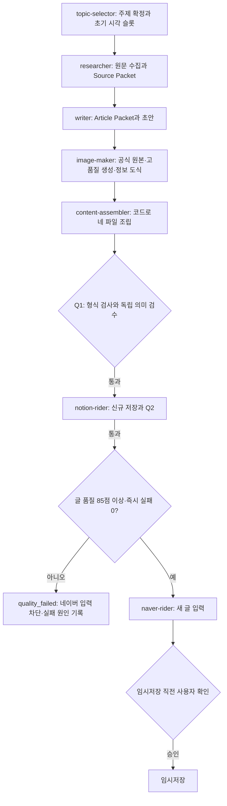

# GPT-6 Luna 실행용 상세 구현 계획

## 0. 문서의 목적과 실행 범위

- 작성일: 2026-09-27 KST.
- 갱신일: 2026-09-28 KST. 최근 네 건의 실패·취소와 현재 소스를 대조한 안정화 계획(0.6절) 추가. 이번 갱신은 문서 작성만이며, 이전 변경의 구현·검증 완료를 뜻하지 않는다.
- 대상 프로젝트: `/Users/beomseok/00_AI/01_ NAVER_BLOG_AUTOMATE`.
- 계획 편집 및 기본 구현 담당: **GPT-6 Luna**. 복잡한 설계 충돌이나 높은 위험 판단에만 Astra 검토를 추가한다.
- 목표: 대시보드의 신규 요청부터 **품질 기준을 통과한 네이버 임시저장 1건**까지의 전체 처리 경로를 안정적으로 연결하고, 글·이미지 품질을 유지하면서 처리시간과 실패 재작업을 줄인다. 발행·예약 발행은 범위에서 제외한다.
- 감사 당시 상태(2026-09-27, 현재 집계 아님): **대시보드·실행기·7단계·Notion Q2·네이버 확인 경로는 실행 중인 코드와 런타임에서 확인됐다. 당시 최근 자동 실행은 26건 중 25건 실패, 1건 확인 대기이며 글 품질 점수의 네이버 저장 차단 연결은 확인되지 않았다. 따라서 전체 성능 최적화보다 실패 원인·품질 Gate·계측을 먼저 정리한다.** T00 기준선은 완료, T01은 구현 중이나 통합 측정 미검증, T02·T03은 테스트 통과 기록만 있고 수용성 미감사, 나머지는 미완료다. 이후 저장 대기 원인 분석과 수정 범위는 0.5절을 따른다.
- 실행 시작 조건: 사용자가 이 계획의 구현을 요청한 뒤 아래 작업을 수행한다. 이번 문서 갱신으로 전체 구현·모델 전환·운영 실행을 시작하지 않는다.
- 활성 실행 계약: `EXECUTION_AGENT.md`; 개발·변경 리뷰 지침: `AGENTS.md`. 참고 설계: `docs/workflow-quality-speed-proposal-2026-09-27.md`.

사용자가 구현을 요청하면 반복해서 착수 승인을 묻지 말고, 허용된 로컬 구현과 검증을 진행한다. 실제 계정 재인증, 운영 전환, 외부 저장은 해당 시점의 사용자 요청 범위와 기존 Gate에 따라 처리한다. 코딩 완료·로컬 검증·실운영 검증은 서로 다른 완료 상태로 보고한다.

실제 작업에서는 코드 실행 전에 현재 호출 모델을 확인한다. 문서에 모델명을 적는 것만으로 실제 모델이 전환되지는 않으므로, GPT-6 Luna를 실행할 수 없으면 다른 모델로 조용히 대체하지 않고 그 사실과 선택지를 보고한다.

### 0.1 작은 단계와 정량 완료 기준

처음부터 새 대형 서비스나 전체 대시보드를 만들지 않는다. 기존 로그 파서·대시보드·캐시와 테스트를 먼저 조사하고, 작은 데이터 품질 보고서나 read-only 대시보드 한 조각부터 구현한다. 각 단계에서 결과와 관련 테스트가 통과한 뒤 다음 단계로 확장한다. 기능은 한 명의 주 담당자가 하나의 작업 묶음으로 끝까지 책임지며, 내부 작업은 조사·검증·분석·구현 순으로 나눈다. 독립적인 세부 작업은 `AGENTS.md`의 「개발 에이전트 수와 위임 기준」에 따라 보조 에이전트 1명에게 맡길 수 있다. 동시 인원은 주 담당자와 재위임을 포함해 총 2명 이내이며, 시간·토큰·품질 근거로 효과를 확인한다. 이 개발 위임 규칙은 운영 파이프라인의 병렬화나 별도 서비스 생성을 뜻하지 않는다.

각 기능 checkpoint는 증거에 기반한 100점 평가를 기록한다.

| 평가 항목 | 배점 | 통과 증거 |
|---|---:|---|
| 요구사항과 수용 시나리오 | 25 | 명시된 입력·출력·경계 사례를 재현해 모두 충족 |
| 정확성과 데이터 무결성 | 25 | 출처·계산·누락·중복·분모를 확인하고 결과를 독립적으로 대조 |
| 테스트와 실패 처리 | 20 | 해당 기능 테스트 및 유효하지 않은 입력·실패 사례 통과 |
| 안전성과 기존 계약 호환 | 20 | 외부 쓰기 Gate·개인정보·legacy 동작 회귀 없음; P0/P1 없음 |
| 재현성·운영·문서 | 10 | 명령·산출물·메트릭 정의와 한계를 다른 실행자가 재현 가능 |

다음 단계 및 완료 조건은 **90점 이상**, 필수 테스트 전체 통과, 미해결 P0/P1 없음이다. 모델 자기평가만으로 점수를 주지 말고 실제 테스트·검증 결과와 리뷰 근거를 기록한다. 미달하면 감점 근거가 된 항목을 고치고 영향받은 테스트로 다시 확인해 재평가한다. 외부 자료 부족 등으로 같은 차단이 반복되면 점수를 임의로 채우지 말고 미완료 원인과 다음 조치를 보고한다.

OpenAI 모델/API/SDK/에이전트/Codex/usage 기능을 구현하거나 선택하기 전에 최신 OpenAI 공식 문서를 확인한다. 접근일, 공식 링크, 확인한 제품 구분(Codex·ChatGPT·API), 모델·reasoning 설정 지원, usage 필드의 한계를 기록하고 현재 계정·런타임에서 실제 사용 가능한지는 별도로 검증한다. OpenAI 기능과 무관한 작업은 해당 없음을 기록한다.

2026-09-27 확인한 공식 문서:

- [모델 선택 가이드](https://developers.openai.com/api/docs/guides/model-selection): 작업 복잡도·비용·지연에 따른 모델 선택.
- [OpenAI 모델 카탈로그](https://developers.openai.com/api/docs/models): 모델별 기능과 제공 표면.
- [추론 가이드](https://developers.openai.com/api/docs/guides/reasoning): reasoning effort 지원이 모델마다 다르며 비용·지연에 영향을 줌.
- [Agents 모델 설정](https://developers.openai.com/api/docs/guides/agents/models): 에이전트/작업 단위의 명시적 모델 설정 기준.
- [Agents usage와 observability](https://developers.openai.com/api/docs/guides/agents-api/observability): usage가 unknown/null일 수 있어 비용·성과를 과장하지 않음.

### 0.2 현행 대시보드와 워크플로우 감사 — 2026-09-27 KST

이번 감사는 소스 읽기, 로컬 대시보드 HTTP/API 읽기, Aside Browser 화면 확인으로 수행했다. 워크플로우 제출·재시도·취소·설정 변경·Notion/네이버 쓰기는 수행하지 않았다.

| 영역 | 확인 결과 | 계획상 의미 |
|---|---|---|
| 대시보드 런타임 | `127.0.0.1:8765` 화면과 API가 응답하고 launchd가 실행 중. 화면의 health는 `아직 점검하지 않음` | 대시보드 전체가 죽은 것은 아니다. 미점검을 장애나 정상으로 단정하지 않는다. |
| 실행 연결 | 수동·예약 요청이 `daily-generate`와 공통 Runner로 들어가고 7단계가 직렬 실행됨 | 기존 실행기를 재사용한다. 새 오케스트레이터를 만들지 않는다. |
| 외부 저장 | Notion 신규 쓰기/Q2와 네이버 입력 준비 뒤 사용자 확인을 거치는 경로가 존재함 | 저장 순서는 대체로 연결됐지만 점수 Gate가 별도로 필요하다. |
| 대시보드 기록 | 최근 화면은 실행·대기·확인 필요 기록을 함께 표시한다. 전체 API에는 199건(실패 116, 차단 4, 로컬 전용 15, 확인 대기 1, 임시저장 완료 7 등)이 집계됨 | 운영 대기열, 실패·차단, 완료 이력, 데모/구형 기록을 구분해 지표가 서로 섞이지 않게 한다. |
| 최근 자동 실행 | 2026-09-20~27 자동 선정 26건 중 25건 실패, 1건 확인 대기, 실행 중 0건. 실패한 마지막 단계는 topic-selector 17건·writer 8건이며 기록의 오류 분류는 모두 `contract_failed` | 대시보드 화면 연결보다 selector/writer 계약 실패의 세부 원인 분류와 재현이 우선이다. |
| 최신 아웃백 실행 | 7단계 상태는 모두 완료/검증으로 표시되고 Notion Q2는 통과했으나 네이버 확인 대기. 상태 파일에 글 품질 점수·rubric 버전이 없음 | 63점 같은 글이 임시저장 경로에 도달하지 않게 평가를 실제 Gate에 연결해야 한다. 아직 네이버 임시저장은 완료되지 않았다. |

기존 루브릭(`evaluation-rubric.md`)은 85점 이상 통과, 70~84점 수정, 0~69점 실패와 즉시 실패 조건을 정의한다. 코드의 네이버 저장 Gate는 현재 manifest·Q1/Q2·대상·사용자 확인을 검증하지만, 이 글 점수를 필수 조건으로 읽지 않는다. topic 선택 성과 피드백, Q1 재시도 피드백, 글 품질 점수는 각각 부분 구현돼 있으나 하나의 실패 원인→수정 단계→재평가 흐름으로 연결됐다고 간주하지 않는다.

따라서 현재 상태를 “시스템 전체 미연결” 또는 “최적화 완료”로 정의하지 않는다. **실행 골격과 외부 저장 안전 Gate는 연결되어 있으나, 초반 실패 원인 진단·게시 전 품질 Gate·생산/이력 계측이 분절되어 있어 품질 통과 임시저장 기준의 속도 비교가 아직 성립하지 않는다.**

### 0.3 재정의한 목표·완료 판정

주요 완료 단위는 Q1 통과가 아니라 대시보드에서 시작한 한 건이 topic-selector부터 네이버 임시저장까지 완료된 결과다. 다음을 모두 만족해야 성공 1건으로 센다.

1. 일곱 단계가 동일한 `run_id`·모델 설정 snapshot·산출물 digest로 연결되고, 실패 시 최초 실패 단계와 구체 원인이 남는다.
2. Q1·manifest와 Notion Q2를 통과하고, `evaluation-rubric.md` 기준 85점 이상·즉시 실패 0을 확인한다. 누락·저점수·digest 불일치는 네이버 입력과 임시저장을 차단한다.
3. 사용자 확인은 대상·제목·이미지·저장 동작에 대해 임시저장 직전에 유지한다. 성공 종점은 `draft_saved`; 발행은 하지 않는다.
4. 대시보드는 진행 중, 사용자 조치 대기, 실패/차단, 임시저장 완료, 구형·데모 이력을 별도 표시하고 같은 사건을 중복 계수하지 않는다.
5. 주 지표는 대시보드 접수부터 `draft_saved`까지의 벽시계 시간과 실제 활성 처리시간이다. 사용자 확인 대기·예약 대기·실패 후 재작업 시간은 별도 표시하되 숨기지 않는다. 단계 p50/p90, 재시도, 실패율, 85점 통과율, 토큰 usage coverage도 함께 보고한다.

속도 개선은 완료 성공 1건당 시간과 품질 통과율을 함께 비교한다. 기존 7건의 임시저장 성공 기록은 방향성 기준선으로만 사용하고 주제·모델·재사용 조건이 다르므로 단독으로 절감률을 확정하지 않는다. 품질 85점·즉시 실패 0·Q1/Q2·사용자 확인 조건을 하나라도 완화해 속도를 얻으면 개선으로 인정하지 않는다.

### 0.4 재정의한 실행 순서

1. **연결 지도 확정:** 각 대시보드 입력(수동/예약), API, batch child, Runner, 7단계, artifact, Q1/Q2, Naver confirmation, 상태·로그의 producer/consumer와 성공·실패 신호를 표로 만든다. 코드상 존재와 실제 UI/API 실행 증거를 구분한다. T00a의 대기 상태 진단·표시 정정은 먼저 수행할 수 있으며, 그 통합 운영 수용 시험은 T06a 이후에 진행한다.
2. **기준선과 실패 원인 고정:** 최근 selector/writer `contract_failed` 표본을 읽기 전용 fixture로 고정하고, 오류 세부 메시지·실패 파일·계약 위반을 분류해 최소 재현을 만든다. 최근 실패가 해소되기 전에는 모델·renderer 최적화 효과를 주장하지 않는다.
3. **운영 품질 Gate 연결:** 5.6절/T06a를 구현해 점수·근거·digest를 네이버 저장 허용 조건에 결합한다. 주제 자체 부적합과 실행 단계 결함을 구분해 실패 기록에서 담당 단계의 개선으로 이어지게 한다.
4. **대시보드 계측 정리:** 활성 큐와 과거 이력, 실제 운영과 데모/구형 기록을 구분한다. 승인 대기와 실패를 모두 “확인 필요” 하나로 뭉치지 않고, 운영 성공률·시간 지표의 분모도 고정한다.
5. **작은 안정성 확인:** 먼저 서로 다른 유형의 3개 입력으로 dashboard-origin → 품질 Gate → Notion Q2 → 사용자 확인 → 임시저장 경로를 확인한다. 실패는 표본에서 숨기지 않고 원인 보완 후 재평가한다.
6. **속도 최적화·비교:** 안정성 확인 후 결정적 조립, 재사용, 불필요한 모델 호출 감소, 단계별 모델 설정 순으로 한 번에 하나씩 바꾼다. 구조 비교는 모델 설정을 고정하고, 모델 비교는 구조를 고정한다. 동일 입력·동일 rubric 조건의 3건 예비 비교 뒤 12건 비교로 확장한다. 외부 임시저장은 건별 사용자 확인을 유지한다.

기존 T00~T12의 작은 기능·검증 단위는 유지하되, 위 순서보다 앞서 최적화나 모델 전환을 운영 기본값으로 적용하지 않는다. 이 문서는 계획만 정하며 구현은 추후 사용자 요청에 따라 GPT-6 Luna가 수행한다.

### 0.5 외부 저장 대기 오진과 후속 실행 누락 수정 계획 — 2026-09-28 KST

**상태: 최초 계획 이후 메시지 일부 변경 확인 / T00a 전체 수용 미검증.** 현재 `runner_actions.py`에는 외부 이어 실행 대기 메시지가 있으나, 표시·이어 실행·저품질 차단의 통합 완료는 확인되지 않았다. 이번 범위는 T00a로 관리한다. 기존 저장 어댑터 재개발·계정 재설정·모델 변경·전체 파이프라인 재작성은 해결책으로 전제하지 않는다. OpenAI 모델·API·SDK 기능을 변경하지 않는 작업이므로 이 수정의 OpenAI 공식 문서 조사는 해당 없음이며, T09의 선행 조사 의무는 유지한다.

#### 확인한 원인과 증거

| 확인 사항 | 근거 | 수정 판단 |
|---|---|---|
| 최초 생성 요청은 저장 어댑터를 의도적으로 전달하지 않는다. | `tools/dashboard_manual_run.py::_request`, `tests/test_dashboard_manual_run.py::test_dashboard_external_resume_injects_adapters_after_initial_run` | 첫 실행의 어댑터 없음은 서버 전체의 연결 누락을 뜻하지 않는다. 생성/저장 분리를 유지한다. |
| 최초 생성이 끝나면 `local-only`와 `next_action.kind=external`이 남는다. | `.automation/dashboard/manual-batches/BATCH-20260927-141249-5b5148ca78ea.json`; 읽기 전용 대시보드 API 결과와 일치 | 유니클로의 직접 중단 지점은 외부 저장 실행 대기이며, 외부 호출 실패가 아니다. |
| 같은 메시지가 나온 뒤 실제 저장 단계가 성공한 비교 기록이 있다. | `.automation/logs/RUN-20260927-061210-3d7f17fae40a.jsonl` 6~9번째 이벤트: skipped 뒤 Notion Q2 passed, 네이버 확인 대기 | 어댑터가 전혀 구현·설정되지 않았다는 기존 진단을 정정한다. 이 과거 성공으로 현재 인증 상태까지 보장하지 않는다. |
| 실행기 메시지는 구간별 미호출을 `adapter is not configured`로 표현한다. | `tools/runner_actions.py::stage_action` | 정상 대기와 실제 연결 누락·인증 실패를 구분해야 한다. |
| 내부 작업 종료는 `completed`지만 업무 결과는 별도 `result_status`에 있다. | `tools/dashboard_manual_run.py::_settle_result`, `tools/dashboard_tasks.py::effective_status` | `completed` 또는 Q1 통과만으로 임시저장 완료를 보고하면 안 된다. 이미 올바르게 구분하는 화면·함수는 재사용한다. |

이 사건에는 총괄 에이전트가 다음 동작을 확인하지 않고 중단한 수행 오류도 있다. 유니클로의 근거 없는 경험담은 별도 콘텐츠 품질 우려이며, 실행 로그에 자동 품질 Gate가 실패했다고 기록된 것은 아니다. 이를 저장 연결 장애나 확정된 품질 점수로 보고하지 않는다.

#### 수정 순서와 소유 범위

GPT-6 Luna 주 담당자 1명이 아래 순서로 구현·검증한다. 이 문서 갱신만으로 구현이나 새 글 생성을 시작하지 않는다.

1. **기준 사례 고정.** 구현 시작 시 위 두 실행의 상태·전이·외부 호출 여부만 추린 작은 fixture를 만든다. 실제 nonce·인증값·개인정보는 제외하고 원본 상태·로그·manifest는 수정하지 않는다. 생성 대기, 실제 어댑터 누락, 인증 실패를 서로 다른 사례로 고정한다.
2. **진단 메시지 정정.** `tools/runner_actions.py`, `tools/runner_loop.py`의 어댑터 없는 실행은 “글 생성 완료 · 외부 저장 미실행”으로 표현한다. 실제 연결 누락은 서버가 보유한 어댑터를 확인할 수 있는 `tools/test_dashboard.py`, `tools/dashboard_manual_actions.py` 경계에서만 판정한다. 기존 상태값과 이력은 유지한다. 필요 정보는 기존 읽기 전용 API에 Notion/Naver 어댑터의 설정 여부와 관측 시점을 최소 필드로 추가한다. 설정 존재·캐시된 health·실제 인증 성공은 별개의 근거로 표시하며, GET 조회 자체가 외부 쓰기나 로그인 복구를 실행하지 않게 한다.
3. **대시보드와 보고 상태 통일.** `tools/dashboard_tasks.py`의 `effective_status`를 기준으로 `dashboard/manual-run.js`, `dashboard/tasks.js`, 알림·완료 집계의 영향 경로를 대조한다. `local-only`는 “글 생성 완료 · 외부 저장 대기”, `awaiting_user_confirmation`은 “입력 완료 · 임시저장 확인 대기”, `draft_saved`는 “임시저장 완료”로 구분한다. 이미 올바른 경로는 유지하고, `completed`를 업무 전체 성공으로 취급하는 경로만 수정한다. 과거 JSON을 일괄 변경하지 않는다.
4. **총괄 에이전트의 이어 실행 절차 명시.** `EXECUTION_AGENT.md`에 생성 종료 후 현재 batch/child의 `result_status`, `next_action`, 실제 연결 상태를 확인하는 절차를 넣는다. 사용자가 해당 글의 외부 저장까지 이미 요청했고 Q1·manifest가 유효하면, 현재 nonce로 기존 `submit_action(..., kind="external")` 경로를 한 번 호출해 Notion/Q2와 네이버 준비를 이어간다. 최종 저장 직전 확인과 이 외부 저장 액션을 혼동해 불필요한 착수 승인을 추가하지 않는다. 생성만 요청했거나 권한 범위가 확인되지 않으면 정상 대기로 남긴다. 승인 범위의 근거는 현재 사용자 요청이며, 주제 모드·`completed`·health만으로 추정하지 않는다.
5. **중복과 복구 경계 유지.** 위 절차는 동일 run/batch/child를 재개한다. 외부 저장 대기 때문에 새 글 생성·producer 전체 재실행을 하지 않는다. nonce를 소모하는 기존 HTTP/manager 액션 경로와 기존 Notion checkpoint를 재사용한다. 호출 시간 초과 시 먼저 최신 `active_action`·실행 결과·저장 checkpoint를 조회하며, 결과가 불명확한 상태에서 새 페이지를 다시 만들지 않는다. 서버 재시작 후 확인 대기 글은 기존 준비 무효화·재검증 계약을 따른다.

이번 최소 수정에서는 서버의 모든 `local-only` 실행을 자동 저장으로 전환하거나 예약·과거 대기열을 자동 재개하는 기능을 추가하지 않는다. 기존 대시보드의 “외부 저장 실행” 동작을 유지하고, 이미 전체 실행을 요청받은 총괄 에이전트가 이 동작을 누락하지 않도록 한다. 독립적인 서버 자동 이어 실행은 별도 범위이며 이번 수정의 완료 조건이 아니다.

#### 품질 Gate와의 관계

- T00a는 상태 해석과 이어 실행 절차의 수정이다. 글 품질 점수를 실제 차단 조건에 연결하는 작업은 기존 T06a가 담당하며, 개발 완료 90점과 글 평가 85점을 혼용하지 않는다.
- 기존 5.6절대로 Q1 후 Notion 쓰기, Q2 후 동일 digest의 글 평가 확인, 품질 통과 후 네이버 입력, 마지막 사용자 확인 후 임시저장을 유지한다. 알려진 품질 결함은 Q1 재평가 대상으로 돌리고, Gate를 이미 통과했다는 사실만으로 무시하지 않는다.
- T06a가 미구현된 상태에서 T00a 완료를 “저품질 글 자동 차단까지 검증 완료”로 보고하지 않는다. 통합 운영 수용 시험은 T06a와 콘텐츠 근거 검증을 충족한 새 글로 진행한다. 기존 아웃백·유니클로 대기 기록은 분석 증거로 보존하며 이번 수정의 시험 입력으로 자동 저장하지 않는다.

#### 수용 시나리오

| 입력·상황 | 기대 결과·관찰 근거 |
|---|---|
| 서버에 양쪽 어댑터가 있고 최초 생성이 완료됨 | 최초 호출은 외부 쓰기 0회, `local-only`와 `external` 액션 표시. 연결 장애·임시저장 완료로 오인하지 않음. |
| 어댑터가 실제로 하나 또는 둘 모두 없음 | 누락된 연결을 명시하고 대기/차단을 표시. 생성은 성공할 수 있지만 외부 저장 성공으로 집계하지 않음. |
| 저장 실행을 요청했고 Q1·manifest가 유효함 | 기존 액션을 통해 동일 run을 재개. producer 추가 호출 0회, Notion Q2 뒤에만 네이버 준비. |
| 인증 만료 또는 네트워크 오류 | 실제 호출 결과의 실패 단계·안전한 원인 기록. `local-only` 메시지에서 인증 오류를 추정하지 않음. |
| 이중 클릭·같은 nonce 재전송·동시 액션 | 기존 action guard가 중복 실행을 거부. Notion 페이지·네이버 저장 중복 0건. |
| 타임아웃 또는 서버 재시작 후 재개 | 현재 checkpoint와 결과를 확인한 뒤 재개하며 이미 저장한 Notion 페이지를 중복 생성하지 않음. |
| Q1 실패·manifest 변경·Q2 실패 | 해당 Gate에서 멈춤. Q1 실패 시 Notion 호출 0회, Q2 실패 시 네이버 준비 0회. |
| 84점·63점·즉시 실패·점수 보고서 누락/다른 digest | T06a 연계 시험에서 네이버 준비·임시저장 0회. 숫자·사람 검수 결과를 자동으로 꾸미지 않음. |
| 네이버 입력까지 완료했으나 최종 확인 없음 | `awaiting_user_confirmation` 유지, 저장 호출 0회. `completed`로 성공 집계하지 않음. |
| 유효한 최종 확인 후 실제 저장 확인 | 대상·제목·이미지와 저장 증거가 일치할 때만 `draft_saved`와 임시저장 완료 보고. |

구현 검증은 기존 `tests/test_dashboard_manual_run.py`, `tests/test_dashboard_manual_actions.py`, `tests/test_dashboard_http.py`, `tests/test_dashboard_tasks.py`, `tests/test_dashboard_adapters.py`, `tests/test_dashboard_ui.mjs`를 먼저 확장한다. 외부 경계는 `tests/test_notion_resume_runner_integration.py`, `tests/test_naver_gate_contract.py`, `tests/test_naver_write_hook.py`, `tests/test_runner_safety.py`로 회귀 확인한다. 상태 전이·실제 액션·어댑터 호출 횟수를 검증하고 문구 일치 테스트만으로 완료하지 않는다. 통합 변경 후 기존 7절의 린트·타입·전체 검사를 현재 revision에서 수행한다.

#### 실제 운영 검증·측정·완료

로컬 검증을 통과하고 해당 운영 실행이 요청된 뒤, Aside Browser로 기존 대시보드에서 새 글 1건을 확인한다. 사용자가 지정한 `as_of_date`를 유지하고, 그 날짜 자료가 없으면 날짜를 오늘로 바꾸지 말고 해당 입력의 제약을 보고한다. 이 한 건은 흐름 검증이며 자동으로 다른 주제를 연속 실행하는 벤치마크가 아니다. 네이버 임시저장 직전에는 대상 블로그·제목·이미지·저장 동작을 제시해 최종 확인을 받는다.

기록할 시간은 `요청 접수 → 생성 종료 → 외부 액션 접수 → Q2 완료 → 최종 확인 대기 → 사용자 확인 → draft_saved`이며, 전체 경과시간과 생성/저장 사이 대기·사용자 확인 대기를 분리한다. `child.ended_at`은 생성 구간 종료일 수 있으므로 최종 저장 시각으로 사용하지 않는다. 기존 원시 시각이 없으면 추정으로 채우지 않는다. 이전/현재 모두 임시저장까지 성공한 비교 가능한 기록과 동일 품질 판정이 있을 때만 `(기존 시간 - 현재 시간) / 기존 시간 × 100`을 계산한다. 주제·모델·입력이 다른 과거 성공 건은 참고 비교임을 명시한다.

T00a의 완료는 메시지·상태·이어 실행 절차의 관련 검증 통과, 개발 완료 평가 90점 이상, 미해결 P0/P1 없음으로 판정한다. 개발 점수·로컬 검사·실제 외부 저장·글 품질 점수·시간 비교 결과를 각각 보고한다. 일부 변경이 있어도 전체 구현 점수와 수용 결과는 미평가다. 문제가 생기면 신규 진단·표시 변경만 되돌리고 기존 수동 외부 액션을 유지한다. 과거 파일·로그·Notion 페이지·네이버 글은 삭제하거나 되돌리지 않는다.

### 0.6 최근 실패를 반영한 개선 계획 — 2026-09-28 KST

**이 절은 최근 실패를 반영한 수정 설계다.** 구현은 2026-09-28 사용자의 명시 요청 후 시작했으며 현재 진행과 검증 근거는 14절에 기록한다. 이 절의 계획 문구만으로 외부 저장 권한이 생기지는 않으며, 기존 임시저장 직전 확인 Gate는 계속 유지한다. 이전 절의 과거 감사 수치를 현재 결과로 재사용하지 않는다.

#### A. 현재 확인된 문제와 미확인 사항

| 확인 사항 | 현재 근거 | 개선 방향 |
|---|---|---|
| 자동 선정 입력에 후보가 없어도 모델을 호출한 뒤 실패했다. | `RUN-20260927-152924-d5bb7a1481de`: visible candidate 0, topic-selector 실패 | 후보·기준일·선정 근거를 모델 호출 전에 검사한다. |
| 두 실행에서 researcher는 통과지만 writer 진입 시 근거 부족으로 실패했다. | `RUN-20260927-153359-9cd62457f5d4`: `evidence:CLAIM-01,evidence:CLAIM-02`; `RUN-20260927-154156-3663049f982c`: `evidence:CLAIM-01` | 실패 책임을 researcher로 돌리고 자료 보완 단위를 만든다. writer가 호출됐는지와 writer 단계 실패 표시는 구분한다. |
| 원문 세 자리를 관련 없는 페이지가 차지했다. | 나리공원 실행의 `metadata/research-capture/<run_id>.json`: 네이버 홈, 서비스 목록, 양주시 블로그 목록 | 공식 도메인 여부와 해당 주장의 공식 근거 여부를 분리한다. 상세 원문을 우선 수집한다. |
| 이전 리다이렉트 수정이 Python 검증과 맞지 않는다. | `research_browser_capture.py`: 브라우저는 같은 kind의 다른 프로필도 관측 성공으로 반환하지만 Python은 requested/final `source_id` 동일성을 요구 | 검증된 동일 기관의 명시적 host 별칭만 허용하고 수집·검증에 같은 규칙을 적용한다. |
| 취소가 단계 종료까지 지연됐다. | `RUN-20260927-155111-ea6d00e42622`: batch 취소 접수 01:03:11 KST, 완료 01:18:56 KST. 현재 state와 batch 모두 `cancelled` | 단계 내부의 프로세스·backoff·재시도 경계까지 취소 신호를 전달한다. 현재도 실행 중이라고 단정하지 않는다. |
| 한 selector 실행의 입력·로그 부담이 크다. | 위 run의 두 번째 프로세스 로그는 약 1 MB, 종료 usage는 input 239,414 / cached input 169,472 / output 4,252 | 원문·과거 로그의 중복 전달 경로를 측정해 줄인다. cached input을 input에 다시 더하지 않으며, 이 값은 한 프로세스 값이지 전체 실행 합계가 아니다. |
| 네이버 저장까지 완료된 최신 비교 표본이 없다. | 위 네 run의 최종 상태는 실패 3건·취소 1건이며 이후 저장 단계는 건너뜀 | 먼저 품질 통과 임시저장 한 건을 만든 뒤 실제 시간 비교를 한다. |

위 근거는 현재 로컬 소스·저장된 상태·캡처·로그를 읽어 확인했다. 현재 웹 인증, 최신 Creator Advisor 후보 공급, 공식 페이지의 현재 내용, 남은 하위 프로세스 유무는 이번 계획 작성에서 재검증하지 않았다. `cancelled` 파일만으로 모든 하위 프로세스 종료까지 증명하지 않는다. 외부 저장 대기 메시지는 연결 장애 증거가 아니며, 과거 health 통과도 지금의 저장 성공을 보장하지 않는다.

#### B. 실행 순서와 작업 단위

구현은 Luna 주 담당자 한 명으로 시작한다. 기존 실행기와 대시보드를 사용하며 다음 순서를 우선한다.

`T00 현재 상태 재확인 → T00d 취소·재시도 → T00b 입력 검사 → T00c 원문·준비도 → T06a 기존 경로 품질 Gate → T00a 이어 실행 검증 → T12a 임시저장 1건 → T01/T04~T11 최적화·비교`

T00a의 읽기 전용 표시 정정은 먼저 할 수 있지만 운영 수용은 품질 Gate 이후다. T00c는 T02의 당장 필요한 수집·준비도 부분이며 이중 구현하지 않는다. T06a의 첫 구현은 기존 Q1/Q2에 연결하고, 새 packet·renderer·T06 완성을 기다리지 않는다. 기존 T03의 해당 이미지 검증은 첫 실제 글에서 충족해야 한다. 안정화 이후에만 새 renderer, 모델 조정, 인원 확대를 검토한다.

**T00d — 취소와 반복 실행 통제**

- 대상: `tools/codex_process.py`, `tools/codex_stage_executor.py`, `tools/runner_attempt.py`, `tools/runner_loop.py`, `tools/run_cancellation.py`, `tools/dashboard_manual_run.py`.
- 구현 전 현재 취소 기록·프로세스 소유 관계·큐 점유를 대조한다. PID만으로 다른 Codex나 대시보드 프로세스를 종료하지 않는다.
- 로컬 producer의 실행 전, 대기 중, 재시도 직전에 run에 결합된 취소 신호를 확인한다. 취소 뒤 새 프로세스 호출·artifact 승격·다음 단계 호출은 0회로 만든다. 현재 동작을 종료해야 하면 이 run이 소유한 로컬 producer만 정리하며, 외부 쓰기는 결과 조회·checkpoint 확인 후 종료 상태를 확정한다.
- 프로세스 재시도와 단계 재시도의 담당을 구분하고 기존 예산을 곱해서 반복하지 않는다. Q1 누적 최대 3회는 유지한다. 같은 입력의 근거 부족·계약 오류는 자동 재실행하지 않는다. 일시 네트워크·요청 제한만 정해진 예산 내에서 재시도한다.
- 기존 단계 시간 상한과 마지막 실제 진행 시각을 노출한다. 단순 무출력을 즉시 실패로 간주하지 않으며, 정상 실행 측정 없이 timeout을 일괄 축소하지 않는다.
- 검증: 실행 중 취소, backoff 중 취소, 재시도 직전 취소, 다음 큐 작업 진행, 서버 재시작 복구, 외부 결과 불명확 상황. 로컬 producer 취소 완료 10초 이내를 초기 수용 목표로 시험하되 현재 성능으로 보고하지 않는다.

**T00b — 주제·기준일·자료 확보 가능성 선검사**

- 대상: `tools/topic_browser_capture.py`, `tools/codex_topic_selection.py`, `tools/topic_selection_decision.py`, `tools/dashboard_manual_request.py`, `tools/codex_stage_executor.py`.
- 자동 선정은 관측 후보 0건, 유효 후보 0건, snapshot 누락·기준일 불일치를 모델 호출 전에 구분한다. 이 경우 새 글을 만들지 않고 근거가 필요한 상태와 다음 조치를 남긴다.
- `as_of_date`, 원문 관측 시각, 실제 실행 시각을 각각 기록한다. 9월 20일 지정 실행을 오늘 날짜로 조용히 바꾸지 않는다. 역사 자료가 없으면 해당 날짜의 과거 사실을 현재 검색으로 만들어내지 않는다.
- 사용자가 제공한 주제, 실제 관측에서 자동 선정한 주제, 과거 관측에 근거해 보조자가 제안한 주제의 provenance를 구분한다. 새 운영 모드가 꼭 필요하지 않다면 기존 두 모드를 유지하고 근거 메타데이터에 선택 주체·snapshot 날짜를 기록한다.
- 후보를 바꿀 때 기존 수집 예산 안에서 제목의 핵심 주장과 필수 공식 이미지 확보 가능성을 먼저 확인한다. 자료 부재면 해당 후보의 보류 사유를 기록한다. 수집기 오류를 주제 자체의 영구 폐기 사유로 만들지 않는다.
- 검증: 후보 없음은 selector 호출 0회, 날짜 불일치는 자동 날짜 변경 0회, 명시 주제는 임의 교체 0회, 역사 snapshot은 현재 순위로 표시 0회.

**T00c — 공식 원문·이미지와 research 완료 계약 연결**

- 대상: `tools/research_browser_capture.py`, `tools/research_crawler_bridge.py`, `tools/research_capture_policy.py`, `tools/research_readiness.py`, `tools/codex_stage_executor.py`, `tools/stage_artifact_promotion.py`, `config/research-source-profiles.json`, `researcher.md`.
- 공식 기관·브랜드와 정확한 도메인을 확인한 기록으로 프로필을 관리한다. 네이버 홈이 네이버의 공식 페이지라는 이유로 다른 상품·장소의 공식 근거가 되지 않게 한다. 프로필 자동 확대·전체 도메인 허용은 하지 않는다.
- 주제 문서의 검증 가능한 상세 URL을 우선하고 검색 페이지의 홈·서비스 메뉴·일반 목록 링크를 수집 후보에서 거른다. 목록은 실제 상세 원문을 찾는 용도로만 사용한다. 공식 Lane 다음 보조/시각 Lane의 직렬 순서는 유지한다.
- 문서 읽기 시도 수와 유효 근거 수를 따로 센다. 무관한 세 문서로 준비 완료를 선언하지 않으며, 기존 최대 문서 수·link depth·host 시간 예산 안에서 추가 근거를 찾는다. 한도를 늘리는 것으로 해결하지 않는다.
- `www.yangju.go.kr ↔ yangju.go.kr`처럼 확인된 동일 기관만 명시적 별칭으로 묶고, Python과 브라우저가 같은 root의 동일 프로필 snapshot·digest를 사용하게 한다. 같은 `official` kind라는 이유만으로 다른 기관 리다이렉트를 허용하지 않는다. alias 밖·출처 미등록·프로필 불일치는 계속 차단한다.
- researcher의 산출물을 단계 성공으로 기록하기 전에 readiness를 검사한다. claim ID와 실제 원문 관측의 연결을 검증하며 모델이 적은 `confirmed`만 신뢰하지 않는다. `search_results`나 목록 문서를 상세 사실의 원문 근거로 승격하지 않는다. writer의 방어 검사도 남긴다.
- 공식 이미지가 필요한 슬롯은 공식 상세 원본 URL, 실제 파일 확보·열림, 대상 일치, 이미지 원장 연결을 확인한다. 검색 썸네일·가짜 제품 사진으로 대체해 통과시키지 않는다. 권리 상태 `미확인`은 기존 실행 계약대로 기록하며, 그것만을 이유로 원본 사용을 막지 않는다.
- 근거가 달라져 재조사가 필요하면 run별 새 revision과 소유권을 기록하고 그 입력을 후속 단계에 명시한다. 기존 동명 research 파일이 있다는 이유만으로 실패 결과를 반복 재사용하거나 삭제·덮어쓰기하지 않는다. 영향받은 하위 결과의 pass·digest는 무효화하고 Q1 누적 횟수는 보존한다.
- 원시 캡처는 보존하면서 모델 입력에서는 중첩 `document_observations`와 독립 문서의 중복 전달을 제거한다. 필요한 원문 근거·source ID·시각·원시 해시를 남기며, 단순 앞부분 자르기로 핵심 근거를 없애지 않는다. 입력 byte 수와 확인 가능한 토큰 usage를 전후 측정한다.
- 검증: 무관한 네이버 링크 제외, 공식 상세 원문 선택, 동일 기관 alias 통과, 다른 공식 기관 redirect 차단, source profile 불일치 차단, 근거 부족이면 researcher 실패·writer 호출 0회, 필수 이미지 누락 차단, 새 revision 반영과 과거 파일 보존.

**T06a + T00a — 품질 판정에서 저장까지 연결**

- 기존 5.6절과 T06a를 적용한다. 글 기준은 **85점 이상 + 즉시 실패 없음**, 개발 기준은 **90점 이상 + 필수 검사 통과 + 미해결 P0/P1 없음**으로 유지한다. 63점 글은 임시저장 대상에서 제외한다.
- 품질 보고서에는 각 항목 점수·감점 근거·평가 주체·rubric 버전·run ID·artifact digest·Q2 결과를 결합한다. 합계 계산과 필수 필드는 코드로 확인하고, 사실성·경험담·이미지 평가는 출처 대조 근거를 요구한다. 모델 자체 평가를 실제 사람 검수로 표시하지 않는다.
- 현행 rubric에는 저장 무결성 5점이 있으므로 최종 100점은 Notion Q2 후 확정한다. 그 전에 검출 가능한 허위 경험·핵심 근거 부족은 Q1/앞 단계에서 차단한다. 네이버 입력 전과 최종 저장 전 모두 현재 결과의 품질 판정을 확인한다.
- `EXECUTION_AGENT.md`의 현재 Q3 선택 기록과 신규 글 품질 Gate의 적용 범위를 명시해 충돌을 없앤 뒤 운영에 적용한다. 계획 문서만으로 현행 Q3가 이미 필수 저장 Gate가 됐다고 해석하지 않는다. 자동 검사·모델 평가·rubric이 요구하는 실제 검수 증거를 각각 구분한다.
- 실패는 `topic_unsuitable`과 `execution_defect`로 나누고 원인 단계·근거·다음 조치를 기록한다. 70~84점은 수정 대기, 70점 미만이나 즉시 실패는 해당 결과 사용 중단이다. 외부 기록 삭제나 주제 영구 차단으로 자동 확대하지 않는다. 정책·프롬프트 자동 수정 대신 재현 시험과 리뷰를 거친 개선 후보로 넘긴다.
- `local-only → external → Q2 → 품질 통과 → 네이버 준비 → 사용자 확인 → draft_saved`를 기존 nonce·checkpoint 경로로 잇는다. 생성 완료를 임시저장 완료로 표시하지 않는다. 외부 결과가 불명확하면 조회부터 하고, 새 페이지를 중복 생성하지 않는다.
- 검증: 85점 경계, 84점·63점·즉시 실패·누락/변조/stale 보고서 차단, Q2 실패 차단, 확인 부재 시 저장 0회, 이중 액션 중복 쓰기 0회. 성공과 실패 모두 기존 대시보드에서 실제 상태와 일치해야 한다.

**T12a — 새 주제 한 건의 완료와 시간 측정**

1. 앞 단계의 로컬 검증과 현행 Gate 검증을 마친 뒤, 구현·운영 실행 요청 범위 안에서 현재 연결을 읽기 전용으로 확인한다. 기존 아웃백·유니클로 실패 결과를 저장 성공 표본으로 재사용하지 않는다.
2. 사용자가 정한 기준일과 실제 자료가 일치하고 공식 원문·필수 이미지를 확보할 수 있는 새 주제 한 건만 고른다. 본문·이미지·Q1·Notion Q2·품질 평가를 통과시킨다.
3. 대상 블로그·제목·이미지·저장 동작에 대한 최종 확인 뒤 네이버 임시저장을 수행하고, Aside에서 저장 완료 표시와 해당 초안 존재를 대조한다. 상태 파일만 `draft_saved`로 만드는 것은 성공이 아니다.
4. 접수·각 단계·재시도·외부 액션·Q2·품질 평가·확인 대기·실제 저장 시각을 기록한다. 전체 경과시간, 시스템 처리시간, 사용자/예약 대기, 실패 재작업을 분리한다. 시스템 처리시간에 네트워크·재시도는 포함하고, 관측되지 않은 대기를 임의로 빼지 않는다.
5. 이전 성공 기록도 비교군으로 사용할 수 있다. 실제 임시저장 증거, 시작/종료 정의, 품질 근거, 주제·이미지 수·모델·재사용 조건을 대조한다. 비교 가능한 과거 성공 시간이 있으면 기존 몇 분→현재 몇 분과 차이를 **과거 성공 대비 참고 비교**로 제시한다. 조건이 다른 비교를 최적화의 인과적 효과로 단정하지 않는다.
6. 절감률은 `(기존 시간 - 현재 시간) / 기존 시간 × 100`으로 계산한다. 기존 시간이 없거나 0, 완료·타임스탬프 근거가 없으면 계산 불가다. 오래된 품질 평가가 없으면 시간 참고 비교만 가능하며 품질 유지까지 입증됐다고 보고하지 않는다.

한 건 성공은 경로 복구의 근거다. 그다음 승인된 범위에서 동일 조건의 3개 입력 비교로 확장하고 T11의 12건은 그 결과 이후 판단한다. 성공한 짝만의 시간 차이와 함께 전체 시도 수·실패율·실패 소비시간을 보고한다. 3건으로 P90·통계적 유의성·최적 모델을 확정하지 않는다. 성공 0건이면 성공 1건당 비용·시간도 계산하지 않는다.

#### C. 검증·중단·완료 기준

구현 시 기존 검사를 먼저 확장한다. 아래는 실행 예정 검사이며 이번 계획 작성에서 실행한 결과가 아니다.

| 작업 | 기존 검증 위치 | 반드시 관찰할 결과 |
|---|---|---|
| T00d | `tests/test_codex_process.py`, `tests/test_dashboard_cancellation.py`, `tests/test_dashboard_cancel_e2e.py`, `tests/test_q1_repair_loop.py` | 취소 후 추가 호출 없음, 후속 큐 진행, Q1 예산 보존, 외부 결과 불확실성 유지 |
| T00b | `tests/test_topic_browser_capture.py`, `tests/test_topic_selection_decision.py`, `tests/test_codex_stage_executor.py` | 후보/날짜 사전 차단, 잘못된 provenance와 임의 주제 변경 없음 |
| T00c | `tests/test_research_capture_boundaries.py`, `tests/test_research_capture_policy.py`, `tests/test_research_readiness.py`, `tests/test_research_freshness.py`, `tests/test_stage_artifact_promotion.py` | 상세 원문·alias·근거 연결, 실패 단계 정확성, 이미지 누락 차단, 원본 보존 |
| T06a/T00a | `tests/test_runner_safety.py`, `tests/test_naver_write_hook.py`, `tests/test_dashboard_manual_actions.py`, `tests/test_notion_resume_runner_integration.py` 및 품질 보고서 경계 검사 | 저품질/잘못된 digest/확인 부재 시 저장 0회, 정상 동작의 중복 쓰기 0회 |
| T12a | Aside의 기존 대시보드·Notion 재조회·네이버 임시저장 화면, run/manifest/평가 기록 | 동일 결과 한 건의 실제 저장, 최종 품질 점수, 재현 가능한 시간 기록 |

- 입력이나 수집 정책 변화 없이 같은 실패가 반복되면 새 주제를 계속 실행하지 않는다. 실패 단계와 근거를 고정해 해당 작업으로 되돌아간다.
- 증거가 부족한 checkpoint는 완료 점수나 통과를 추정하지 않는다. 개발 평가는 0.1절 표에 실제 검증 근거를 붙여 채점하며, 본 계획에 적은 시험 설계는 구현 테스트 통과 점수가 아니다.
- 모델 변경은 이번 안정화의 선행 조건이 아니다. Codex 호출·usage를 수정하거나 T09를 수행하기 전 0.1절에 따라 공식 문서와 현재 런타임을 재확인한다. 이 계획 작성에서는 새 모델 지원·가격·usage 의미를 확인했다고 주장하지 않는다.
- 변경별로 직접 영향 경로를 리뷰하고 기존 CI·Codex 자동 리뷰를 유지한다. 새 PR·push는 실제 요청 범위를 따른다. 원격 결과가 없으면 로컬 검증과 구분한다.
- 롤백은 새 변경과 신규 실행 설정에만 적용한다. 기존 dirty 작업, 역사 산출물, 외부 저장 기록은 보존한다. 품질 Gate를 꺼서 운영 완료를 만들지 않는다.
- 문서 완료, 코드 완료, 로컬 검증 완료, 실제 임시저장 완료, 시간 절감 확인을 각각 기록한다. 이번 갱신의 완료 범위는 **개선 계획 작성**이다.

## 1. 확정한 설계 방향

1. 현재 Python 실행기를 유지하고 7개 단계의 순서·책임·필수 산출물을 보존한다.
2. AI는 자료 해석, 본문 집필, 시각 설계가 필요한 경우의 판단, 독립적인 Q1 의미 검수에 사용한다.
3. 파일 경로·본문 변환·표와 목록 문법·이미지 배치·원장·해시·manifest는 프로그램이 처리한다.
4. 조사 결과와 본문을 구조화된 패킷으로 전달하되, 원문·조건·예외를 손실시키는 요약은 하지 않는다.
5. 사진형 썸네일은 좋은 기존 결과물 수준을 유지한다. 정확한 정보 도식은 재사용 가능한 제작기로 만든다.
6. 모델과 실행 방식은 실행 접수 시 고정한다. 진행 중인 실행의 설정을 바꾸지 않는다.
7. 먼저 기존 모델로 구조 변경의 효과를 측정하고, 그다음 같은 입력으로 모델 변경 효과를 비교한다.
8. 중앙 DB, 새 오케스트레이션 프레임워크, 전체 대시보드 재작성은 이번 범위에서 제외한다.



## 2. 시작할 때 다시 확인할 기준선

아래 값은 2026-09-27 조사에서 확인한 기록이다. 후속 Luna는 최신 파일을 다시 확인하고 달라진 값은 실행 보고서에 적는다. 과거 기록을 수정하지 않는다.

| 항목 | 당시 확인 내용 | 해석 제한 |
|---|---|---|
| 현재 기본 모델 | 주제 Luna medium, 조사·집필·이미지 Terra medium, 조립 Luna low. 모두 GPT-5.6 계열 | 최신 활성 preset과 실행 snapshot 재확인 |
| 단계 시간 중앙값 | 주제 2.07분, 조사 2.95분, 집필 2.41분, 이미지 7.54분, 조립 2.83분 | 시기·모델·주제·재사용이 섞인 과거 표본. 합계를 현재 한 편의 시간으로 사용하지 않음 |
| 이전 집계 | 9월 17~27일 비시험 daily-generate 30건 모두 failed | 당시 집계이며 근본 원인 재현 결과가 아님. 0.2절의 현재 dashboard API 집계와 표본·범위가 다르므로 합치지 않음 |
| 반복 조립 사례 | `RUN-20260912-221133-dd63c0c64ed8`: 조립 3회 약 14.27분 후 표 문법 오류로 실패 | 모델 성능 단독 지표로 사용하지 않음 |
| 원문 수집 프로필 | 공식 hostname은 `www.naver.com` 하나 | 실제 수집기·프로필이 이후 바뀌었는지 확인 |
| 이미지 검증 | local-render와 호출 증명 관련 미완료 사항이 T07 결과 문서에 기록됨 | 실제 코드와 최소 재현으로 재검증 |

단계 시간의 기존 집계 조건은 stage 이벤트, `dry_run=false`, 성공 상태, `execution=produced`, `duration_ms>1000`이었다. 이 조건은 완전한 신규 생성 여부를 판별하지 못한다. 새 계측에서는 생성·재사용을 명시적으로 나눈다.

기존에 구현된 자동 주제 결정, 재사용 분기, Q1 누적 횟수, Notion 재개, 대시보드 캐시·usage 집계는 먼저 읽고 재사용한다. 같은 기능을 새 계층으로 복제하지 않는다.

### 2.1 조립 예비시험 실측 — 2026-09-27

동일한 기존 글 `한정선 찹쌀떡`의 초안·image-map·이미지 4개를 복사해, 네 최종 파일로 변환하는 기계적 조립만 시험했다. 실제 운영 StageExecutor 전체나 운영 프롬프트 그대로의 비교는 아니다. 모델은 기본 조립 설정인 `gpt-5.6-luna / low`를 사용했고, 구현 담당으로 지정한 GPT-6 Luna의 성능을 시험한 것이 아니다.

| 시험 | 실측 시간 | 결과 |
|---|---:|---|
| 첫 모델 예비시험 | 52.938초 | LIST 내부 빈 줄로 parser 검증 실패 |
| 문법 지침 보완 후 두 번째 모델 시험 | 218.588초 | TEXT 내부 ALT 태그로 parser 검증 실패 |
| 프로그램 조립, 같은 글을 새 프로세스로 5회 | 중앙값 **0.685초**, 범위 0.680~0.748초 | 5/5 검증 통과 |
| 유효한 조립 절감률 | **산출 불가** | 성공한 모델 기준선 없음. 결과 JSON의 `reduction_percent=null` |

프로그램 측정에는 Python 시작·import·입출력·기존 parser 및 manifest 작성·검증이 포함된다. 모델 측정에는 호출·추론·도구·수정 작업과 실패 시점까지의 검증이 포함되며, 두 번 모두 parser에서 실패해 manifest 검증에는 도달하지 않았다. 입력 복사 준비와 기대 결과 비교는 측정 구간 밖이다. 변환기 개발 시간은 실행 지연에 포함하지 않았다.

검증 범위와 해석:

- 프로그램의 최종 본문 Markdown은 기존 결과와 byte 단위로 동일했다. 태그 파일 3개는 빈 블록 수를 제외한 내용·표·목록·링크·이미지 순서·alt가 같았고, 입력 초안과 이미지 파일 해시도 보존됐다.
- 5회는 **글 한 편의 반복 실행**이다. 다양한 주제 5개의 성공률이나 전체 품질 평가가 아니다. 빈 줄 배치와 모바일 읽기 경험도 이번 동등성 검증에 포함하지 않았다.
- 리서치·집필·새 이미지 생성·Q1 의미 검수·Q2·외부 저장은 실행하지 않았다. 원본 보존 확인을 최신성 검증이나 글·이미지 품질 향상으로 해석하지 않는다.
- 두 모델 시험 사이에 문법 지침을 바꿨다. 동일 조건의 반복 표본으로 평균내거나 운영 실패율·모델 자체의 품질 지표로 사용하지 않는다.
- 실패 호출에 소비된 271.526초는 실패 비용으로 보존한다. 이 값을 성공 시간으로 간주해 0.685초와 비교하거나 ‘99% 절감’으로 보고하지 않는다.
- 당시 대상 테스트 3개, Ruff 검사·포맷 검사, Basedpyright가 통과했다. 운영 전체 회귀·외부 E2E·원격 CI 완료를 뜻하지 않는다.

근거 파일:

- [시험 규칙 및 실행 명령](benchmarks/assembly_smoke/protocol.md)
- [첫 모델 실패 원자료](artifacts/workflow-optimization/assembly-smoke-20260927-01/baseline.json)
- [두 번째 모델 및 프로그램 5회 측정 원자료](artifacts/workflow-optimization/assembly-smoke-20260927-02/result.json)
- [상세 결과 보고서](artifacts/workflow-optimization/assembly-smoke-20260927-02/report.md)
- 각 실행 디렉터리의 `baseline/prompt.txt`, `model-log/attempt-1/codex-attempt-1.jsonl`에 원래 프롬프트와 호출 기록이 있다.

결론: **이 글의 기계적 조립을 내용 보존 조건 아래 1초 이내에 처리할 수 있다는 가능성은 확인했다. 전체 계획의 속도·품질 개선은 아직 미검증이다.** 이 예비 코드를 정식 renderer로 바로 채택하거나 T05·T06·T11을 완료로 표시하지 않는다.

### 2.2 예상 절감률과 측정 목표의 구분

대화에서 제시한 **전체 자동 처리시간 20~30% 단축, 중심 예상 25%**는 미검증 설계 가정이며, 예비시험에서 계산된 값이나 통계적 신뢰구간이 아니다. 이는 목표나 성과로 인용하지 않는다. 새 공식 목표는 0.3절에 정의한 대시보드 접수→네이버 임시저장 완료 경로의 실제 측정이며, 조사·이미지·검수·외부 I/O의 비중을 측정한 뒤 절감 가능성을 판단한다.

| 구분 | 값 | 상태·측정 범위 |
|---|---|---|
| 기계적 조립 시간 | 중앙값 0.685초 | 한 편의 프로그램 실행 실측. 운영 Q1 시간 아님 |
| 전체 자동 처리시간 예상 | 20~30%, 중심 25% 단축 | 미검증 과거 가정. 목표·성과로 사용하지 않음 |
| 대시보드→네이버 임시저장 활성 시간 목표 | 중앙값 30% 단축 | 새 8절의 공식 측정 목표. 사용자 확인 대기·예약 대기는 별도 표시하고 숨기지 않음 |
| 검증된 절감률 | 없음 | 성공한 같은 조건의 기준선과 후보 결과가 확보된 뒤 계산 |

가정의 산술 예시는 20분 작업이면 14~16분, 30분이면 21~24분이다. 현재 시스템의 평균 소요 시간이 20분 또는 30분이라는 뜻은 아니다. 구현 단계에서는 예상 수치보다 실제 측정값을 우선하며, 25%나 30%를 맞추려고 이미지·근거·검수 요구를 낮추지 않는다.

## 3. 반드시 유지할 운영 계약

- 신규 실행의 `pipeline_version=workflow-optimized-v1`, 내부 `mode=formal`, 사용자 입력 방식 2종을 유지한다.
- 수동 요청의 KST 기준일은 사용자가 제공한다. 기존 예약은 예약일 KST 날짜를 사용한다. 분야·독자·목적을 새 필수 입력으로 추가하지 않는다.
- 자동 주제는 Creator Advisor 관측과 호스트 결정 파일에 고정한다. 모델이 재선정하지 않는다.
- 브라우저 작업은 Aside만 사용한다. PATH 확인 후 `/Users/beomseok/.local/bin/aside`를 확인한다. 격리 단계에서 업데이트·재설치·다른 브라우저로 우회하지 않는다.
- researcher의 두 Lane은 같은 프로세스에서 직렬로 실행한다. writer와 image-maker의 선후관계도 유지한다.
- Q1 전 Notion 쓰기, Q2 전 네이버 입력을 허용하지 않는다.
- Q1은 동일 run ID에서 누적 최대 3회이며 재개·수동 재시도·새 실행 방식 선택으로 초기화하지 않는다. Q1 실패가 이전 producer를 자동 재호출하게 하지 않는다.
- Notion 대상 ID는 그대로 유지한다. 허용된 신규 페이지·첨부 생성만 수행하고 기존 항목을 수정하지 않는다.
- 임시저장 바로 전 대상 블로그·제목·이미지·저장 동작에 대한 사용자 확인을 유지한다. 발행·예약 발행은 수행하지 않는다.
- manifest의 필수 파일과 순서, 실제 byte size와 SHA-256, canonical digest 규칙을 유지한다. 패킷이나 검수 보고서로 기존 manifest를 대체하지 않는다.
- 공식 원본은 현행 출처 정책에 따라 사용한다. 권리 상태 `미확인`만을 이유로 원본을 생성 이미지로 바꾸지 않는다. 원본 편집은 편집 가능 여부가 따로 확인된 경우만 허용한다.
- 원본 URL·권리·제작 기록은 내부 원장에 보존한다. 공개 이미지 캡션은 실제 외부 출처명만 표시한다.
- 사람 검수를 모델이 수행했다고 기록하지 않는다. Q3는 총괄 계약상 선택 기록이며 Q1/Q2의 대체물이 아니다.

현재 이미지 하위 지침·검증기의 사람 검수 필수 조건과 총괄 Q3 선택 규칙이 충돌하는 범위는 T03에서 명시적으로 정리한다. 새 승인 대기를 자동 도입하거나 모든 이미지 검사를 삭제하는 방식으로 해결하지 않는다. 실제 사람 평가가 필요한 실험 결과는 평가가 올 때까지 미평가로 남긴다.

## 4. 작업 트리와 증거 관리

현재 작업 트리에 기존 변경이 많다. 구현 시작 시 `git status --short`와 필요한 파일의 현재 내용을 기록하고, HEAD만으로 기준선을 판단하지 않는다. 관련 입력 파일의 SHA-256 목록을 함께 남긴다. `reset`, 일괄 checkout, 기존 산출물 삭제, 무관한 포맷 변경은 하지 않는다.

검증 산출물은 새 디렉터리 `artifacts/workflow-optimization/<execution-id>/`에 남긴다. 동일 이름이 있으면 새 ID를 사용한다. 원본 운영 logs/state/manifest를 고치지 않는다. API 키·토큰·쿠키·브라우저 인증 상태를 증거에 저장하지 않는다.

후속 실행자는 다음 세 파일을 유지한다.

| 새 증거 파일 | 내용 |
|---|---|
| `ledger.md` | task ID, 상태, 수정 파일, 검사 명령·종료 코드, 결과 파일, 작업 트리 fingerprint |
| `baseline.json` | 조사 시점, 실행별 시간·usage·오류·계측 누락, 표본 분류 |
| `handoff.md` | 완료된 항목, 다음 한 작업, 실제 막힌 조건, 재개에 필요한 경로 |

기본은 Luna가 주 담당자로서 한 작업씩 구현한다. 독립적인 세부 작업에만 `AGENTS.md`의 에이전트 운영 기준을 적용하고, 주 담당자가 결과 통합과 완료 판정을 책임진다. 보조 투입 시 ledger에 분할 이유·담당 범위·실제 모델·전체 경과시간·참여자별 토큰·품질 검증·단일 담당자 대비 결과와 한계를 남긴다. 각 작업의 완료 조건을 충족한 뒤 다음 작업으로 이동한다. 문맥이 바뀌면 ledger와 변경된 파일을 읽고 이어간다. 커밋·push·PR 작성·댓글은 사용자 요청이 있을 때 수행한다. 별도 작업에 이 계획을 전송하는 것도 이번 계획 작성에는 포함하지 않는다.

## 5. 데이터와 실행 계약

### 5.1 실행 방식 고정

새로운 정책은 `legacy`와 `optimized` 두 실행 전략으로만 시작한다. 이것은 과거 베타·정식 모드의 부활이 아니며 사용자 주제 입력 방식과도 무관하다.

- 새 `config/workflow-optimization.json`은 기본 `legacy`로 추가한다. `optimized`는 먼저 격리된 비교 실행에만 선택한다.
- run 접수 시 전략, packet/renderer/reviewer 규칙 버전 및 관련 digest를 state에 snapshot으로 기록한다. 대시보드 큐는 실행 시작이 아닌 요청 접수 시 child에 같은 snapshot을 고정하고, 예약은 각 실행 요청을 만드는 시점의 설정을 고정한다.
- resume는 저장된 snapshot을 사용한다. 다른 전략으로 이어서 실행하거나 설정 누락을 최신값으로 채우지 않는다.
- 변경 전 역사 기록의 필드 부재만 `legacy`로 해석한다. 신규 실행은 해당 snapshot을 필수로 검증한다.
- `input_fingerprint`, state 직렬화·복원, 이벤트 스키마, Gate 검증을 함께 갱신한다. 전역 설정을 중간에 바꿔 실행 중인 Gate를 우회하지 못하게 한다.
- 역할별 모델은 기존 `ModelConfigSnapshot`을 재사용한다. 모델 설정과 실행 전략 설정의 책임을 섞지 않는다.

### 5.2 Source Packet

계획 경로: `metadata/stage-packets/<run_id>/source-packet.json`.

필수 내용:

- schema version, run ID, topic ID, 원문 키워드, KST 기준일, 주제 결정 digest.
- 원문 source ID, URL, 공식·보조 구분, 관측 시각, 원시 스냅샷 경로·해시.
- claim ID, 주장, 적용 조건·예외, 근거 상태, 연결 source ID, 원문 발췌와 위치.
- 독자 질문, 답변에 필요한 claim ID, 아직 답할 수 없는 질문과 사유.
- 8개 공통 시각 슬롯 필드 전부와 공식 이미지 후보·권리 상태·원본 URL.
- 생성 규칙과 모델 설정 digest, packet digest.

확인된 사실과 해석·미확인을 구분한다. 핵심 질문의 근거가 없으면 부족함을 표시하고 중단한다. 검색 요약문만으로 공식 원문 확인을 표시하지 않는다. 주제에 필요한 근거를 확보하는 것이 기준이며, URL 개수를 채우기 위해 관련 없는 문서를 늘리지 않는다.

### 5.3 Article Packet

계획 경로: `metadata/stage-packets/<run_id>/article-packet.json`.

- 제목, 순서 있는 본문 block, 출처·claim 참조, 시각 슬롯, 이미지 문구·의도, Source Packet digest.
- block 종류: paragraph, heading, list, table, image-slot, blank. 강조·링크 등은 기존 inline markup 계약을 따르고 새로운 문법을 중복 정의하지 않는다.
- 표는 열과 셀 구조로 저장하고, 빈 값 처리·줄바꿈·구분자 escaping을 규칙으로 명시한다. 모르는 내용을 임의의 값으로 채우지 않는다.
- 공개 본문과 내부 근거·권리 정보는 별도 필드로 분리한다.
- writer가 저장할 완성 문장과 구조가 원본이다. 조립 단계는 문장과 제목을 재작성하지 않는다.
- `drafts/[키워드].md`는 같은 Article Packet에서 출력하고 별도 내용 원본으로 수정하지 않는다. Markdown을 수동 변경하면 packet과의 불일치를 잡아낸다.

초기 renderer 개발에서는 기존 Markdown에서 같은 내부 block 구조를 읽어 검증한다. 정식 optimized 경로는 packet을 단일 내용 원본으로 사용한다. 이행 중인 Markdown 입력은 명시적인 legacy 입력 경로로 제한한다.

### 5.4 스키마와 파일 소유권

- 새 packet·검수·전략 record 정의는 `schemas/workflow-contract.schema.json`의 식별 가능한 정의에 추가한다. 모호한 `anyOf`로 잘못된 record가 통과하지 않게 한다.
- 타입은 현재 frozen dataclass와 JSON boundary 패턴을 우선 재사용한다. 계획만을 위해 Pydantic·새 프레임워크를 추가하지 않는다.
- `stage_artifact_promotion.py`의 경로 허용은 researcher의 현재 run source packet, writer의 현재 run article packet만 정확히 확장한다. `metadata/**` 전체를 허용하지 않는다.
- 모델의 임시 staging 안에서 결과를 받아 호스트가 필수 필드와 digest를 완성하고 검증한다. 모델이 원본 프로젝트나 trusted work 디렉터리에 직접 기록하지 않게 한다.
- source packet과 `research/<keyword>.md`, article packet과 초안은 각각 동일 단계의 일관된 묶음으로 검증·승격한다. 부분 승격 후 실패 시 새 결과만 복구하고 기존 파일은 보존한다.
- 같은 키워드의 기존 canonical 파일을 다른 run이 덮어쓰지 않게 현재 ownership 규칙을 유지한다. 비교 실험은 별도 root에서 수행한다.

### 5.5 Q1 의미 검수 보고서

계획 경로: `.automation/work/<run_id>/content-assembler/attempt-<n>/q1-review.json`.

보고서는 호스트가 보관하며 `run_id`, `topic_id`, 시도 번호, 최종 `artifact_digest`, source/article packet digest, 정책 버전, 실제 모델·effort, 항목별 판정·관련 block/claim ID를 포함한다.

Q1 처리 순서:

1. 코드로 네 최종 파일을 생성하고 문법·슬롯·순서·파일 검사를 수행한다.
2. 기존 manifest 작성기로 현재 산출물의 digest를 만든다.
3. 동일 산출물·근거와 실제 이미지를 독립 검수 호출에 읽기 전용으로 전달한다.
4. 제목 약속·독자 질문·주장 근거·최신성·반복·시각 정보 기여를 판정한다. 긴 본문 재출력을 요구하지 않는다.
5. 보고서 schema, identity와 digest를 호스트가 검증하고 다시 manifest를 확인한다.
6. 두 검사 모두 통과했을 때만 최신 Q1 이벤트를 passed로 기록한다.

검수 보고서는 canonical manifest 파일 목록에 넣지 않아 자기참조 digest를 만들지 않는다. 대신 보고서 해시와 artifact/packet digest를 로그에 결합하고 Gate에서 검증한다. 해시만으로 모델 호출이 증명되는 것은 아니므로 호스트가 실제 완료한 검수 호출과 결과를 연결한다.

`runner_actions.stage_action()`은 현재 assembler details를 artifact digest 중심으로 새로 구성하고, `runner_stages._quality()`도 제한된 필드만 전달한다. 두 경로와 `gate._verify_latest_q1()`을 함께 수정해야 보고서가 외부 쓰기 Gate까지 유효하게 전달된다.

optimized 신규 실행에서 보고서 누락·이전 시도 보고서·다른 run·다른 digest·의미 검수 실패는 저장을 차단한다. model-review 자체의 실패도 누적 Q1 3회 안에서 처리한다. 내부 프로세스 재시도로 숨은 검수 호출이 증식하지 않게 호출 횟수와 Q1 시도 예산을 함께 기록한다.

### 5.6 글 품질 판정과 실패 피드백 Gate

`evaluation-rubric.md`의 운영 글 루브릭을 기준으로 사용한다. 기준은 85점 이상 통과, 70~84점 수정 필요, 0~69점 실패이며, 즉시 실패 조건은 총점과 무관하게 실패다. 개발 checkpoint의 90점 기준과 혼용하지 않는다.

Notion Q2 통과 뒤 네이버 입력·임시저장 전에 동일한 최종 산출물 digest를 대상으로 글 점수와 근거를 기록한다. 85점 미만, 점수 보고서 누락·불일치, 즉시 실패 항목이 있으면 `naver-rider`를 차단한다. 따라서 63점 결과는 네이버 임시저장에 도달할 수 없다. 사용자 확인은 이 품질 Gate를 통과한 뒤에도 임시저장 버튼 바로 앞에서 별도로 유지한다. 실패한 글이나 기존 Notion 기록은 자동 삭제하지 않는다.

실패 피드백은 `topic_unsuitable`(자료·검색 의도·독자 가치가 주제 자체에 부족)와 `execution_defect`(연구 수집·공식 출처 확인·집필·이미지·조립·검수 단계의 누락 또는 오류)를 구분한다. 첫 유형은 해당 후보를 폐기/보류 목록으로 보내고, 둘째 유형은 주제를 자동 폐기하지 않고 원인 단계만 보완 대상으로 지정한다. 모든 판정은 항목 점수, 실패 코드, 근거, 책임 단계, 조치, 반복 여부, run/artifact digest와 rubric 버전을 남긴다. 실패 기록은 제안·재현 시험 입력으로만 사용하고 프롬프트·정책을 자동 수정하지 않는다. 규칙 변경은 회귀 시험과 검토를 통과한 뒤 별도 변경으로 반영한다.

## 6. 작업 목록과 의존성

| ID | 작업 | 선행 작업 | 상태 |
|---|---|---|---|
| T00 | 현재 파일과 재현 기준선 고정 | 없음 | 완료 |
| T00a | 외부 저장 대기 진단·표시·총괄 이어 실행 절차 정정(0.5절) | T00; 통합 운영 수용은 T06a 후 | 메시지 일부 변경 확인·전체 수용 미검증 |
| T00b | 주제·기준일·자료 확보 가능성 선검사(0.6절) | T00d | 계획 작성·미착수 |
| T00c | 공식 원문·이미지·readiness·근거 입력 정리(0.6절; T02 일부) | T00b | 일부 프로필 변경 존재·수집/검증 불일치 확인·미완료 |
| T00d | 로컬 producer 취소·재시도·실행 예산 정리(0.6절) | T00 현재 상태 재확인 | 계획 작성·미착수 |
| T01 | 데이터 조사·품질·분석·모델·대시보드 MVP | T00 | 진행 중 |
| T02 | 원문 수집과 산출물 경계 안정화 | T00 | 기존 테스트 통과·수용성 미감사 |
| T03 | 이미지 제작 증명과 품질 판정 정리 | T00 | 기존 테스트 통과·P1 수용 차단 |
| T04 | packet·실행 snapshot 계약 | T01 | 미착수 |
| T05 | 결정적 renderer와 기존 문법 동등성 | T04 | 미착수 |
| T06 | Q1 의미 검수·로그·Gate 연결 | T05 | 미착수 |
| T06a | 글 품질 점수·실패 피드백과 네이버 저장 Gate 연결 | 기존 Q1/Q2; 신규 T06은 후속 연계 | 구현 완료·로컬 회귀 통과; PR 자동 리뷰·운영 수용 미완료 |
| T07 | researcher·writer의 packet 생성 연결 | T02, T04, T06, T06a | 미착수 |
| T08 | 이미지 템플릿·제작기 연결 | T03, T07 | 미착수 |
| T09 | GPT-6 모델 후보와 설정 연결 | T06 | 미착수 |
| T10 | 근거에 기반한 재사용·resume 검증 | T07, T08, T09 | 미착수 |
| T11 | 동일 입력 품질·속도 비교 | T01~T10, T06a | 미착수 |
| T12 | 실제 흐름 검증과 운영 전환 | T00a, T11 | 미착수 |
| T12a | 기존 경로에서 새 주제 한 건의 실제 임시저장·시간 기록 | T00b, T00c, T00d, T06a, T00a | 계획 작성·미착수 |

실행 순서는 0.6절의 안정화 순서를 먼저 따른다. T12a는 T12의 전체 운영 전환과 별개로 기존 경로 한 건을 먼저 확인하는 작업이다. T02/T03의 관련 검증을 재사용하고, 안정화 후에는 표의 의존성에 따라 최적화한다. 인증이나 사람 평가처럼 외부 조건만 막혀 있으면 의존하지 않는 로컬 작업을 진행하되, 막힌 task를 완료로 표시하지 않는다.

조립 예비시험은 위 작업 목록 외의 탐색 실험으로 완료됐다. T05의 구현 참고 자료로 사용하되 운영 문법 전체·Article Packet·Q1 연결을 충족하지 않아 해당 task의 상태는 미착수로 유지한다. T06까지 연결하면 3개 고정 입력으로 조립과 Q1을 포함한 작은 비교를 먼저 수행하고, T11에서 전체 파이프라인·모델 비교로 확장한다.

### T00. 현재 파일과 재현 기준선 고정

**읽을 파일:** `AGENTS.md`, `EXECUTION_AGENT.md`, 단계별 Markdown, `evaluation-rubric.md`, 기존 제안서, `tools/runner_actions.py`, `tools/codex_stage_executor.py`, `tools/model_presets.py`, `tools/stage_artifact_promotion.py`.

**수행:** 현재 변경 목록과 관련 파일 fingerprint를 남긴다. 성공·실패·재사용 실행을 구분해 표본을 선정한다. 원본 운영 자료를 읽기 전용으로 복사한 테스트 fixture root를 만든다. 사용자 정보나 계정 값은 fixture에 넣지 않는다.

**산출물:** ledger, 기준선 파일 목록, 현재 모델·계약 snapshot, 3개 초기 비교 사례.

**완료 조건:** 다른 세션에서도 같은 입력 파일과 해시로 사례를 복원할 수 있다. 기존 작업 트리·운영 로그에 수정이 없다.

### T01. 데이터 조사·품질·분석·모델·대시보드 MVP

**기존 대상:** `tools/dashboard_usage.py`, `tools/runner_stages.py`, `tools/codex_process.py`, `schemas/workflow-contract.schema.json`.

**한 작업의 책임자:** GPT-6 Luna 주 담당자 한 명이 조사부터 dashboard MVP와 최종 검증까지 책임진다. 아래 단계별 산출물은 같은 T01에서 다음 단계로 넘어가기 위한 확인점이며, 의존하는 단계는 순서대로 진행한다. 독립적인 자료 조사나 검증 등은 `AGENTS.md`의 조건과 총 2명 상한 안에서 보조 에이전트에게 맡길 수 있다. 분석·구현·대시보드의 연결과 최종 검증 책임은 주 담당자가 유지한다.

**OpenAI 선행 조사:** OpenAI 모델·토큰 usage를 해석하는 코드나 선택을 시작하기 전에 위 공식 문서와 현재 Codex/API 사용 표면을 다시 확인한다. Model catalog의 API 지원만으로 Codex 앱·격리 환경에서 사용 가능하다고 추정하지 않는다. 접근일·모델 ID·지원 reasoning/usage 필드·미지원 필드를 `data-analysis-notes.md`에 기록한다. 순수 로컬 데이터/대시보드 변경이면 OpenAI 연동은 해당 없음이라고 기록한다.

**단계 1 — 자료 찾기:** `tools/dashboard_usage.py`, `tools/runner_stages.py`, `tools/codex_process.py`, `schemas/workflow-contract.schema.json`, 기존 dashboard API/UI를 읽는다. 먼저 분석 질문, 사용 목적, source path, 이벤트 의미, 기준 날짜, 업데이트 시점, 민감 필드를 정리한다. 예시 질문은 “단계별 활성 시간·재시도·실패·모델별 토큰 중 어디서 품질을 유지하며 시간이 줄어드는가?”다. 운영 원본은 읽기 전용으로 다루고, 테스트 fixture에는 인증·원문 프롬프트·개인정보를 넣지 않는다.

**단계 2 — 데이터 검사:** 코드를 만들기 전에 표본 파일의 schema, run/stage/attempt 키, 성공·실패·재사용 비율, 결측·중복·잘린 JSONL, 시간 범위·coverage, source version, 모델별 usage 존재 여부를 요약한다. 알 수 없는 usage는 null/unknown으로 보존하고 0으로 채우지 않는다. 표본 선택 편향, 오래된/미완료 run을 구분한다. 품질이 분석 기준 미달이면 원인·보완할 측정만 보고하고 모델링/대시보드 확장을 보류한다.

**단계 3 — 분석과 모델 선택:** 분모와 메트릭부터 명시한다. run·stage·outer/process attempt, 생성·재사용, 성공·실패별 표본수를 표시하고 p50/p90 처리시간·재시도 비용·coverage·입력/캐시/출력/reasoning 토큰을 분리한다. 먼저 기술 통계와 단순 기준선을 만들고 다른 날짜·단계·모델 그룹과 비교한다. 시간 절감 원인과 품질 결과가 혼합되면 인과라고 부르지 않는다. Predictive ML은 질문과 표본이 이를 뒷받침할 때만 선택하고, 그렇지 않으면 투명한 집계/추세 모델에서 멈춘다. 모델을 쓰면 holdout 또는 시계열 분리, leakage 방지, 적합한 평가 지표, baseline 비교를 기록한다.

**단계 4 — 작은 대시보드:** 기존 대시보드에 read-only 성능 분석 화면 하나를 추가한다. source freshness, 선택 기간·run 수·coverage, 단계별 p50/p90와 실패·재시도·usage 차트, 메트릭 정의·분모를 함께 보여준다. missing과 zero를 구분하고, raw prompt·자격 증명·민감 텍스트를 노출하지 않는다. 새 DB·서비스·범용 시각화 프레임워크를 도입하거나 기존 화면을 통째로 다시 쓰지 않는다.

**신규 계획:** `tools/workflow_performance_report.py`, `tests/test_workflow_performance_report.py`, 기존 dashboard에 추가할 read-only performance 화면. 필요하면 작은 모듈을 단계별로 더하되 하나의 분석 작업으로 함께 관리한다.

**수행:** 기존 usage 증분 파서를 재사용해 읽기 전용 보고서를 만든다. run/stage/outer attempt/process attempt/model/effort/생성·재사용을 구분한다. 새 실행에는 자료 수집, 모델·도구 호출, 이미지 생성, 파일 변환, 검수, 외부 I/O, 대기 시간을 겹치지 않게 기록한다. 얻을 수 없는 세부 시간은 null로 둔다.

입력 전체·캐시 입력·비캐시 입력·출력·reasoning을 구분하고 제공되지 않은 필드는 unknown으로 표시한다. cached input을 입력 전체에 다시 더하지 않는다. usage 없는 실패를 0토큰으로 처리하지 않는다. 잘린 JSONL, 구·신 attempt 경로 중복, 재개, 파일 교체·축소를 처리한다.

**단계별 테스트:**

1. 데이터 검사기: 결측·중복·잘린 로그·알 수 없는 usage·실패 포함 분모·재시도 합계를 fixture로 검증한다.
2. 분석·모델: 고정 표본의 예상 집계와 수치를 대조하고, 누수/표본 부족 때 예측을 차단하며 metric이 정의된 분모를 사용하는지 검증한다.
3. dashboard: 같은 fixture API 응답으로 기간/단계 필터, zero-vs-unknown, empty/error state와 source freshness 표시를 검증한다.
4. 통합: `tests/test_dashboard_usage.py`, `tests/test_runner_telemetry.py`, 신규 보고서/화면 테스트를 실행한다. 각 단계의 변경 직후 관련 테스트를 통과시킨 다음 다음 단계로 진행한다.

**완료 점수:** 위 100점 평가를 데이터 분석에 적용해 출처·coverage·계산 재현·분모·모델 유효성·dashboard metric 일치를 실제 근거로 채점한다. 90점 미만이면 가장 낮은 증거 항목을 수정하고 관련 단위/통합 테스트를 반복한다. P0/P1, 쓰기 경로 유출, 핵심 데이터 정합성 실패는 총점과 무관하게 실패다.

**완료 조건:** 90점 이상, 모든 단계 체크 및 필수 테스트 통과, 기존 source에서 집계를 재현, coverage와 오류 분류 표시, dashboard의 정의와 API 수치 일치, raw 원본 수정·민감정보 노출 없음, CLI의 정상 입력·잘못된 입력·help 확인. 범위가 커지면 확장 기능을 backlog에 남기고 이 dashboard MVP가 통과할 때까지 키우지 않는다.

### T02. 원문 수집과 산출물 경계 안정화

**대상:** `tools/research_browser_capture.py`, `tools/research_capture_policy.py`, `tools/research_readiness.py`, `tools/research_crawler_bridge.py`, `tools/codex_stage_executor.py`, `tools/codex_stage_command.py`, `tools/stage_artifact_promotion.py`, `config/research-source-profiles.json`.

**수행:** 최근 오류 5종을 재현 가능한 범위에서 분리한다. Aside 접근 실패와 모델 프로세스 실패를 동일 원인으로 뭉뚱그리지 않는다. 확인되지 않은 인증 문제를 자동 로그인·설정 초기화로 처리하지 않는다.

공식 원문 프로필을 benchmark 주제에 필요한 검증된 기관·브랜드부터 보완한다. 공식 주체와 정확한 host를 확인한 근거를 남긴다. 원문 수집은 제한된 탐색 예산 안에서 핵심 질문의 근거 확보 여부로 종료한다. 임의 hostname을 공식으로 승격하거나 모든 도메인을 허용하지 않는다.

researcher 완료 직후 readiness를 검사해 다음 producer 호출 전에 실패시키고, 원인은 researcher 자료 부족으로 기록한다. 브라우저 원시 입력은 모델 출력과 분리해 변경을 차단한다. staging의 선언 누락은 파일 검사를 끄는 대신 호스트의 정확한 산출물 목록 작성으로 줄인다.

**검증:** `test_research_capture_boundaries.py`, `test_research_readiness.py`, `test_stage_artifact_promotion.py`, `test_codex_stage_executor.py`, `test_aside_browser.py`. 원문 부족 시 writer 호출 0회, 원시 근거 변조·추가 파일·타 run 경로 차단을 확인한다.

**완료 조건:** 공식/보조 원문 확보 사례와 부족 사례가 구분되고, 오류가 발생한 단계·필요 조치가 정확히 보고된다. 실제 Aside 검증이 막혔으면 로컬 통과와 별도로 미검증을 기록한다.

### T03. 이미지 제작 증명과 품질 판정 정리

**대상:** `tools/image_quality.py`, `tools/image_contract.py`, `schemas/workflow-contract.schema.json`, `image-maker.md`, `image-style-guide.md`, `evaluation-rubric.md`, `docs/task-7-image-production-result.md`.

**수행:** T07 문서의 local-render 실패를 현재 코드에서 재현한다. snapshot·renderer version, 실제 파일 크기·decode·해시 검사를 올바르게 연결한다. metadata 문자열만으로 실제 제작 방식·호출 성공을 인정하지 않는다.

호스트 이미지 실행 계층에 생성 요청의 실제 제어값, 요청·응답 식별자 또는 도구 실행 증거, 참조 이미지 해시, 출력 해시를 기록한다. 모델이 스스로 작성한 영수증은 거부한다. 인증값·원문 응답의 민감 정보는 저장하지 않는다.

기존 도구가 모델 snapshot·quality를 제어하지 못하면 `locked`를 만들어 쓰지 않는다. 제어 가능한 기존 허용 경로의 존재를 먼저 확인하고, 없으면 이미지 운영 경로를 미완료로 보고한다. 이 계획을 근거로 새 유료 API 계약이나 임의 공급자로 전환하지 않는다.

구 metadata는 역사 기록으로 읽을 수 있게 하되 신규 optimized 자산의 제작 증명으로 재승격하지 않는다. 실제 사람 평가와 모델 평가를 분리하고 Q3 선택 규칙은 유지한다. 신규 운영 Gate가 요구할 자동 검사는 source·파일·의미·모바일 증거를 포함한다.

**검증:** `tests/test_image_quality.py`, `tests/test_workflow_contract.py`. 실제 local-render 산출물 통과, 다른 output hash·위조 호출 증거·잘못된 크기·1px 이미지 차단, 사람이 평가하지 않은 결과의 human pass 차단.

**완료 조건:** 실제 파일에 연결된 제작 증명과 정확한 평가 주체가 남는다. 과거 약한 테스트의 생산 준비 판정은 역사 읽기 테스트와 신규 운영 차단 테스트로 분리하고, 검증을 없애서 통과시키지 않는다.

### T04. Packet과 실행 snapshot 계약

**대상:** `schemas/workflow-contract.schema.json`, `schemas/manual-batch.schema.json`, `tools/runner_types.py`, `tools/runner_state_request.py`, `tools/runner_job.py`, `tools/stage_artifact_promotion.py`, `tools/dashboard_manual_models.py`, `tools/dashboard_manual_request.py`, `tools/dashboard_manual_run.py`.

**신규 계획:** `tools/stage_packets.py`, `tools/workflow_optimization_config.py`, `config/workflow-optimization.json`, `tests/test_stage_packets.py`, `tests/test_workflow_optimization_config.py`.

**수행:** 5절의 Source/Article Packet 타입·파서·digest와 실행 전략 snapshot을 만든다. JSON 경계에서 검증하고 내부에서는 검증된 타입을 전달한다. 내부 block 모델은 `tools/notion_content_models.py`의 기존 구조와 호환시켜 두 개의 상충하는 문법을 만들지 않는다.

단계 소유권·현재 run 경로·원문 identity·필수 시각 슬롯을 검증한다. canonical manifest의 기존 파일 순서는 바꾸지 않는다. 신규 record의 식별자를 추가하고 옛 이벤트·manifest를 읽는 회귀 검사를 유지한다. 대시보드 child 저장·직렬화·RunnerRequest 변환·retry/external action 재개까지 동일 snapshot이 전달되게 연결한다. 현재 단일 child 계약과 과거 3-child 읽기 호환은 유지한다.

**검증:** 신규 테스트, `test_runner_state.py`, `test_runner_recovery_concurrency.py`, `test_workflow_compatibility.py`, `test_stage_artifact_promotion.py`.

**완료 조건:** 잘못된 run/기준일/근거 참조/시각 필드/해시/경로가 거부되고, 다중 산출물 승격 실패 후 원상태가 보존된다. resume의 전략 변경·필수 snapshot 제거를 차단한다.

### T05. 결정적 renderer와 문법 동등성

**기존 대상:** `tools/notion_content_models.py`, `tools/notion_copy_grammar.py`, `tools/notion_copy_parser.py`, `tools/notion_copy_normalizer.py`, `tools/notion_inline_markup.py`, `tools/manifest.py`.

**신규 계획:** `tools/article_renderer.py`, `tools/article_render_cli.py`, `tests/test_article_renderer.py`. 입력 어댑터가 복잡해지면 해당 책임만 별도 파일로 분리한다.

**수행:** 문단·소제목·목록·표·링크·이미지·빈 줄을 한 block 구조에서 기존 최종 파일 4종으로 출력한다. 빈 셀·구분자·따옴표·한글·공백 있는 경로·BOM 처리 계약을 정한다. 파싱이 안 되는 구조를 조용히 생략하지 않는다.

썸네일을 첫 이미지로 두되 manifest의 해시 순서와 혼동하지 않는다. 공개 출처 표시와 내부 메타데이터 제거는 기존 허용 범위만 적용한다. 내용·표·링크·서식 의미가 같고 각 format의 문법이 유효한지 검증한다.

첫 구현은 운영 경로에 붙이지 않고 격리 root에서 기존 초안·자산을 입력받아 생성한다. 읽은 초안을 수정하지 않는다.

**예비시험 반영:** `benchmarks/assembly_smoke/render.py`, `check.py`, `test_render.py`의 한 편 동등성 검증을 출발점으로 참고한다. 이 코드는 제한된 Markdown만 지원하므로 그대로 운영 경로에 복사하지 않는다. 기존 parser를 기준으로 LIST/TABLE 내부 빈 줄과 TEXT/IMAGE/ALT 경계를 구조적으로 출력하고, 예비시험에서 관측한 두 오류를 회귀 사례로 추가한다. 빈 블록을 비교에서 제외한 시험의 한계는 실제 레이아웃·모바일 검증으로 보완한다.

**검증:** text/table/list/link/image/blank를 모두 포함한 실제 fixture, 과거 `TABLE pipe row contains an empty cell` 등 실패 사례. 출력 재파싱 후 독립적인 기대 block과 비교하고 manifest 검증을 수행한다. 자신의 출력을 기대값으로 복사하는 테스트를 만들지 않는다.

**완료 조건:** 동일 입력·고정 설정에 동일 출력, 네 파일 내용 동등성, 누락·외부 원장 노출 차단. CLI 정상·bad input·help 직접 확인. 성능은 렌더러와 Q1 추론 시간을 나눠 측정한다.

### T06. Q1 의미 검수와 Gate 연결

**대상:** `tools/codex_stage_executor.py`, `tools/codex_stage_command.py`, `tools/runner_execution.py`, `tools/runner_actions.py`, `tools/runner_attempt.py`, `tools/runner_stages.py`, `tools/gate.py`, `tools/workflow_hook.py`, 관련 스키마와 `content-assembler.md`.

**신규 계획:** `tools/q1_semantic_review.py`, `tools/optimized_stage_executor.py`, `tests/test_q1_semantic_review.py`, `tests/test_optimized_stage_executor.py`.

**수행:** 기존 StageExecutor 인터페이스를 지키는 얇은 분기에서 optimized assembler만 교체한다. 실제 executor를 만드는 `runner_execution.py`에서 저장된 전략에 따라 선택되게 연결하고, 테스트·benchmark에서 명시적으로 주입한 executor를 무시하지 않는다. CLI·대시보드·resume가 같은 선택 규칙을 쓰게 한다. 별도 범용 실행 프레임워크를 만들지 않는다. 단계 이벤트는 계속 content-assembler로 기록한다.

검수 호출은 산출물을 새로 만드는 producer 호출과 구분한다. 기존 `_require_produced_execution`을 모든 단계에서 약화하지 말고, 검수 전용 구조화 결과·읽기 전용 입력·완료 상태를 사용한다. 기존 격리·프로세스 실행기를 재사용한다.

5.5절의 보고서 결합과 Gate 검사를 구현한다. 모델이 선언한 run ID나 digest는 신뢰하지 않고 호스트 값과 대조한다. 검수 뒤 파일이 바뀌면 기존 pass를 재사용하지 않는다. renderer 오류는 코드로 수정 가능하지만 본문·근거 결함을 발견하면 assembler가 원문을 고치거나 앞단계를 다시 호출하지 않고 중단한다.

**검증:** 신규 테스트, `test_q1_repair_loop.py`, `test_runner_actions.py`, `test_runner_telemetry.py`, `test_gate_and_manifest_regressions.py`, `test_notion_write_gate.py`, `test_workflow_hook.py`.

**완료 조건:** schema pass/semantic fail인 결과의 Notion 호출 0회, report 누락·변조·stale report 차단, 3회 소진 후 추가 호출 0회, legacy 읽기 호환. 최종 파일 전체를 재작성하는 LLM 호출이 사라지고 독립 검수 호출은 남는다.

**조기 비교:** T00에서 고정한 3개 입력으로 기존 조립과 새 조립을 격리 실행한다. 현재 모델 설정을 양쪽에 동일하게 유지하고 실제 StageExecutor·운영 프롬프트를 기준선에 사용한다. 양쪽이 같은 근거·글·이미지를 대상으로 동등한 Q1 검수를 수행하도록 한 뒤, 프로그램 변환 시간·모델 검수 시간·재시도 시간·Q1까지의 합계를 분리한다. 성공한 짝의 비교가 없으면 절감률은 계산 불가로 남긴다. 이 결과는 조립 변경의 판단 자료이며 T11이나 운영 전환의 완료를 대신하지 않는다.

### T06a. 글 품질 점수·실패 피드백과 네이버 저장 Gate 연결

**읽을 계약:** `evaluation-rubric.md`, `EXECUTION_AGENT.md`, Q1/Q2·네이버 임시저장 Gate, 기존 topic-feedback 기록 형식과 단계 실패 로그. 주제 선정 성과 피드백과 글 품질/실행 실패 피드백은 목적이 다르므로 기존 체계를 먼저 확인하고 중복 저장소를 만들지 않는다.

**수행:** 우선 기존 실행 경로의 Q1/Q2와 연결하며 신규 packet·renderer·T06 구현을 선행 조건으로 두지 않는다. 이후 T06에서도 같은 판정을 재사용한다. 기존 글 평가의 85점 통과·70~84점 수정·0~69점 실패와 즉시 실패 규칙을 실행 가능한 구조화 결과로 고정한다. 판정 보고서는 rubric 버전, run/topic ID, 산출물 digest, 항목별 점수·근거, 즉시 실패 코드, 원인 유형(`topic_unsuitable` 또는 `execution_defect`), 실패 단계와 다음 조치를 담는다. Notion Q2를 통과했더라도 품질 점수 85점 미만·즉시 실패·보고서 누락 또는 digest 불일치이면 네이버 입력과 임시저장을 차단한다. 85점 이상이어도 임시저장 직전의 명시적 사용자 확인은 생략하지 않는다.

63점 같은 실패는 네이버에 임시저장하지 않고 `quality_failed`로 끝낸다. 주제 부적합은 후보 폐기/보류 근거로 남기고, 실행 결함은 주제를 자동 폐기하지 않고 실패 단계 보완으로 돌린다. 실패 결과를 기존 산출물에 덮어쓰거나 자동 삭제하지 않는다. 반복 원인은 개선 후보로 집계하되, 지침·프롬프트의 자동 변경은 금지하고 재현 fixture와 회귀 검사 후 별도 승인된 변경으로 반영한다.

**검증:** 격리된 fixture에서 85점 경계 통과, 84점 수정 차단, 69점 및 63점 실패 차단, 즉시 실패의 총점 무시, 점수 누락·오래된/다른 digest·잘못된 rubric 버전 차단을 확인한다. 원인 유형별로 후보 폐기와 실행 단계 보완이 구분되는지, 피드백이 민감값 없이 기록되는지, 실패 때 Naver adapter 호출이 0회인지 검사한다. 성공 경로에서는 Q2, 점수 Gate, 명시적 사용자 확인 뒤에만 임시저장 동작이 가능함을 격리 환경에서 검증한다.

**완료 조건:** `evaluation-rubric.md`와 실행 Gate의 기준이 일치하고, 네이버 임시저장 전에 점수·digest·즉시 실패를 검증하며, 실패 원인을 구조화해 다음 개선 작업에서 조회할 수 있다. 자동 정책 변경·기존 기록 삭제·외부 중복 쓰기가 없다.

### T07. Researcher와 writer의 packet 생성 연결

**대상:** `tools/codex_stage_executor.py`, `tools/codex_stage_command.py`, `tools/stage_artifact_promotion.py`, `researcher.md`, `writer.md`, `content-assembler.md`, `schemas/stage-result.schema.json`.

**수행:** optimized researcher가 Source Packet을, writer가 Article Packet을 반환하게 한다. 호스트가 schema와 identity를 검사하고 기존 research/draft Markdown도 같은 자료에서 생성한다. keyword·run·파일명·해시 등 정해진 값은 호스트가 부여한다.

모델 입력에는 단계에 필요한 계약과 관련 근거를 전달하되 총괄 안전 규칙을 삭제하지 않는다. 전체 원문이 필요하면 해당 claim의 보존 원문을 조회할 수 있게 한다. 영구 지침을 캐시할 때는 규칙 버전·내용 해시를 포함한다. 긴 입력을 줄였다는 이유만으로 처리 시간 개선을 주장하지 않는다.

topic-selector 산출물과 고정 주제는 유지한다. 초기에는 topic-selector 자체의 LLM 호출을 제거하지 않는다. Source/Article Packet이 충분히 검증된 뒤 별도 측정으로 판단한다.

**검증:** `test_codex_stage_executor.py`, `test_stage_artifact_promotion.py`, `test_research_readiness.py`, 신규 packet·executor 테스트. 주장에 없는 내용 추가, 조건 손실, 잘못된 source ID, 제목 질문 미충족, 시각 슬롯 누락 사례를 포함한다.

**완료 조건:** research → draft → final의 내용 출처와 슬롯이 추적되고, 다음 단계가 긴 Markdown 전체를 다시 해석할 필요가 줄어든다. legacy 실행은 기존 산출물을 계속 읽는다.

### T08. 이미지 템플릿과 제작기 연결

**대상:** image-maker 경로, `tools/image_quality.py`, 이미지 지침, Article Packet의 시각 명세.

**신규 계획:** `tools/image_render.py`, `tests/test_image_render.py`, version이 있는 최소 템플릿 자산 디렉터리.

**수행:** 우선 비교표·절차·일정 세 유형만 지원한다. 검증된 값·문구·레이아웃을 입력받고 한글 폰트, 글자 넘침, 대비, 모바일 폭을 검사한다. 실제 렌더러가 필요한 라이브러리는 기존 설치·프로젝트 의존성을 확인한 뒤 pyproject/lock에 재현 가능하게 반영한다.

공식 원본·사진형 생성·도식 local-render를 명시적으로 분기한다. 썸네일을 단순 도형 카드로 대체하지 않는다. 이미지 수를 고정으로 줄이거나 필수 슬롯을 text-only로 바꿔 속도 목표를 맞추지 않는다.

제작기는 renderer/font/input/output 해시와 제작 방식을 기록한다. image-map과 generation/quality 원장은 실제 결과에서 작성한다. 관련 없는 오래된 이미지를 품질 재검수 없이 재사용하지 않는다.

**검증:** 실제 이미지 제작과 390×844 모바일 표시 확인, 긴 한글·숫자·좁은 표·공식 원본 무편집·thumbnail 중복 hash 차단. 브라우저 렌더 확인은 Aside로만 수행한다.

**완료 조건:** 최소 세 도식 유형의 정보·가독성이 검증되고 좋은 사진형 썸네일 기준이 유지된다. 실물 파일 확인 없이 metadata 테스트만으로 완료 처리하지 않는다.

### T09. GPT-6 모델 후보와 설정 연결

**대상:** `tools/model_presets.py`, `tools/dashboard_model_settings.py`, `tools/codex_stage_command.py`, `tools/startup_project_contract.py`, `tools/codex_profile_isolation.py`, 필요한 대시보드 preset 표시와 테스트.

**비교 후보:**

| 단계 | 후보 | 비고 |
|---|---|---|
| topic-selector | `gpt-6-luna`, low | 고정 주제의 이유·독자 질문·시각 계획 |
| researcher | `gpt-6-sol`, medium | 원문과 주장 연결 |
| writer | `gpt-6-sol`, medium | 한국어 본문 품질 우선 |
| image-maker | `gpt-6-luna`, low | 필요할 때 제작 지시 정리. 실제 이미지 모델과 구분 |
| content-assembler | `gpt-6-sol`, low/medium 비교 | 코드 조립 뒤 Q1 의미 검수 모델 |

**수행:** 필요한 조합만 허용 목록에 추가하고 후보 preset을 명시적으로 만든다. 현재 활성 기본 preset을 즉시 바꾸지 않는다. 기존 설정 snapshot의 파싱·digest·재개를 유지한다. 조립 모델 표시에는 실제로 Q1 검수에 쓰인다는 점을 반영한다.

현재 UI는 기존 preset을 복제하는 경로 중심이므로 후보 preset을 선택·저장할 실제 경로도 확인한다. 기능에 필요한 최소 UI 변경만 수행한다. 임의 모델 텍스트를 무제한으로 받아들이지 않는다.

모델 availability·routing·reasoning 지원은 구현 당시 실제 Codex 격리 호출로 확인한다. 문서상의 API 지원과 현재 Codex 계정 실행 가능 여부를 혼동하지 않는다. 전역 provider·사용자 계정 설정을 고쳐 우회하지 않는다.

**검증:** `test_dashboard_model_settings.py`, `test_codex_stage_executor.py`, `test_startup_preflight.py`, `test_codex_profile_isolation.py`, `test_dashboard_ui.mjs`. 서로 다른 override/default 값으로 실제 우선순위를 검증하고 전체 격리 설정을 완화하지 않았는지 확인한다.

**완료 조건:** 후보가 실제 단계 명령에 적용되고 run별로 고정됨. 새 설정 저장 후에도 이미 시작된 실행은 기존 설정을 사용함. 실제 실행이 불가능한 모델은 후보 미검증으로 남기고 성공을 꾸미지 않음.

### T10. 재사용과 resume 검증

**대상:** `tools/research_freshness.py`, `tools/research_freshness_v2.py`, `tools/codex_stage_executor.py`, `tools/runner_state_request.py`, `tools/runner_records.py`, packet·이미지 제작 코드.

**수행:** 기존 캐시·재사용을 확장한다. 키에는 원문 키워드·기준일·원시 근거 digest·주장/본문 digest·규칙 버전·모델 snapshot·renderer/font·출처 정책 등 해당 결과에 영향을 주는 입력을 포함한다.

원문이나 정책이 바뀌면 관련 산출물 재사용을 무효화한다. 시간에 민감한 가격·일정·판매 상태는 기준일에 재확인한다. 내용에 영향 없는 실행 식별 필드는 별도 결합해 잘못된 run의 권한을 가져오지 않게 한다.

캐시 hit도 현재 필수 검사와 Gate를 통과해야 한다. 이미 Q1/Q2를 통과한 다른 run의 저장 권한·Notion page ID·사용자 확인은 재사용하지 않는다. cache hit와 새 생성을 이벤트에서 구분한다. 자동 전면 재실행이나 nested retry를 추가하지 않는다.

**검증:** `test_research_freshness.py`, `test_runner_state.py`, `test_runner_recovery_concurrency.py`, `test_q1_repair_loop.py`, `test_notion_resume_runner_integration.py`, 신규 executor 테스트.

**완료 조건:** 입력 불변 시 재사용, 단일 근거·폰트·정책 변경 시 필요한 부분 invalidation, 다른 run의 외부 쓰기 권한 재사용 차단, resume 후 Q1 예산 유지.

### T11. 같은 입력으로 품질·속도 비교

**신규 계획:** `tools/workflow_benchmark.py`, `tests/test_workflow_benchmark.py`, `tests/fixtures/workflow_optimization/`.

**수행:** benchmark는 실제 StageExecutor와 renderer를 실행하되 별도 fixture root를 사용한다. Notion·네이버 live adapter가 주입되면 즉시 거부한다. 기존 `--dry-run`이 실제 producer를 실행하는지 확인 없이 benchmark 대용으로 쓰지 않는다.

2.1절 예비시험의 실패 출력·시간·원래 프롬프트를 보존하고 재현 fixture로 활용한다. 정식 기준선은 축약 조립 프롬프트가 아닌 해당 전략의 실제 운영 경로로 새로 확보한다. 시도 수·시간 제한·재시도 규칙·측정 구간·동등성 기준은 시작 전에 고정하며, 도중에 규칙을 바꾸면 별도 실험으로 구분한다. 모델 출력의 수동 보정 시간을 숨기거나 실패 사례를 성공 표본에 넣지 않는다. T06의 조기 비교 결과도 최종 보고서에 포함한다.

먼저 3개 입력으로 도구·평가표를 확인한 뒤 제품·음식, 행사·여행, 정책·절차, 비교·설명에서 각 3개씩 총 12개 고정 입력으로 확장한다. 기준일·자료·본문 요구·이미지 슬롯을 고정한다.

비교군은 A: 현재 구조+현재 모델, B: optimized 구조+현재 모델, C: optimized 구조+후보 모델이다. A와 B는 같은 원시 자료를 제공하고 각 입력 adapter가 처리하게 한다. 단계별 분리 실험으로 이미지 생성 대기와 조립 효과도 따로 측정한다. 변경을 한 번에 모두 섞은 결과만 제시하지 않는다.

기존 경로가 실패하는 입력도 포함하고 실패·재시도 시간을 기록한다. 양쪽 모두 품질을 통과한 paired 사례의 시간과 전체 입력의 통과율을 별도로 보고한다. 성공 사례만 골라 전체가 빨라졌다고 주장하지 않는다.

모델 이름을 가린 글·이미지 평가를 수행한다. 자동 점수와 사람 점수는 구분한다. 시간은 순서를 교차해 같은 계정의 혼잡 영향을 줄이고, 경쟁 후보가 비슷하면 경계 사례를 반복한다.

**완료 조건:** 8절의 수용 기준, 원본 결과·보고서·coverage·실패 목록이 남음. 모델 호출만 빠르고 최종 결과는 나빠지는 후보는 채택하지 않음.

### T12. 실제 흐름 검증과 운영 전환

**선행:** T11 채택 조건 통과와 해당 운영 작업에 대한 사용자 실행 요청 범위 확인. 네이버 임시저장 직전 확인은 별도 유지.

**수행:** 기존 대시보드 `http://127.0.0.1:8765`에서 Aside로 실제 요청을 사용한다. 자동 주제 1건과 사용자 주제 1건을 포함하고 필요하면 문제 유형 1건을 추가한다. 같은 글을 여러 번 외부 저장하는 시험은 하지 않는다.

실제 Q1, 지정 Notion 데이터 소스 신규 저장, Q2 재조회, 네이버 새 글 입력, 사용자 확인 대기 상태를 관측한다. 승인이 있으면 임시저장까지 확인하고, 없으면 대기를 정상 상태로 보고한다. 확인 대기를 시스템 오류로 취급하지 않는다.

별도 검수자가 모바일 본문과 이미지를 확인한다. 대시보드 모델 설정·상태·오류 표시도 실제로 사용한다. 운영 전환 시 기존 설정을 보존하고 신규 접수만 optimized로 선택한다. 이미 실행 중인 작업과 예약을 임의로 중단하거나 다른 모델로 바꾸지 않는다.

**완료 조건:** 코드 완료, 로컬 검증, 외부 E2E, 사용자 확인·임시저장 각각의 결과가 구분됨. 외부 인증·사람 평가가 없으면 해당 범위가 미완료라는 사실과 필요한 한 가지 조치를 보고함.

## 7. 검증 명령과 실행 표면

다음은 현재 존재하는 로컬 품질 검사 명령이다. 구현 작업별 관련 테스트부터 실행하고, 통합 변경이 끝난 시점의 현재 작업 트리에서 전체 검사를 한 번 실행한다. 코드가 다시 바뀌면 영향 범위를 다시 검사한다.

```bash
uv run --no-sync pytest -q tests/test_codex_stage_executor.py tests/test_stage_artifact_promotion.py tests/test_q1_repair_loop.py tests/test_runner_actions.py
uv run --no-sync pytest -q tests/test_image_quality.py tests/test_research_readiness.py tests/test_research_freshness.py tests/test_dashboard_model_settings.py
uv run --no-sync ruff check tools tests
uv run --no-sync basedpyright
uv run --no-sync pytest -q
npm test
```

의존성 환경이 없으면 현재 lock을 먼저 확인하고 CI와 같은 `uv sync --frozen --group dev`로 준비한다. 새 의존성 추가는 실제 기능에 필요한 경우에만 pyproject와 lock을 함께 갱신한다. 기존 실패는 기준선과 비교해 구분하고, 자신의 변경이 만든 실패는 해결한다.

아래 CLI는 **이 계획에서 새로 만들 기능**이며 현재 존재하는 명령이 아니다. 구현자가 이 인터페이스를 만든 뒤 실제로 실행하고 증거를 남긴다.

```text
python3 -m tools.workflow_performance_report --root <프로젝트> --limit 30 --output <새-보고서.json>
python3 -m tools.article_render_cli --fixture-root <격리-root> --input <article-packet.json> --output-root <새-출력-root>
python3 -m tools.workflow_benchmark --cases <cases.json> --variant <baseline|optimized-current|optimized-candidate> --output-root <새-결과-root>
```

각 신규 CLI는 `--help`, 올바른 입력, 누락·잘못된 입력을 직접 실행한다. 문자열의 프롬프트 문구를 테스트하지 말고 파일·정규화 block·Gate 결정·호출 횟수·실제 모델 선택 같은 행동을 검증한다.

CI 성공은 실제 원격 실행이 있을 때만 적는다. PR을 생성하지 않았다면 `로컬 검사 결과 / 원격 CI 미실행`으로 보고한다. 네이티브 자동 리뷰 연결도 별도 요청 없이 완료했다고 표시하지 않는다.

## 8. 최종 수용 기준

| 구분 | 기준 |
|---|---|
| 글 품질 | 현행 100점 rubric 85점 이상, 즉시 실패 0, 동일 입력의 기존 좋은 결과보다 핵심 항목·종합 중앙 평가 저하 없음 |
| 제목·정보 | 제목이 약속한 구체적 질문에 근거 있는 답변. 자료 부족을 일반론 반복으로 채워 통과시키지 않음 |
| 이미지 | 평가 5항목 합 16/20 이상·개별 3점 이상, 관련성·가독성·완성도·정보 기여 유지. 썸네일 단순화로 속도 목표를 맞추지 않음 |
| 무결성 | 네 최종 파일·이미지·썸네일·manifest·Q1 보고서가 동일 결과에 결합됨 |
| 안전 | 외부 중복 쓰기, 대상 불일치, Q1/Q2 우회, 확인 없는 임시저장 0건 |
| 속도 | 안정된 성공 기준선 확보 후 dashboard 접수부터 네이버 임시저장 완료까지 활성 처리시간 중앙값 30% 단축을 목표로 측정. 달성 전에는 목표로만 표시 |
| 종료 범위 | 성공 종점은 `draft_saved`. 전체 벽시계 시간, 사용자 확인 대기, 예약 대기, 실패·재시도 시간을 각각 보고 |
| 과거 예상치 | 전체 자동 처리시간 20~30%·중심 25%는 미검증 가정. 공식 성과로 사용하지 않고 0.685초 조립 예비시험으로 환산하지 않음 |
| 느린 사례 | P90 악화 없음. 12개 표본의 P90은 잠정값이며 운영 데이터로 보완 |
| 완료율 | 동일 입력 평가셋에서 품질 통과율 저하 없음. 실패·재시도 소비 시간 포함 |
| 사용량 | 입력·캐시·비캐시·출력·reasoning과 누락 coverage 분리. 사용량 감소율을 시간 감소율로 환산하지 않음 |
| 호환 | 기존 로그·manifest·state 읽기, 이전 preset, resume·Q1 누적 횟수, legacy 외부 저장 계약 회귀 없음 |

속도 비교의 주요 지표는 dashboard 요청에서 `draft_saved`까지의 활성 처리시간과 성공 1건당 전체 벽시계 시간이다. 사용자 확인·예약 대기와 실패·재시도는 별도 구간으로도 보고하며 전체 비용에서 삭제하지 않는다. 성공 0건이면 ‘성공 1건당 시간’을 계산 불가로 표시한다.

품질 기준은 통과했지만 30% 목표를 못 달성하면 실제 개선율과 남은 병목을 보고한다. 목표 수치를 맞추려고 글 길이·이미지 슬롯·검수·원문 확인을 줄이지 않는다. 품질 비교에 필요한 사람 평가가 없으면 그 결과는 미검증이다.

## 9. 롤백과 실패 처리

- optimized가 문제를 일으키면 신규 접수 전략을 legacy로 되돌린다. 실행 중인 run은 저장된 전략을 유지하거나 안전하게 중단하고 원인을 기록한다.
- 다른 전략으로 같은 run을 이어서 처리하거나 Q1 예산을 초기화하지 않는다.
- 새 코드·설정의 롤백 대상은 자신이 만든 변경으로 한정한다. 기존 dirty 변경과 역사 자료는 보존한다.
- 실패한 이미지 한 장의 수정이 허용되는 상황에서도 본문·근거 변경 여부를 검사한다. 이미 검증된 digest가 바뀌면 관련 검수는 다시 필요하다.
- Notion 저장 여부가 불명확하면 기존 run ID 재조회·재개 계약으로 확인한다. 무조건 신규 페이지를 만들지 않는다.
- 코드·Gate 결함은 수정하고 회귀 검사한다. 인증·권한·사용자 판단이 필요할 때만 해당 외부 작업을 멈추고 정확한 이유를 알린다.

## 10. Luna의 결과 보고 형식

각 작업이 끝날 때 다음 내용을 ledger와 사용자 보고에 남긴다.

```text
작업: Txx <작업명>
상태: 완료 / 진행 중 / 외부 조건 대기
변경: <파일과 달라진 동작>
검증: <실행한 명령·실제 시나리오·결과 경로>
품질·속도: <측정값 또는 미측정>
남은 조건: <있으면 구체적으로>
다음 작업: <의존성을 충족한 task ID>
```

최종 보고에는 구현 완료 범위, 기존 실패와 새 실패 구분, 품질 비교, 실측 시간·usage, 채택 모델, 외부 E2E·사용자 확인·임시저장 상태, 롤백 방법을 포함한다. 새 기능의 존재만으로 운영 검증이 끝났다고 말하지 않는다.

## 11. 구현을 시작할 때 GPT-6 Luna에 전달할 프롬프트

아래 문장은 사용자가 실제 구현을 시작하기로 결정한 뒤 전달한다.

전달 전 Astra가 실제 실행 모델을 `gpt-6-luna`로 지정한다. 아래 프롬프트를 현재 Astra 대화에 적는 것만으로 Luna가 실행되었다고 기록하지 않는다.

> 프로젝트 루트의 AGENTS.md, EXECUTION_AGENT.md, Plan.md를 읽고, 먼저 0.6절 순서로 기존 경로를 안정화하세요. T00 재확인 후 T00d → T00b → T00c → T06a → T00a → T12a 순서로 진행하며 관련 T02/T03 검증을 재사용하세요. 목표는 좋은 기존 글·이미지 품질을 유지하면서 대시보드 접수부터 실제 네이버 임시저장까지의 시간과 반복 실패를 줄이는 것입니다. 새 packet·renderer·모델 전환은 한 건의 안정화 검증 뒤에 진행하세요. 현재 dirty 작업 트리와 역사 자료를 보존하고, 각 task의 완료 조건을 실제로 검증한 뒤 ledger에 기록하세요. 이미 있는 실행기·캐시·스키마·Gate를 재사용하고 무관한 리팩터링은 하지 마세요. 구현 담당 모델이 GPT-6 Luna라는 이유로 운영의 모든 모델을 Luna로 바꾸지 마세요. 외부 조건이 막혀도 독립적인 로컬 구현은 진행하되, 외부 검증 결과를 꾸미지 마세요. Q1/Q2, Aside 전용 접근, 연구 Lane 직렬 실행, 네이버 임시저장 직전 사용자 확인을 유지하세요. 코드 완료·로컬 검사·품질 비교·실운영 검증을 나누어 보고하세요. 커밋·push·PR·운영 전환은 실제 사용자 요청 범위에 따라 수행하세요.

> 2.1절의 예비시험은 프로그램 조립의 가능성만 확인했습니다. 모델 기준선은 두 번 모두 실패했고 유효한 절감률은 없습니다. 2.2절의 전체 시간 20~30%·중심 25%는 추정이며 성과로 인용하지 마세요. T05에서 parser 호환성을 보완하고, T06 뒤 실제 운영 경로와 동등한 Q1을 포함한 3개 입력의 조기 비교를 먼저 수행하세요. 본문·이미지 보존과 실제 품질 평가를 구분하고, 실패·재시도 비용과 미측정 범위를 모두 보고하세요.

## 12. 설계 근거

- 현재 프로젝트 코드와 활성 지침을 기준으로 연결 파일·실제 검사 명령을 확인했다. `신규 계획`으로 표시된 파일·CLI는 아직 없다.
- 기존 조사: `docs/workflow-quality-speed-proposal-2026-09-27.md`.
- 조립 예비시험: [실측 보고서](artifacts/workflow-optimization/assembly-smoke-20260927-02/report.md). 계획 갱신 시 원자료와 수치를 대조했으며 추가 모델 호출이나 운영 실행은 하지 않았다.
- 모델 배치의 출발점: [OpenAI GPT-6 모델 안내](https://developers.openai.com/api/docs/guides/latest-model). 이 대화에서 확인한 문서 기준이며 실제 Codex 라우팅은 T09에서 확인한다.
- 성능 방향: [OpenAI 지연 최적화 안내](https://developers.openai.com/api/docs/guides/latency-optimization). 출력·왕복·불필요한 LLM 작업 축소를 적용하되 개선폭은 프로젝트 실험으로 판단한다.

## 13. 이번 갱신 후 함께 검토할 핵심

1. **먼저 고칠 부분:** 0.6절의 후보·기준일 선검사, 공식 상세 원문 수집, 수집기와 검증기의 redirect 계약, researcher 완료 판정, 취소·재시도 경계를 먼저 안정화한다.
2. **첫 운영 완료:** 기존 Q1/Q2와 글 품질 Gate를 연결해 T12a에서 새 글 한 건의 실제 임시저장을 확인한다. renderer와 모델 변경을 이 확인의 선행 조건으로 두지 않는다.
3. **시간 비교:** 과거 성공 건은 증거와 조건을 맞춰 참고 비교에 사용한다. 이후 동일 조건 비교로 확대한다. 전체 25% 예상과 활성 처리시간 30% 목표는 실측 성과가 아니며, 0.685초 조립 결과를 전체 절감률로 환산하지 않는다.
4. **역할과 현재 상태:** 이번 변경은 0.6절 구현을 시작했다. GPT-6 Luna 실행 여부가 확인되지 않으면 Luna가 실행했다고 보고하지 않는다. 복잡한 설계 충돌에는 Astra 검토를 추가할 수 있다.

## 14. 구현 진행 기록 — 2026-09-28

**T06a 품질 Gate — 구현 및 로컬 통합 완료, 운영 수용 전.** Q2 이후의 검수 보고서를 `metadata/quality-reviews/<run_id>.json`에서 읽고, rubric 버전·run/topic ID·artifact digest·Q2 검증 시각·7개 영역 점수와 근거·즉시 실패·원인과 다음 조치를 검증한다. 85점 미만·즉시 실패·보고서 누락/오래됨/불일치이면 Naver 준비 입력과 저장을 차단한다. 저점수는 `quality_failed`로 남겨 점수와 개선 조치를 추적한다. 보고서 없는 과거 run은 통과로 추정하지 않는다. 추가로 Q2 확인본과 canonical Naver input의 제목·블록·본문 이미지 순서를 비교하고, 현재 manifest의 본문 이미지와 썸네일 각각에 Q3 점수·자동 검사·모바일 캡처·사람 통과 기록이 모두 있을 때만 저장 Gate를 통과시킨다. 모든 네 최종 Markdown 산출물을 manifest 필수 구성으로 고정하고, CLI 확인은 현재 nonce와 설정된 Aside 기반 Naver adapter를 전달한다.

현재 검증: PR 작업본의 후속 자동 리뷰에서 발견된 결함들을 차례로 수정 중이다. Q3 이후 CLI resume에서 Naver adapter를 다시 주입하고 Aside gateway를 닫으며, 저장 결과가 불확실한 상태의 resume/recover와 준비 갱신을 차단한다. 불확실 플래그는 모든 로컬 Gate 통과 뒤 외부 저장 호출 직전에만 기록한다. Q2 이후 이미지 Q3를 image-maker 사전검수 파일에서 분리해 `metadata/quality-reviews/<run_id>-images.jsonl`에 저장하므로, producer 증거는 run fingerprint에서 계속 보호되고 Q3를 `READY_FOR_NAVER` 경계에서 갱신할 수 있다. 해당 파일의 모바일 캡처는 같은 run의 metadata 하위 디렉터리에 저장하며 파일명 형식에 관계없이 원본 assets와 격리된다. 관련 101개 회귀 테스트, Ruff, basedpyright가 통과했다. 이 상태의 전체 테스트·원격 CI·Codex 자동 리뷰 및 실제 Naver 운영 검증은 아직 확인 전이며, 이 단계는 실제 글의 점수 통과나 임시저장 성공을 뜻하지 않는다.

다음: 이번 수정 revision을 기존 PR에 반영하고 원격 CI와 Codex 자동 리뷰 완료를 확인한다. 남은 0.6절 안정화 항목을 검증한 뒤 새 주제 한 건을 시작한다. 실제 운영 글은 rubric과 원문·이미지를 검토하고 85점 이상을 확인한 뒤에도, 임시저장 버튼 직전 대상·제목·이미지를 보여주고 사용자 확인을 받은 경우에만 저장한다.
