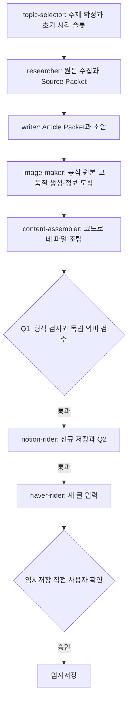

# GPT-6 Luna 실행용 상세 구현 계획

> PR 검토 범위: 이 문서는 원격보다 앞선 로컬 작업 트리의 조사 결과를 포함한다. 원격 checkout과의 차이 및 이번 PR에 포함한 증거는 [검토 범위](docs/review-package.md)를 먼저 확인한다. 현재 PR은 계획·측정 결과·리뷰 규칙을 게시하며 운영 구현을 포함하지 않는다.

## 0. 문서의 목적과 실행 범위

- 작성일: 2026-09-27 KST.
- 갱신일: 2026-09-27 KST. 조립 예비시험 실측과 후속 측정 조건 반영.
- 대상 프로젝트: `/Users/beomseok/00_AI/01_ NAVER_BLOG_AUTOMATE`.
- 계획 갱신·진행 관리·결과 검토 담당: **GPT-6 Astra**. 이번 요청은 이 문서 갱신과 사용자와의 리뷰까지다.
- 구현 담당: **GPT-6 Luna**. 이 이름은 코드를 구현할 에이전트이며, 운영 파이프라인의 모든 단계를 Luna로 바꾸라는 뜻이 아니다.
- 목표: 좋은 기존 글·이미지의 품질을 유지하거나 높이면서, **Q1을 통과한 결과 1건을 얻는 처리 시간과 반복 실패 비용을 줄인다.**
- 현재 상태: **계획 및 별도 조립 예비시험 완료, T00~T12의 운영 기능 구현·연결은 미착수**. 예비시험 코드는 `benchmarks/assembly_smoke/`에 있으며 운영 경로에 연결하지 않았다.
- 실행 시작 조건: 사용자가 이 계획의 구현을 요청한 뒤 아래 작업을 수행한다. 이번 문서 갱신으로 전체 구현·모델 전환·운영 실행을 시작하지 않는다.
- 목표 운영 계약: 조사한 최신 로컬 `AGENTS.md`이며, GitHub 리뷰에서는 [계약 snapshot](docs/reference/local-operating-contract-2026-09-27.md)을 기준으로 한다. 이 PR의 이전 운영 코드와는 아직 동기화되지 않았으므로 구현 시작 전에 T00의 기준 정합성 검사를 통과해야 한다. 참고 설계: `docs/workflow-quality-speed-proposal-2026-09-27.md`.

사용자가 구현을 요청하면 반복해서 착수 승인을 묻지 말고, 허용된 로컬 구현과 검증을 진행한다. 실제 계정 재인증, 운영 전환, 외부 저장은 해당 시점의 사용자 요청 범위와 기존 Gate에 따라 처리한다. 코딩 완료·로컬 검증·실운영 검증은 서로 다른 완료 상태로 보고한다.

구현 요청을 받으면 Astra가 실제 호출 모델을 `gpt-6-luna`로 지정해 구현을 위임하고 결과를 검토한다. 문서에 모델명을 적는 것만으로 현재 대화 모델이 자동 전환되는 것은 아니다. 호출 기록으로 모델을 확인하고, 지정 모델이 사용 불가하면 대체 실행 여부를 숨기지 않고 보고한다. 현재는 이 계획의 구현을 Luna에 위임하지 않은 상태다.

## 1. 확정한 설계 방향

1. 현재 Python 실행기를 유지하고 7개 단계의 순서·책임·필수 산출물을 보존한다.
2. AI는 자료 해석, 본문 집필, 시각 설계가 필요한 경우의 판단, 독립적인 Q1 의미 검수에 사용한다.
3. 파일 경로·본문 변환·표와 목록 문법·이미지 배치·원장·해시·manifest는 프로그램이 처리한다.
4. 조사 결과와 본문을 구조화된 패킷으로 전달하되, 원문·조건·예외를 손실시키는 요약은 하지 않는다.
5. 사진형 썸네일은 좋은 기존 결과물 수준을 유지한다. 정확한 정보 도식은 재사용 가능한 제작기로 만든다.
6. 모델과 실행 방식은 실행 접수 시 고정한다. 진행 중인 실행의 설정을 바꾸지 않는다.
7. 먼저 기존 모델로 구조 변경의 효과를 측정하고, 그다음 같은 입력으로 모델 변경 효과를 비교한다.
8. 중앙 DB, 새 오케스트레이션 프레임워크, 전체 대시보드 재작성은 이번 범위에서 제외한다.



## 2. 시작할 때 다시 확인할 기준선

아래 값은 2026-09-27 조사에서 확인한 기록이다. 후속 Luna는 최신 파일을 다시 확인하고 달라진 값은 실행 보고서에 적는다. 과거 기록을 수정하지 않는다.

| 항목 | 당시 확인 내용 | 해석 제한 |
|---|---|---|
| 현재 기본 모델 | 주제 Luna medium, 조사·집필·이미지 Terra medium, 조립 Luna low. 모두 GPT-5.6 계열 | 최신 활성 preset과 실행 snapshot 재확인 |
| 단계 시간 중앙값 | 주제 2.07분, 조사 2.95분, 집필 2.41분, 이미지 7.54분, 조립 2.83분 | 시기·모델·주제·재사용이 섞인 과거 표본. 합계를 현재 한 편의 시간으로 사용하지 않음 |
| 최근 30건 | 9월 17~27일 비시험 daily-generate 30건 모두 failed | 오류 메시지 분류이며 근본 원인 재현 결과가 아님 |
| 반복 조립 사례 | `RUN-20260912-221133-dd63c0c64ed8`: 조립 3회 약 14.27분 후 표 문법 오류로 실패 | 모델 성능 단독 지표로 사용하지 않음 |
| 원문 수집 프로필 | 공식 hostname은 `www.naver.com` 하나 | 실제 수집기·프로필이 이후 바뀌었는지 확인 |
| 이미지 검증 | local-render와 호출 증명 관련 미완료 사항이 T07 결과 문서에 기록됨 | 실제 코드와 최소 재현으로 재검증 |

단계 시간의 기존 집계 조건은 stage 이벤트, `dry_run=false`, 성공 상태, `execution=produced`, `duration_ms>1000`이었다. 이 조건은 완전한 신규 생성 여부를 판별하지 못한다. 새 계측에서는 생성·재사용을 명시적으로 나눈다.

기존에 구현된 자동 주제 결정, 재사용 분기, Q1 누적 횟수, Notion 재개, 대시보드 캐시·usage 집계는 먼저 읽고 재사용한다. 같은 기능을 새 계층으로 복제하지 않는다.

### 2.1 조립 예비시험 실측 — 2026-09-27

동일한 기존 글 `한정선 찹쌀떡`의 초안·image-map·이미지 4개를 복사해, 네 최종 파일로 변환하는 기계적 조립만 시험했다. 실제 운영 StageExecutor 전체나 운영 프롬프트 그대로의 비교는 아니다. 모델은 기본 조립 설정인 `gpt-5.6-luna / low`를 사용했고, 구현 담당으로 지정한 GPT-6 Luna의 성능을 시험한 것이 아니다.

| 시험 | 실측 시간 | 결과 |
|---|---:|---|
| 첫 모델 예비시험 | 52.938초 | LIST 내부 빈 줄로 parser 검증 실패 |
| 문법 지침 보완 후 두 번째 모델 시험 | 218.588초 | TEXT 내부 ALT 태그로 parser 검증 실패 |
| 프로그램 조립, 같은 글을 새 프로세스로 5회 | 중앙값 **0.685초**, 범위 0.680~0.748초 | 5/5 검증 통과 |
| 유효한 조립 절감률 | **산출 불가** | 성공한 모델 기준선 없음. 결과 JSON의 `reduction_percent=null` |

프로그램 측정에는 Python 시작·import·입출력·기존 parser 및 manifest 작성·검증이 포함된다. 모델 측정에는 호출·추론·도구·수정 작업과 실패 시점까지의 검증이 포함되며, 두 번 모두 parser에서 실패해 manifest 검증에는 도달하지 않았다. 입력 복사 준비와 기대 결과 비교는 측정 구간 밖이다. 변환기 개발 시간은 실행 지연에 포함하지 않았다.

검증 범위와 해석:

- 프로그램의 최종 본문 Markdown은 기존 결과와 byte 단위로 동일했다. 태그 파일 3개는 빈 블록 수를 제외한 내용·표·목록·링크·이미지 순서·alt가 같았고, 입력 초안과 이미지 파일 해시도 보존됐다.
- 5회는 **글 한 편의 반복 실행**이다. 다양한 주제 5개의 성공률이나 전체 품질 평가가 아니다. 빈 줄 배치와 모바일 읽기 경험도 이번 동등성 검증에 포함하지 않았다.
- 리서치·집필·새 이미지 생성·Q1 의미 검수·Q2·외부 저장은 실행하지 않았다. 원본 보존 확인을 최신성 검증이나 글·이미지 품질 향상으로 해석하지 않는다.
- 두 모델 시험 사이에 문법 지침을 바꿨다. 동일 조건의 반복 표본으로 평균내거나 운영 실패율·모델 자체의 품질 지표로 사용하지 않는다.
- 실패 호출에 소비된 271.526초는 실패 비용으로 보존한다. 이 값을 성공 시간으로 간주해 0.685초와 비교하거나 ‘99% 절감’으로 보고하지 않는다.
- 당시 대상 테스트 3개, Ruff 검사·포맷 검사, Basedpyright가 통과했다. 운영 전체 회귀·외부 E2E·원격 CI 완료를 뜻하지 않는다.

근거 파일:

- [시험 규칙 및 실행 명령](benchmarks/assembly_smoke/protocol.md)
- [첫 모델 실패 원자료](artifacts/workflow-optimization/assembly-smoke-20260927-01/baseline.json)
- [두 번째 모델 및 프로그램 5회 측정 원자료](artifacts/workflow-optimization/assembly-smoke-20260927-02/result.json)
- [상세 결과 보고서](artifacts/workflow-optimization/assembly-smoke-20260927-02/report.md)
- 각 실행 디렉터리의 `baseline/prompt.txt`, `model-log/attempt-1/codex-attempt-1.jsonl`에 원래 프롬프트와 호출 기록이 있다.

결론: **이 글의 기계적 조립을 내용 보존 조건 아래 1초 이내에 처리할 수 있다는 가능성은 확인했다. 전체 계획의 속도·품질 개선은 아직 미검증이다.** 이 예비 코드를 정식 renderer로 바로 채택하거나 T05·T06·T11을 완료로 표시하지 않는다.

### 2.2 예상 절감률과 측정 목표의 구분

대화에서 제시한 **전체 자동 처리시간 20~30% 단축, 중심 예상 25%**는 Astra의 설계상 가정이다. 예비시험에서 계산된 값이나 통계적 신뢰구간이 아니다. 조립 자동화, 반복 입력·호출 감소, 단계별 모델 조정이 효과를 내고 글·이미지 품질과 필수 검수가 유지된다는 전제다. 이미지 생성·조사·검수·외부 I/O가 차지하는 실제 비중에 따라 이 범위보다 작거나 클 수 있다.

| 구분 | 값 | 상태·측정 범위 |
|---|---|---|
| 기계적 조립 시간 | 중앙값 0.685초 | 한 편의 프로그램 실행 실측. 운영 Q1 시간 아님 |
| 전체 자동 처리시간 예상 | 20~30%, 중심 25% 단축 | 미검증 가정. 요청 접수 후 생성·Q1·Notion/Q2·네이버 입력 완료까지, 사용자 확인 대기 제외 |
| Q1까지의 활성 처리시간 목표 | 중앙값 30% 단축 | 기존 8절의 측정 목표 유지. 전체 자동 처리시간 예상과 분모가 다름 |
| 검증된 절감률 | 없음 | 성공한 같은 조건의 기준선과 후보 결과가 확보된 뒤 계산 |

가정의 산술 예시는 20분 작업이면 14~16분, 30분이면 21~24분이다. 현재 시스템의 평균 소요 시간이 20분 또는 30분이라는 뜻은 아니다. 구현 단계에서는 예상 수치보다 실제 측정값을 우선하며, 25%나 30%를 맞추려고 이미지·근거·검수 요구를 낮추지 않는다.

## 3. 반드시 유지할 운영 계약

- 신규 실행의 `pipeline_version=workflow-optimized-v1`, 내부 `mode=formal`, 사용자 입력 방식 2종을 유지한다.
- 수동 요청의 KST 기준일은 사용자가 제공한다. 기존 예약은 예약일 KST 날짜를 사용한다. 분야·독자·목적을 새 필수 입력으로 추가하지 않는다.
- 자동 주제는 Creator Advisor 관측과 호스트 결정 파일에 고정한다. 모델이 재선정하지 않는다.
- 브라우저 작업은 Aside만 사용한다. PATH 확인 후 `/Users/beomseok/.local/bin/aside`를 확인한다. 격리 단계에서 업데이트·재설치·다른 브라우저로 우회하지 않는다.
- researcher의 두 Lane은 같은 프로세스에서 직렬로 실행한다. writer와 image-maker의 선후관계도 유지한다.
- Q1 전 Notion 쓰기, Q2 전 네이버 입력을 허용하지 않는다.
- Q1은 동일 run ID에서 누적 최대 3회이며 재개·수동 재시도·새 실행 방식 선택으로 초기화하지 않는다. Q1 실패가 이전 producer를 자동 재호출하게 하지 않는다.
- Notion 대상 ID는 그대로 유지한다. 허용된 신규 페이지·첨부 생성만 수행하고 기존 항목을 수정하지 않는다.
- 임시저장 바로 전 대상 블로그·제목·이미지·저장 동작에 대한 사용자 확인을 유지한다. 발행·예약 발행은 수행하지 않는다.
- manifest의 필수 파일과 순서, 실제 byte size와 SHA-256, canonical digest 규칙을 유지한다. 패킷이나 검수 보고서로 기존 manifest를 대체하지 않는다.
- 공식 원본은 현행 출처 정책에 따라 사용한다. 권리 상태 `미확인`만을 이유로 원본을 생성 이미지로 바꾸지 않는다. 원본 편집은 편집 가능 여부가 따로 확인된 경우만 허용한다.
- 원본 URL·권리·제작 기록은 내부 원장에 보존한다. 공개 이미지 캡션은 실제 외부 출처명만 표시한다.
- 사람 검수를 모델이 수행했다고 기록하지 않는다. Q3는 총괄 계약상 선택 기록이며 Q1/Q2의 대체물이 아니다.

현재 이미지 하위 지침·검증기의 사람 검수 필수 조건과 총괄 Q3 선택 규칙이 충돌하는 범위는 T03에서 명시적으로 정리한다. 새 승인 대기를 자동 도입하거나 모든 이미지 검사를 삭제하는 방식으로 해결하지 않는다. 실제 사람 평가가 필요한 실험 결과는 평가가 올 때까지 미평가로 남긴다.

## 4. 작업 트리와 증거 관리

현재 작업 트리에 기존 변경이 많다. 구현 시작 시 `git status --short`와 필요한 파일의 현재 내용을 기록하고, HEAD만으로 기준선을 판단하지 않는다. 관련 입력 파일의 SHA-256 목록을 함께 남긴다. `reset`, 일괄 checkout, 기존 산출물 삭제, 무관한 포맷 변경은 하지 않는다.

검증 산출물은 새 디렉터리 `artifacts/workflow-optimization/<execution-id>/`에 남긴다. 동일 이름이 있으면 새 ID를 사용한다. 원본 운영 logs/state/manifest를 고치지 않는다. API 키·토큰·쿠키·브라우저 인증 상태를 증거에 저장하지 않는다.

후속 실행자는 다음 세 파일을 유지한다.

| 새 증거 파일 | 내용 |
|---|---|
| `ledger.md` | task ID, 상태, 수정 파일, 검사 명령·종료 코드, 결과 파일, 작업 트리 fingerprint |
| `baseline.json` | 조사 시점, 실행별 시간·usage·오류·계측 누락, 표본 분류 |
| `handoff.md` | 완료된 항목, 다음 한 작업, 실제 막힌 조건, 재개에 필요한 경로 |

기본은 Luna가 한 작업씩 구현한다. 각 작업의 완료 조건을 충족한 뒤 다음 작업으로 이동한다. 문맥이 바뀌면 ledger와 변경된 파일을 읽고 이어간다. 커밋·push·PR 작성·댓글은 사용자 요청이 있을 때 수행한다. 별도 작업에 이 계획을 전송하는 것도 이번 계획 작성에는 포함하지 않는다.

## 5. 데이터와 실행 계약

### 5.1 실행 방식 고정

새로운 정책은 `legacy`와 `optimized` 두 실행 전략으로만 시작한다. 이것은 과거 베타·정식 모드의 부활이 아니며 사용자 주제 입력 방식과도 무관하다.

- 새 `config/workflow-optimization.json`은 기본 `legacy`로 추가한다. `optimized`는 먼저 격리된 비교 실행에만 선택한다.
- run 접수 시 전략, packet/renderer/reviewer 규칙 버전 및 관련 digest를 state에 snapshot으로 기록한다. 대시보드 큐는 실행 시작이 아닌 요청 접수 시 child에 같은 snapshot을 고정하고, 예약은 각 실행 요청을 만드는 시점의 설정을 고정한다.
- resume는 저장된 snapshot을 사용한다. 다른 전략으로 이어서 실행하거나 설정 누락을 최신값으로 채우지 않는다.
- 변경 전 역사 기록의 필드 부재만 `legacy`로 해석한다. 신규 실행은 해당 snapshot을 필수로 검증한다.
- `input_fingerprint`, state 직렬화·복원, 이벤트 스키마, Gate 검증을 함께 갱신한다. 전역 설정을 중간에 바꿔 실행 중인 Gate를 우회하지 못하게 한다.
- 역할별 모델은 기존 `ModelConfigSnapshot`을 재사용한다. 모델 설정과 실행 전략 설정의 책임을 섞지 않는다.

### 5.2 Source Packet

계획 경로: `metadata/stage-packets/<run_id>/source-packet.json`.

필수 내용:

- schema version, run ID, topic ID, 원문 키워드, KST 기준일, 주제 결정 digest.
- 원문 source ID, URL, 공식·보조 구분, 관측 시각, 원시 스냅샷 경로·해시.
- claim ID, 주장, 적용 조건·예외, 근거 상태, 연결 source ID, 원문 발췌와 위치.
- 독자 질문, 답변에 필요한 claim ID, 아직 답할 수 없는 질문과 사유.
- 8개 공통 시각 슬롯 필드 전부와 공식 이미지 후보·권리 상태·원본 URL.
- 생성 규칙과 모델 설정 digest, packet digest.

확인된 사실과 해석·미확인을 구분한다. 핵심 질문의 근거가 없으면 부족함을 표시하고 중단한다. 검색 요약문만으로 공식 원문 확인을 표시하지 않는다. 주제에 필요한 근거를 확보하는 것이 기준이며, URL 개수를 채우기 위해 관련 없는 문서를 늘리지 않는다.

### 5.3 Article Packet

계획 경로: `metadata/stage-packets/<run_id>/article-packet.json`.

- 제목, 순서 있는 본문 block, 출처·claim 참조, 시각 슬롯, 이미지 문구·의도, Source Packet digest.
- block 종류: paragraph, heading, list, table, image-slot, blank. 강조·링크 등은 기존 inline markup 계약을 따르고 새로운 문법을 중복 정의하지 않는다.
- 표는 열과 셀 구조로 저장하고, 빈 값 처리·줄바꿈·구분자 escaping을 규칙으로 명시한다. 모르는 내용을 임의의 값으로 채우지 않는다.
- 공개 본문과 내부 근거·권리 정보는 별도 필드로 분리한다.
- writer가 저장할 완성 문장과 구조가 원본이다. 조립 단계는 문장과 제목을 재작성하지 않는다.
- `drafts/[키워드].md`는 같은 Article Packet에서 출력하고 별도 내용 원본으로 수정하지 않는다. Markdown을 수동 변경하면 packet과의 불일치를 잡아낸다.

초기 renderer 개발에서는 기존 Markdown에서 같은 내부 block 구조를 읽어 검증한다. 정식 optimized 경로는 packet을 단일 내용 원본으로 사용한다. 이행 중인 Markdown 입력은 명시적인 legacy 입력 경로로 제한한다.

### 5.4 스키마와 파일 소유권

- 새 packet·검수·전략 record 정의는 `schemas/workflow-contract.schema.json`의 식별 가능한 정의에 추가한다. 모호한 `anyOf`로 잘못된 record가 통과하지 않게 한다.
- 타입은 현재 frozen dataclass와 JSON boundary 패턴을 우선 재사용한다. 계획만을 위해 Pydantic·새 프레임워크를 추가하지 않는다.
- `stage_artifact_promotion.py`의 경로 허용은 researcher의 현재 run source packet, writer의 현재 run article packet만 정확히 확장한다. `metadata/**` 전체를 허용하지 않는다.
- 모델의 임시 staging 안에서 결과를 받아 호스트가 필수 필드와 digest를 완성하고 검증한다. 모델이 원본 프로젝트나 trusted work 디렉터리에 직접 기록하지 않게 한다.
- source packet과 `research/<keyword>.md`, article packet과 초안은 각각 동일 단계의 일관된 묶음으로 검증·승격한다. 부분 승격 후 실패 시 새 결과만 복구하고 기존 파일은 보존한다.
- 같은 키워드의 기존 canonical 파일을 다른 run이 덮어쓰지 않게 현재 ownership 규칙을 유지한다. 비교 실험은 별도 root에서 수행한다.

### 5.5 Q1 의미 검수 보고서

계획 경로: `.automation/work/<run_id>/content-assembler/attempt-<n>/q1-review.json`.

보고서는 호스트가 보관하며 `run_id`, `topic_id`, 시도 번호, 최종 `artifact_digest`, source/article packet digest, 정책 버전, 실제 모델·effort, 항목별 판정·관련 block/claim ID를 포함한다.

Q1 처리 순서:

1. 코드로 네 최종 파일을 생성하고 문법·슬롯·순서·파일 검사를 수행한다.
2. 기존 manifest 작성기로 현재 산출물의 digest를 만든다.
3. 동일 산출물·근거와 실제 이미지를 독립 검수 호출에 읽기 전용으로 전달한다.
4. 제목 약속·독자 질문·주장 근거·최신성·반복·시각 정보 기여를 판정한다. 긴 본문 재출력을 요구하지 않는다.
5. 보고서 schema, identity와 digest를 호스트가 검증하고 다시 manifest를 확인한다.
6. 두 검사 모두 통과했을 때만 최신 Q1 이벤트를 passed로 기록한다.

검수 보고서는 canonical manifest 파일 목록에 넣지 않아 자기참조 digest를 만들지 않는다. 대신 보고서 해시와 artifact/packet digest를 로그에 결합하고 Gate에서 검증한다. 해시만으로 모델 호출이 증명되는 것은 아니므로 호스트가 실제 완료한 검수 호출과 결과를 연결한다.

`runner_actions.stage_action()`은 현재 assembler details를 artifact digest 중심으로 새로 구성하고, `runner_stages._quality()`도 제한된 필드만 전달한다. 두 경로와 `gate._verify_latest_q1()`을 함께 수정해야 보고서가 외부 쓰기 Gate까지 유효하게 전달된다.

optimized 신규 실행에서 보고서 누락·이전 시도 보고서·다른 run·다른 digest·의미 검수 실패는 저장을 차단한다. model-review 자체의 실패도 누적 Q1 3회 안에서 처리한다. 내부 프로세스 재시도로 숨은 검수 호출이 증식하지 않게 호출 횟수와 Q1 시도 예산을 함께 기록한다.

## 6. 작업 목록과 의존성

| ID | 작업 | 선행 작업 | 상태 |
|---|---|---|---|
| T00 | 현재 파일과 재현 기준선 고정 | 없음 | 미착수 |
| T01 | 성능·실패·usage 계측 | T00 | 미착수 |
| T02 | 원문 수집과 산출물 경계 안정화 | T00 | 미착수 |
| T03 | 이미지 제작 증명과 품질 판정 정리 | T00 | 미착수 |
| T04 | packet·실행 snapshot 계약 | T01 | 미착수 |
| T05 | 결정적 renderer와 기존 문법 동등성 | T04 | 미착수 |
| T06 | Q1 의미 검수·로그·Gate 연결 | T05 | 미착수 |
| T07 | researcher·writer의 packet 생성 연결 | T02, T04, T06 | 미착수 |
| T08 | 이미지 템플릿·제작기 연결 | T03, T07 | 미착수 |
| T09 | GPT-6 모델 후보와 설정 연결 | T06 | 미착수 |
| T10 | 근거에 기반한 재사용·resume 검증 | T07, T08, T09 | 미착수 |
| T11 | 동일 입력 품질·속도 비교 | T01~T10 | 미착수 |
| T12 | 실제 흐름 검증과 운영 전환 | T11 | 미착수 |

기본 실행 순서는 번호순이다. 인증이나 사람 평가처럼 외부 조건만 막혀 있으면 의존하지 않는 로컬 작업을 진행하되, 막힌 task를 완료로 표시하지 않는다.

조립 예비시험은 위 작업 목록 외의 탐색 실험으로 완료됐다. T05의 구현 참고 자료로 사용하되 운영 문법 전체·Article Packet·Q1 연결을 충족하지 않아 해당 task의 상태는 미착수로 유지한다. T06까지 연결하면 3개 고정 입력으로 조립과 Q1을 포함한 작은 비교를 먼저 수행하고, T11에서 전체 파이프라인·모델 비교로 확장한다.

### T00. 현재 파일과 재현 기준선 고정

**읽을 파일:** `AGENTS.md`, 단계별 Markdown, `evaluation-rubric.md`, 기존 제안서, `tools/runner_actions.py`, `tools/codex_stage_executor.py`, `tools/model_presets.py`, `tools/stage_artifact_promotion.py`.

**수행:** 현재 변경 목록과 관련 파일 fingerprint를 남긴다. 성공·실패·재사용 실행을 구분해 표본을 선정한다. 원본 운영 자료를 읽기 전용으로 복사한 테스트 fixture root를 만든다. 사용자 정보나 계정 값은 fixture에 넣지 않는다.

구현할 checkout의 코드·단계별 지침·스키마·manifest·검사기와 목표 계약의 차이를 먼저 목록화한다. 필요한 기존 변경만 의존성 단위로 가져오고, 운영 로그·원본 글·이미지·인증 자료를 일괄 게시하지 않는다. 최소한 다음을 같은 revision의 회귀 검사로 확인한다.

- `naver-input.md`를 포함한 네 최종 Markdown과 모든 필수 자산이 manifest의 size·SHA-256·digest 검증에 포함된다.
- Q3 기록이 없어도 Q1·Q2와 대상·digest 검증을 통과한 네이버 입력은 허용된다. Q1/Q2 실패·대상 불일치·산출물 변조는 차단하고, 임시저장은 별도 명시적 사용자 확인 전까지 차단한다.
- 사용자 주제·자동 주제의 단일 파이프라인, Q1 누적 재시도 한도, 외부 저장의 중복 방지와 기존 로그·manifest 읽기 호환을 보존한다.

현재 로컬에 있는 동작이라도 GitHub의 구현 기준에 존재하는지 확인한다. 문서만 최신 계약으로 바꾸거나 옛 코드에 계획을 바로 적용한 상태를 기준선으로 승인하지 않는다.

**산출물:** ledger, 기준선 파일 목록, 현재 모델·계약 snapshot, 계약 차이와 동기화 기록, 같은 revision의 회귀 검사 결과, 3개 초기 비교 사례.

**완료 조건:** 다른 세션에서도 같은 입력 파일과 해시로 사례를 복원할 수 있다. 구현 기준의 코드·계약 정합성과 관련 회귀 검사를 통과해야 T01 이후로 진행한다. 기존 작업 트리·운영 로그에 수정이 없다.

### T01. 성능·실패·usage 계측

**기존 대상:** `tools/dashboard_usage.py`, `tools/runner_stages.py`, `tools/codex_process.py`, `schemas/workflow-contract.schema.json`.

**신규 계획:** `tools/workflow_performance_report.py`, `tests/test_workflow_performance_report.py`.

**수행:** 기존 usage 증분 파서를 재사용해 읽기 전용 보고서를 만든다. run/stage/outer attempt/process attempt/model/effort/생성·재사용을 구분한다. 새 실행에는 자료 수집, 모델·도구 호출, 이미지 생성, 파일 변환, 검수, 외부 I/O, 대기 시간을 겹치지 않게 기록한다. 얻을 수 없는 세부 시간은 null로 둔다.

입력 전체·캐시 입력·비캐시 입력·출력·reasoning을 구분하고 제공되지 않은 필드는 unknown으로 표시한다. cached input을 입력 전체에 다시 더하지 않는다. usage 없는 실패를 0토큰으로 처리하지 않는다. 잘린 JSONL, 구·신 attempt 경로 중복, 재개, 파일 교체·축소를 처리한다.

**검증:** `tests/test_dashboard_usage.py`, `tests/test_runner_telemetry.py`, 신규 보고서 테스트. missing usage, 재시도 합계, 캐시 중복 집계, 성공 0건의 분모 처리 사례를 포함한다.

**완료 조건:** 기존 로그로 집계 재현, coverage 표시, 오류 분류, 원본 무수정. CLI의 정상 입력·잘못된 입력·help를 직접 실행한다.

### T02. 원문 수집과 산출물 경계 안정화

**대상:** `tools/research_browser_capture.py`, `tools/research_capture_policy.py`, `tools/research_readiness.py`, `tools/research_crawler_bridge.py`, `tools/codex_stage_executor.py`, `tools/codex_stage_command.py`, `tools/stage_artifact_promotion.py`, `config/research-source-profiles.json`.

**수행:** 최근 오류 5종을 재현 가능한 범위에서 분리한다. Aside 접근 실패와 모델 프로세스 실패를 동일 원인으로 뭉뚱그리지 않는다. 확인되지 않은 인증 문제를 자동 로그인·설정 초기화로 처리하지 않는다.

공식 원문 프로필을 benchmark 주제에 필요한 검증된 기관·브랜드부터 보완한다. 공식 주체와 정확한 host를 확인한 근거를 남긴다. 원문 수집은 제한된 탐색 예산 안에서 핵심 질문의 근거 확보 여부로 종료한다. 임의 hostname을 공식으로 승격하거나 모든 도메인을 허용하지 않는다.

researcher 완료 직후 readiness를 검사해 다음 producer 호출 전에 실패시키고, 원인은 researcher 자료 부족으로 기록한다. 브라우저 원시 입력은 모델 출력과 분리해 변경을 차단한다. staging의 선언 누락은 파일 검사를 끄는 대신 호스트의 정확한 산출물 목록 작성으로 줄인다.

**검증:** `test_research_capture_boundaries.py`, `test_research_readiness.py`, `test_stage_artifact_promotion.py`, `test_codex_stage_executor.py`, `test_aside_browser.py`. 원문 부족 시 writer 호출 0회, 원시 근거 변조·추가 파일·타 run 경로 차단을 확인한다.

**완료 조건:** 공식/보조 원문 확보 사례와 부족 사례가 구분되고, 오류가 발생한 단계·필요 조치가 정확히 보고된다. 실제 Aside 검증이 막혔으면 로컬 통과와 별도로 미검증을 기록한다.

### T03. 이미지 제작 증명과 품질 판정 정리

**대상:** `tools/image_quality.py`, `tools/image_contract.py`, `schemas/workflow-contract.schema.json`, `image-maker.md`, `image-style-guide.md`, `evaluation-rubric.md`, `docs/task-7-image-production-result.md`.

**수행:** T07 문서의 local-render 실패를 현재 코드에서 재현한다. snapshot·renderer version, 실제 파일 크기·decode·해시 검사를 올바르게 연결한다. metadata 문자열만으로 실제 제작 방식·호출 성공을 인정하지 않는다.

호스트 이미지 실행 계층에 생성 요청의 실제 제어값, 요청·응답 식별자 또는 도구 실행 증거, 참조 이미지 해시, 출력 해시를 기록한다. 모델이 스스로 작성한 영수증은 거부한다. 인증값·원문 응답의 민감 정보는 저장하지 않는다.

기존 도구가 모델 snapshot·quality를 제어하지 못하면 `locked`를 만들어 쓰지 않는다. 제어 가능한 기존 허용 경로의 존재를 먼저 확인하고, 없으면 이미지 운영 경로를 미완료로 보고한다. 이 계획을 근거로 새 유료 API 계약이나 임의 공급자로 전환하지 않는다.

구 metadata는 역사 기록으로 읽을 수 있게 하되 신규 optimized 자산의 제작 증명으로 재승격하지 않는다. 실제 사람 평가와 모델 평가를 분리하고 Q3 선택 규칙은 유지한다. 신규 운영 Gate가 요구할 자동 검사는 source·파일·의미·모바일 증거를 포함한다.

**검증:** `tests/test_image_quality.py`, `tests/test_workflow_contract.py`. 실제 local-render 산출물 통과, 다른 output hash·위조 호출 증거·잘못된 크기·1px 이미지 차단, 사람이 평가하지 않은 결과의 human pass 차단.

**완료 조건:** 실제 파일에 연결된 제작 증명과 정확한 평가 주체가 남는다. 과거 약한 테스트의 생산 준비 판정은 역사 읽기 테스트와 신규 운영 차단 테스트로 분리하고, 검증을 없애서 통과시키지 않는다.

### T04. Packet과 실행 snapshot 계약

**대상:** `schemas/workflow-contract.schema.json`, `schemas/manual-batch.schema.json`, `tools/runner_types.py`, `tools/runner_state_request.py`, `tools/runner_job.py`, `tools/stage_artifact_promotion.py`, `tools/dashboard_manual_models.py`, `tools/dashboard_manual_request.py`, `tools/dashboard_manual_run.py`.

**신규 계획:** `tools/stage_packets.py`, `tools/workflow_optimization_config.py`, `config/workflow-optimization.json`, `tests/test_stage_packets.py`, `tests/test_workflow_optimization_config.py`.

**수행:** 5절의 Source/Article Packet 타입·파서·digest와 실행 전략 snapshot을 만든다. JSON 경계에서 검증하고 내부에서는 검증된 타입을 전달한다. 내부 block 모델은 `tools/notion_content_models.py`의 기존 구조와 호환시켜 두 개의 상충하는 문법을 만들지 않는다.

단계 소유권·현재 run 경로·원문 identity·필수 시각 슬롯을 검증한다. canonical manifest의 기존 파일 순서는 바꾸지 않는다. 신규 record의 식별자를 추가하고 옛 이벤트·manifest를 읽는 회귀 검사를 유지한다. 대시보드 child 저장·직렬화·RunnerRequest 변환·retry/external action 재개까지 동일 snapshot이 전달되게 연결한다. 현재 단일 child 계약과 과거 3-child 읽기 호환은 유지한다.

**검증:** 신규 테스트, `test_runner_state.py`, `test_runner_recovery_concurrency.py`, `test_workflow_compatibility.py`, `test_stage_artifact_promotion.py`.

**완료 조건:** 잘못된 run/기준일/근거 참조/시각 필드/해시/경로가 거부되고, 다중 산출물 승격 실패 후 원상태가 보존된다. resume의 전략 변경·필수 snapshot 제거를 차단한다.

### T05. 결정적 renderer와 문법 동등성

**기존 대상:** `tools/notion_content_models.py`, `tools/notion_copy_grammar.py`, `tools/notion_copy_parser.py`, `tools/notion_copy_normalizer.py`, `tools/notion_inline_markup.py`, `tools/manifest.py`.

**신규 계획:** `tools/article_renderer.py`, `tools/article_render_cli.py`, `tests/test_article_renderer.py`. 입력 어댑터가 복잡해지면 해당 책임만 별도 파일로 분리한다.

**수행:** 문단·소제목·목록·표·링크·이미지·빈 줄을 한 block 구조에서 기존 최종 파일 4종으로 출력한다. 빈 셀·구분자·따옴표·한글·공백 있는 경로·BOM 처리 계약을 정한다. 파싱이 안 되는 구조를 조용히 생략하지 않는다.

썸네일을 첫 이미지로 두되 manifest의 해시 순서와 혼동하지 않는다. 공개 출처 표시와 내부 메타데이터 제거는 기존 허용 범위만 적용한다. 내용·표·링크·서식 의미가 같고 각 format의 문법이 유효한지 검증한다.

첫 구현은 운영 경로에 붙이지 않고 격리 root에서 기존 초안·자산을 입력받아 생성한다. 읽은 초안을 수정하지 않는다.

**예비시험 반영:** `benchmarks/assembly_smoke/render.py`, `check.py`, `test_render.py`의 한 편 동등성 검증을 출발점으로 참고한다. 이 코드는 제한된 Markdown만 지원하므로 그대로 운영 경로에 복사하지 않는다. 기존 parser를 기준으로 LIST/TABLE 내부 빈 줄과 TEXT/IMAGE/ALT 경계를 구조적으로 출력하고, 예비시험에서 관측한 두 오류를 회귀 사례로 추가한다. 빈 블록을 비교에서 제외한 시험의 한계는 실제 레이아웃·모바일 검증으로 보완한다.

**검증:** text/table/list/link/image/blank를 모두 포함한 실제 fixture, 과거 `TABLE pipe row contains an empty cell` 등 실패 사례. 출력 재파싱 후 독립적인 기대 block과 비교하고 manifest 검증을 수행한다. 자신의 출력을 기대값으로 복사하는 테스트를 만들지 않는다.

**완료 조건:** 동일 입력·고정 설정에 동일 출력, 네 파일 내용 동등성, 누락·외부 원장 노출 차단. CLI 정상·bad input·help 직접 확인. 성능은 렌더러와 Q1 추론 시간을 나눠 측정한다.

### T06. Q1 의미 검수와 Gate 연결

**대상:** `tools/codex_stage_executor.py`, `tools/codex_stage_command.py`, `tools/runner_execution.py`, `tools/runner_actions.py`, `tools/runner_attempt.py`, `tools/runner_stages.py`, `tools/gate.py`, `tools/workflow_hook.py`, 관련 스키마와 `content-assembler.md`.

**신규 계획:** `tools/q1_semantic_review.py`, `tools/optimized_stage_executor.py`, `tests/test_q1_semantic_review.py`, `tests/test_optimized_stage_executor.py`.

**수행:** 기존 StageExecutor 인터페이스를 지키는 얇은 분기에서 optimized assembler만 교체한다. 실제 executor를 만드는 `runner_execution.py`에서 저장된 전략에 따라 선택되게 연결하고, 테스트·benchmark에서 명시적으로 주입한 executor를 무시하지 않는다. CLI·대시보드·resume가 같은 선택 규칙을 쓰게 한다. 별도 범용 실행 프레임워크를 만들지 않는다. 단계 이벤트는 계속 content-assembler로 기록한다.

검수 호출은 산출물을 새로 만드는 producer 호출과 구분한다. 기존 `_require_produced_execution`을 모든 단계에서 약화하지 말고, 검수 전용 구조화 결과·읽기 전용 입력·완료 상태를 사용한다. 기존 격리·프로세스 실행기를 재사용한다.

5.5절의 보고서 결합과 Gate 검사를 구현한다. 모델이 선언한 run ID나 digest는 신뢰하지 않고 호스트 값과 대조한다. 검수 뒤 파일이 바뀌면 기존 pass를 재사용하지 않는다. renderer 오류는 코드로 수정 가능하지만 본문·근거 결함을 발견하면 assembler가 원문을 고치거나 앞단계를 다시 호출하지 않고 중단한다.

**검증:** 신규 테스트, `test_q1_repair_loop.py`, `test_runner_actions.py`, `test_runner_telemetry.py`, `test_gate_and_manifest_regressions.py`, `test_notion_write_gate.py`, `test_workflow_hook.py`.

**완료 조건:** schema pass/semantic fail인 결과의 Notion 호출 0회, report 누락·변조·stale report 차단, 3회 소진 후 추가 호출 0회, legacy 읽기 호환. 최종 파일 전체를 재작성하는 LLM 호출이 사라지고 독립 검수 호출은 남는다.

**조기 비교:** T00에서 고정한 3개 입력으로 기존 조립과 새 조립을 격리 실행한다. 현재 모델 설정을 양쪽에 동일하게 유지하고 실제 StageExecutor·운영 프롬프트를 기준선에 사용한다. 양쪽이 같은 근거·글·이미지를 대상으로 동등한 Q1 검수를 수행하도록 한 뒤, 프로그램 변환 시간·모델 검수 시간·재시도 시간·Q1까지의 합계를 분리한다. 성공한 짝의 비교가 없으면 절감률은 계산 불가로 남긴다. 이 결과는 조립 변경의 판단 자료이며 T11이나 운영 전환의 완료를 대신하지 않는다.

### T07. Researcher와 writer의 packet 생성 연결

**대상:** `tools/codex_stage_executor.py`, `tools/codex_stage_command.py`, `tools/stage_artifact_promotion.py`, `researcher.md`, `writer.md`, `content-assembler.md`, `schemas/stage-result.schema.json`.

**수행:** optimized researcher가 Source Packet을, writer가 Article Packet을 반환하게 한다. 호스트가 schema와 identity를 검사하고 기존 research/draft Markdown도 같은 자료에서 생성한다. keyword·run·파일명·해시 등 정해진 값은 호스트가 부여한다.

모델 입력에는 단계에 필요한 계약과 관련 근거를 전달하되 총괄 안전 규칙을 삭제하지 않는다. 전체 원문이 필요하면 해당 claim의 보존 원문을 조회할 수 있게 한다. 영구 지침을 캐시할 때는 규칙 버전·내용 해시를 포함한다. 긴 입력을 줄였다는 이유만으로 처리 시간 개선을 주장하지 않는다.

topic-selector 산출물과 고정 주제는 유지한다. 초기에는 topic-selector 자체의 LLM 호출을 제거하지 않는다. Source/Article Packet이 충분히 검증된 뒤 별도 측정으로 판단한다.

**검증:** `test_codex_stage_executor.py`, `test_stage_artifact_promotion.py`, `test_research_readiness.py`, 신규 packet·executor 테스트. 주장에 없는 내용 추가, 조건 손실, 잘못된 source ID, 제목 질문 미충족, 시각 슬롯 누락 사례를 포함한다.

**완료 조건:** research → draft → final의 내용 출처와 슬롯이 추적되고, 다음 단계가 긴 Markdown 전체를 다시 해석할 필요가 줄어든다. legacy 실행은 기존 산출물을 계속 읽는다.

### T08. 이미지 템플릿과 제작기 연결

**대상:** image-maker 경로, `tools/image_quality.py`, 이미지 지침, Article Packet의 시각 명세.

**신규 계획:** `tools/image_render.py`, `tests/test_image_render.py`, version이 있는 최소 템플릿 자산 디렉터리.

**수행:** 우선 비교표·절차·일정 세 유형만 지원한다. 검증된 값·문구·레이아웃을 입력받고 한글 폰트, 글자 넘침, 대비, 모바일 폭을 검사한다. 실제 렌더러가 필요한 라이브러리는 기존 설치·프로젝트 의존성을 확인한 뒤 pyproject/lock에 재현 가능하게 반영한다.

공식 원본·사진형 생성·도식 local-render를 명시적으로 분기한다. 썸네일을 단순 도형 카드로 대체하지 않는다. 이미지 수를 고정으로 줄이거나 필수 슬롯을 text-only로 바꿔 속도 목표를 맞추지 않는다.

제작기는 renderer/font/input/output 해시와 제작 방식을 기록한다. image-map과 generation/quality 원장은 실제 결과에서 작성한다. 관련 없는 오래된 이미지를 품질 재검수 없이 재사용하지 않는다.

**검증:** 실제 이미지 제작과 390×844 모바일 표시 확인, 긴 한글·숫자·좁은 표·공식 원본 무편집·thumbnail 중복 hash 차단. 브라우저 렌더 확인은 Aside로만 수행한다.

**완료 조건:** 최소 세 도식 유형의 정보·가독성이 검증되고 좋은 사진형 썸네일 기준이 유지된다. 실물 파일 확인 없이 metadata 테스트만으로 완료 처리하지 않는다.

### T09. GPT-6 모델 후보와 설정 연결

**대상:** `tools/model_presets.py`, `tools/dashboard_model_settings.py`, `tools/codex_stage_command.py`, `tools/startup_project_contract.py`, `tools/codex_profile_isolation.py`, 필요한 대시보드 preset 표시와 테스트.

**비교 후보:**

| 단계 | 후보 | 비고 |
|---|---|---|
| topic-selector | `gpt-6-luna`, low | 고정 주제의 이유·독자 질문·시각 계획 |
| researcher | `gpt-6-sol`, medium | 원문과 주장 연결 |
| writer | `gpt-6-sol`, medium | 한국어 본문 품질 우선 |
| image-maker | `gpt-6-luna`, low | 필요할 때 제작 지시 정리. 실제 이미지 모델과 구분 |
| content-assembler | `gpt-6-sol`, low/medium 비교 | 코드 조립 뒤 Q1 의미 검수 모델 |

**수행:** 필요한 조합만 허용 목록에 추가하고 후보 preset을 명시적으로 만든다. 현재 활성 기본 preset을 즉시 바꾸지 않는다. 기존 설정 snapshot의 파싱·digest·재개를 유지한다. 조립 모델 표시에는 실제로 Q1 검수에 쓰인다는 점을 반영한다.

현재 UI는 기존 preset을 복제하는 경로 중심이므로 후보 preset을 선택·저장할 실제 경로도 확인한다. 기능에 필요한 최소 UI 변경만 수행한다. 임의 모델 텍스트를 무제한으로 받아들이지 않는다.

모델 availability·routing·reasoning 지원은 구현 당시 실제 Codex 격리 호출로 확인한다. 문서상의 API 지원과 현재 Codex 계정 실행 가능 여부를 혼동하지 않는다. 전역 provider·사용자 계정 설정을 고쳐 우회하지 않는다.

**검증:** `test_dashboard_model_settings.py`, `test_codex_stage_executor.py`, `test_startup_preflight.py`, `test_codex_profile_isolation.py`, `test_dashboard_ui.mjs`. 서로 다른 override/default 값으로 실제 우선순위를 검증하고 전체 격리 설정을 완화하지 않았는지 확인한다.

**완료 조건:** 후보가 실제 단계 명령에 적용되고 run별로 고정됨. 새 설정 저장 후에도 이미 시작된 실행은 기존 설정을 사용함. 실제 실행이 불가능한 모델은 후보 미검증으로 남기고 성공을 꾸미지 않음.

### T10. 재사용과 resume 검증

**대상:** `tools/research_freshness.py`, `tools/research_freshness_v2.py`, `tools/codex_stage_executor.py`, `tools/runner_state_request.py`, `tools/runner_records.py`, packet·이미지 제작 코드.

**수행:** 기존 캐시·재사용을 확장한다. 키에는 원문 키워드·기준일·원시 근거 digest·주장/본문 digest·규칙 버전·모델 snapshot·renderer/font·출처 정책 등 해당 결과에 영향을 주는 입력을 포함한다.

원문이나 정책이 바뀌면 관련 산출물 재사용을 무효화한다. 시간에 민감한 가격·일정·판매 상태는 기준일에 재확인한다. 내용에 영향 없는 실행 식별 필드는 별도 결합해 잘못된 run의 권한을 가져오지 않게 한다.

캐시 hit도 현재 필수 검사와 Gate를 통과해야 한다. 이미 Q1/Q2를 통과한 다른 run의 저장 권한·Notion page ID·사용자 확인은 재사용하지 않는다. cache hit와 새 생성을 이벤트에서 구분한다. 자동 전면 재실행이나 nested retry를 추가하지 않는다.

**검증:** `test_research_freshness.py`, `test_runner_state.py`, `test_runner_recovery_concurrency.py`, `test_q1_repair_loop.py`, `test_notion_resume_runner_integration.py`, 신규 executor 테스트.

**완료 조건:** 입력 불변 시 재사용, 단일 근거·폰트·정책 변경 시 필요한 부분 invalidation, 다른 run의 외부 쓰기 권한 재사용 차단, resume 후 Q1 예산 유지.

### T11. 같은 입력으로 품질·속도 비교

**신규 계획:** `tools/workflow_benchmark.py`, `tests/test_workflow_benchmark.py`, `tests/fixtures/workflow_optimization/`.

**수행:** benchmark는 실제 StageExecutor와 renderer를 실행하되 별도 fixture root를 사용한다. Notion·네이버 live adapter가 주입되면 즉시 거부한다. 기존 `--dry-run`이 실제 producer를 실행하는지 확인 없이 benchmark 대용으로 쓰지 않는다.

2.1절 예비시험의 실패 출력·시간·원래 프롬프트를 보존하고 재현 fixture로 활용한다. 정식 기준선은 축약 조립 프롬프트가 아닌 해당 전략의 실제 운영 경로로 새로 확보한다. 시도 수·시간 제한·재시도 규칙·측정 구간·동등성 기준은 시작 전에 고정하며, 도중에 규칙을 바꾸면 별도 실험으로 구분한다. 모델 출력의 수동 보정 시간을 숨기거나 실패 사례를 성공 표본에 넣지 않는다. T06의 조기 비교 결과도 최종 보고서에 포함한다.

먼저 3개 입력으로 도구·평가표를 확인한 뒤 제품·음식, 행사·여행, 정책·절차, 비교·설명에서 각 3개씩 총 12개 고정 입력으로 확장한다. 기준일·자료·본문 요구·이미지 슬롯을 고정한다.

비교군은 A: 현재 구조+현재 모델, B: optimized 구조+현재 모델, C: optimized 구조+후보 모델이다. A와 B는 같은 원시 자료를 제공하고 각 입력 adapter가 처리하게 한다. 단계별 분리 실험으로 이미지 생성 대기와 조립 효과도 따로 측정한다. 변경을 한 번에 모두 섞은 결과만 제시하지 않는다.

기존 경로가 실패하는 입력도 포함하고 실패·재시도 시간을 기록한다. 양쪽 모두 품질을 통과한 paired 사례의 시간과 전체 입력의 통과율을 별도로 보고한다. 성공 사례만 골라 전체가 빨라졌다고 주장하지 않는다.

모델 이름을 가린 글·이미지 평가를 수행한다. 자동 점수와 사람 점수는 구분한다. 시간은 순서를 교차해 같은 계정의 혼잡 영향을 줄이고, 경쟁 후보가 비슷하면 경계 사례를 반복한다.

**완료 조건:** 8절의 수용 기준, 원본 결과·보고서·coverage·실패 목록이 남음. 모델 호출만 빠르고 최종 결과는 나빠지는 후보는 채택하지 않음.

### T12. 실제 흐름 검증과 운영 전환

**선행:** T11 채택 조건 통과와 해당 운영 작업에 대한 사용자 실행 요청 범위 확인. 네이버 임시저장 직전 확인은 별도 유지.

**수행:** 기존 대시보드 `http://127.0.0.1:8765`에서 Aside로 실제 요청을 사용한다. 자동 주제 1건과 사용자 주제 1건을 포함하고 필요하면 문제 유형 1건을 추가한다. 같은 글을 여러 번 외부 저장하는 시험은 하지 않는다.

실제 Q1, 지정 Notion 데이터 소스 신규 저장, Q2 재조회, 네이버 새 글 입력, 사용자 확인 대기 상태를 관측한다. 승인이 있으면 임시저장까지 확인하고, 없으면 대기를 정상 상태로 보고한다. 확인 대기를 시스템 오류로 취급하지 않는다.

별도 검수자가 모바일 본문과 이미지를 확인한다. 대시보드 모델 설정·상태·오류 표시도 실제로 사용한다. 운영 전환 시 기존 설정을 보존하고 신규 접수만 optimized로 선택한다. 이미 실행 중인 작업과 예약을 임의로 중단하거나 다른 모델로 바꾸지 않는다.

**완료 조건:** 코드 완료, 로컬 검증, 외부 E2E, 사용자 확인·임시저장 각각의 결과가 구분됨. 외부 인증·사람 평가가 없으면 해당 범위가 미완료라는 사실과 필요한 한 가지 조치를 보고함.

## 7. 검증 명령과 실행 표면

다음은 현재 존재하는 로컬 품질 검사 명령이다. 구현 작업별 관련 테스트부터 실행하고, 통합 변경이 끝난 시점의 현재 작업 트리에서 전체 검사를 한 번 실행한다. 코드가 다시 바뀌면 영향 범위를 다시 검사한다.

```bash
uv run --no-sync pytest -q tests/test_codex_stage_executor.py tests/test_stage_artifact_promotion.py tests/test_q1_repair_loop.py tests/test_runner_actions.py
uv run --no-sync pytest -q tests/test_image_quality.py tests/test_research_readiness.py tests/test_research_freshness.py tests/test_dashboard_model_settings.py
uv run --no-sync ruff check tools tests
uv run --no-sync basedpyright
uv run --no-sync pytest -q
npm test
```

의존성 환경이 없으면 현재 lock을 먼저 확인하고 CI와 같은 `uv sync --frozen --group dev`로 준비한다. 새 의존성 추가는 실제 기능에 필요한 경우에만 pyproject와 lock을 함께 갱신한다. 기존 실패는 기준선과 비교해 구분하고, 자신의 변경이 만든 실패는 해결한다.

아래 CLI는 **이 계획에서 새로 만들 기능**이며 현재 존재하는 명령이 아니다. 구현자가 이 인터페이스를 만든 뒤 실제로 실행하고 증거를 남긴다.

```text
python3 -m tools.workflow_performance_report --root <프로젝트> --limit 30 --output <새-보고서.json>
python3 -m tools.article_render_cli --fixture-root <격리-root> --input <article-packet.json> --output-root <새-출력-root>
python3 -m tools.workflow_benchmark --cases <cases.json> --variant <baseline|optimized-current|optimized-candidate> --output-root <새-결과-root>
```

각 신규 CLI는 `--help`, 올바른 입력, 누락·잘못된 입력을 직접 실행한다. 문자열의 프롬프트 문구를 테스트하지 말고 파일·정규화 block·Gate 결정·호출 횟수·실제 모델 선택 같은 행동을 검증한다.

CI 성공은 실제 원격 실행이 있을 때만 적는다. PR을 생성하지 않았다면 `로컬 검사 결과 / 원격 CI 미실행`으로 보고한다. 네이티브 자동 리뷰 연결도 별도 요청 없이 완료했다고 표시하지 않는다.

## 8. 최종 수용 기준

| 구분 | 기준 |
|---|---|
| 글 품질 | 현행 100점 rubric 85점 이상, 즉시 실패 0, 동일 입력의 기존 좋은 결과보다 핵심 항목·종합 중앙 평가 저하 없음 |
| 제목·정보 | 제목이 약속한 구체적 질문에 근거 있는 답변. 자료 부족을 일반론 반복으로 채워 통과시키지 않음 |
| 이미지 | 평가 5항목 합 16/20 이상·개별 3점 이상, 관련성·가독성·완성도·정보 기여 유지. 썸네일 단순화로 속도 목표를 맞추지 않음 |
| 무결성 | 네 최종 파일·이미지·썸네일·manifest·Q1 보고서가 동일 결과에 결합됨 |
| 안전 | 외부 중복 쓰기, 대상 불일치, Q1/Q2 우회, 확인 없는 임시저장 0건 |
| 속도 | 정상 기준선 확보 후 Q1까지 활성 처리시간 중앙값 30% 단축을 목표로 측정. 달성 전에는 목표로만 표시 |
| 예상치 검증 | 전체 자동 처리시간 20~30% 단축·중심 25%는 미검증 가정. Q1까지 30% 목표와 구분하고 0.685초 예비시험으로 환산하지 않음 |
| 느린 사례 | P90 악화 없음. 12개 표본의 P90은 잠정값이며 운영 데이터로 보완 |
| 완료율 | 동일 입력 평가셋에서 품질 통과율 저하 없음. 실패·재시도 소비 시간 포함 |
| 사용량 | 입력·캐시·비캐시·출력·reasoning과 누락 coverage 분리. 사용량 감소율을 시간 감소율로 환산하지 않음 |
| 호환 | 기존 로그·manifest·state 읽기, 이전 preset, resume·Q1 누적 횟수, legacy 외부 저장 계약 회귀 없음 |

속도 비교의 주요 지표는 Q1까지의 활성 처리시간이다. 원문 수집부터 외부 저장·네이버 입력까지의 전체 자동 처리시간과 사용자 확인 대기는 별도 측정한다. 성공 0건이면 ‘성공 1건당 시간’을 계산 불가로 표시한다.

품질 기준은 통과했지만 30% 목표를 못 달성하면 실제 개선율과 남은 병목을 보고한다. 목표 수치를 맞추려고 글 길이·이미지 슬롯·검수·원문 확인을 줄이지 않는다. 품질 비교에 필요한 사람 평가가 없으면 그 결과는 미검증이다.

## 9. 롤백과 실패 처리

- optimized가 문제를 일으키면 신규 접수 전략을 legacy로 되돌린다. 실행 중인 run은 저장된 전략을 유지하거나 안전하게 중단하고 원인을 기록한다.
- 다른 전략으로 같은 run을 이어서 처리하거나 Q1 예산을 초기화하지 않는다.
- 새 코드·설정의 롤백 대상은 자신이 만든 변경으로 한정한다. 기존 dirty 변경과 역사 자료는 보존한다.
- 실패한 이미지 한 장의 수정이 허용되는 상황에서도 본문·근거 변경 여부를 검사한다. 이미 검증된 digest가 바뀌면 관련 검수는 다시 필요하다.
- Notion 저장 여부가 불명확하면 기존 run ID 재조회·재개 계약으로 확인한다. 무조건 신규 페이지를 만들지 않는다.
- 코드·Gate 결함은 수정하고 회귀 검사한다. 인증·권한·사용자 판단이 필요할 때만 해당 외부 작업을 멈추고 정확한 이유를 알린다.

## 10. Luna의 결과 보고 형식

각 작업이 끝날 때 다음 내용을 ledger와 사용자 보고에 남긴다.

```text
작업: Txx <작업명>
상태: 완료 / 진행 중 / 외부 조건 대기
변경: <파일과 달라진 동작>
검증: <실행한 명령·실제 시나리오·결과 경로>
품질·속도: <측정값 또는 미측정>
남은 조건: <있으면 구체적으로>
다음 작업: <의존성을 충족한 task ID>
```

최종 보고에는 구현 완료 범위, 기존 실패와 새 실패 구분, 품질 비교, 실측 시간·usage, 채택 모델, 외부 E2E·사용자 확인·임시저장 상태, 롤백 방법을 포함한다. 새 기능의 존재만으로 운영 검증이 끝났다고 말하지 않는다.

## 11. 구현을 시작할 때 GPT-6 Luna에 전달할 프롬프트

아래 문장은 사용자가 실제 구현을 시작하기로 결정한 뒤 전달한다.

전달 전 Astra가 실제 실행 모델을 `gpt-6-luna`로 지정한다. 아래 프롬프트를 현재 Astra 대화에 적는 것만으로 Luna가 실행되었다고 기록하지 않는다.

> 프로젝트 루트의 AGENTS.md와 Plan.md를 읽고, Plan.md의 T00부터 의존성 순서대로 구현하세요. 목표는 좋은 기존 글·이미지 품질을 유지하면서 Q1 통과 결과를 얻는 시간과 반복 실패를 줄이는 것입니다. 현재 dirty 작업 트리와 역사 자료를 보존하고, 각 task의 완료 조건을 실제로 검증한 뒤 ledger에 기록하세요. 이미 있는 실행기·캐시·스키마·Gate를 재사용하고 무관한 리팩터링은 하지 마세요. 구현 담당 모델이 GPT-6 Luna라는 이유로 운영의 모든 모델을 Luna로 바꾸지 마세요. 외부 조건이 막혀도 독립적인 로컬 구현은 진행하되, 외부 검증 결과를 꾸미지 마세요. Q1/Q2, Aside 전용 접근, 연구 Lane 직렬 실행, 네이버 임시저장 직전 사용자 확인을 유지하세요. 코드 완료·로컬 검사·품질 비교·실운영 검증을 나누어 보고하세요. 커밋·push·PR·운영 전환은 실제 사용자 요청 범위에 따라 수행하세요.

> 2.1절의 예비시험은 프로그램 조립의 가능성만 확인했습니다. 모델 기준선은 두 번 모두 실패했고 유효한 절감률은 없습니다. 2.2절의 전체 시간 20~30%·중심 25%는 추정이며 성과로 인용하지 마세요. T05에서 parser 호환성을 보완하고, T06 뒤 실제 운영 경로와 동등한 Q1을 포함한 3개 입력의 조기 비교를 먼저 수행하세요. 본문·이미지 보존과 실제 품질 평가를 구분하고, 실패·재시도 비용과 미측정 범위를 모두 보고하세요.

## 12. 설계 근거

- 현재 프로젝트 코드와 활성 지침을 기준으로 연결 파일·실제 검사 명령을 확인했다. `신규 계획`으로 표시된 파일·CLI는 아직 없다.
- 기존 조사: `docs/workflow-quality-speed-proposal-2026-09-27.md`.
- 조립 예비시험: [실측 보고서](artifacts/workflow-optimization/assembly-smoke-20260927-02/report.md). 계획 갱신 시 원자료와 수치를 대조했으며 추가 모델 호출이나 운영 실행은 하지 않았다.
- 모델 배치의 출발점: [OpenAI GPT-6 모델 안내](https://developers.openai.com/api/docs/guides/latest-model). 이 대화에서 확인한 문서 기준이며 실제 Codex 라우팅은 T09에서 확인한다.
- 성능 방향: [OpenAI 지연 최적화 안내](https://developers.openai.com/api/docs/guides/latency-optimization). 출력·왕복·불필요한 LLM 작업 축소를 적용하되 개선폭은 프로젝트 실험으로 판단한다.

## 13. 이번 갱신 후 함께 검토할 핵심

1. **진행 근거:** 한 편의 내용과 이미지 보존 및 짧은 변환 시간을 확인했으므로 조립 자동화부터 검증하는 방향을 유지한다. 5회 성공을 전체 품질·안정성 검증으로 확대 해석하지 않는다.
2. **가장 큰 미확인 사항:** 이번 최적화와 동일 조건에서 실제 운영 조립과 Q1을 모두 통과한 비교 기준선을 아직 확보하지 못했다. T06 직후 작은 비교를 넣어 전체 구현이 끝나기 전에 이 불확실성을 줄인다.
3. **예상과 목표:** 전체 25% 예상과 Q1까지 30% 목표는 분리한다. 실제 값이 낮으면 남은 병목과 추가 구현 비용을 보고 다음 최적화 범위를 재평가한다.
4. **역할과 현재 상태:** Astra가 계획을 갱신·검토하고, 구현 요청 후 Luna가 T00부터 수행한다. 이번 갱신으로 Luna 구현이나 운영 전환을 시작하지 않았다.
