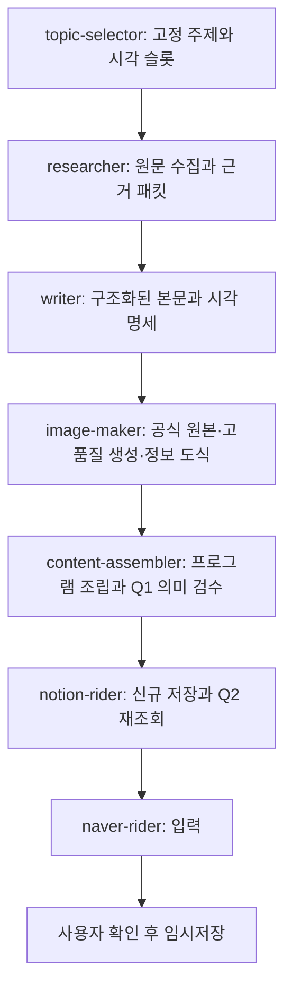

# 글·이미지 품질을 보존하는 워크플로 최적화 제안

- 검토일: 2026-09-27 KST
- 상태: 설계 제안. 운영 코드·모델 설정·활성 지침 변경 및 새 생성 실행 없음.
- 목표: 현재 좋은 결과물 수준을 최소 기준으로 삼아, 검수된 글 1건을 얻는 시간과 실패에 소비하는 시간을 줄인다.
- 근거: 현재 작업 트리의 코드·설정, 로컬 실행 상태·이벤트·usage, 글 2종과 이미지 4개 직접 확인, OpenAI 공식 모델·지연 최적화 문서.
- 과거 계획과의 관계: `central-log-hub-implementation-plan.md`의 Source Packet·Article Packet·렌더러 방향을 이어가되, 최근 실패 기록·이미지 편차·의미 검수 보존을 반영한 별도 제안이다. 기존 문서는 수정하지 않는다.

## 1. 제안의 핵심

새로 만든다면 **프로그램이 실행 순서와 파일 형식을 관리하고, AI가 자료 해석·집필·의미 검수를 담당하는 구조**로 만든다.

기존 Python 실행기, Aside Browser, 7단계 책임, Q1/Q2, manifest, Hook, Notion·네이버 어댑터를 활용한다. 품질을 좌우하는 조사와 집필에는 충분한 모델 역량을 배정하고, 동일 내용을 여러 파일로 재작성하는 일과 이미지마다 제작 코드를 다시 만드는 일을 줄인다.

우선순위는 다음과 같다.

1. 정상적인 자료 수집과 완료 경로를 확보하고 품질 기준 사례를 고정한다.
2. 조립 문법과 산출물 계약 때문에 반복되는 AI 작업을 프로그램으로 옮긴다.
3. 이미지의 역할별 제작 방식을 고정하고 좋은 썸네일 수준을 유지한다.
4. 같은 자료로 모델과 reasoning effort를 비교해 단계별 설정을 정한다.
5. 구조화된 입력과 안전한 재사용을 정착시킨다.

## 2. 현재 확인한 상태

### 2.1 이미 적용된 요소

- 자동 주제의 결정적 선정과 `selection-decision.json` 고정.
- 호스트가 Aside에서 읽은 자료를 격리된 모델에 전달하는 구조.
- 단계별 모델 설정과 실행별 설정 digest.
- 단계 산출물 재사용 분기, 시도별 로그, Q1 누적 3회 제한.
- Notion·네이버 전용 실행 어댑터와 저장·재개 관련 코드.
- 대시보드 snapshot cache와 usage 집계 코드.

이 항목을 새 기능처럼 다시 만들지 않는다. 특히 중앙 DB 도입과 대시보드 전면 재작성은 이번 생성 속도 개선의 선행조건이 아니다.

### 2.2 실제 모델 설정

`.automation/dashboard/model-settings.json`, revision 2의 활성 기본값이다. 최근 실행 state에도 같은 설정이 기록되어 있다.

| 단계 | 모델 | reasoning effort |
|---|---|---|
| topic-selector | gpt-5.6-luna | medium |
| researcher | gpt-5.6-terra | medium |
| writer | gpt-5.6-terra | medium |
| image-maker | gpt-5.6-terra | medium |
| content-assembler | gpt-5.6-luna | low |

`image-maker`의 언어 모델과 실제 이미지를 생성하는 모델은 별개다. 현재 이미지 지침·검증기는 `gpt-image-2.5-flare-2026-09-08`, high를 명시한다. 이 문자열과 메타데이터만으로 실제 호출이나 모든 산출물의 품질이 증명되지는 않는다.

현재 `tools/model_presets.py` 허용 목록에는 GPT-6 조합이 없다. 앱에서 모델이 보이는 것과 이 파이프라인이 해당 모델을 허용하고 실행하는 것은 별도로 검증해야 한다.

### 2.3 과거 단계 시간: 이미지와 조립이 주요 개선 후보

`.automation/logs/*.jsonl`의 stage 이벤트 중 `dry_run=false`, `status=passed 또는 validated`, `execution=produced`, `duration_ms>1000`을 집계했다. 1초 이하의 즉시 재사용 등을 제외하기 위한 필터이며, 완전한 새 생성 여부를 보증하는 계측은 아니다.

| 단계 | 관측 수 | 중앙값 | 범위 |
|---|---:|---:|---:|
| 주제 선정 | 26 | 2.07분 | 1.41~4.30분 |
| 조사 | 23 | 2.95분 | 2.31~5.29분 |
| 집필 | 18 | 2.41분 | 1.60~6.81분 |
| 이미지 제작 | 13 | 7.54분 | 2.64~15.13분 |
| 최종 조립 | 12 | 2.83분 | 1.80~4.65분 |

관측 기간은 9월 5~26일이며 단계마다 마지막 성공일이 다르다. 모델·주제·이미지 수·재개 여부·코드가 섞인 역사 기록이다. 이 표의 중앙값을 합쳐 현재 글 한 편의 생성 시간으로 해석하면 안 된다. 이미지 단계 시간에는 준비·코드 작성·검사 등이 포함되므로 순수 이미지 API 지연으로 볼 수도 없다.

구체적 사례:

- `RUN-20260905-093909-fb455ac4447d`: producer 단계 시간 합 17.03분. 이미지 7.38분, 조립 2.75분. 외부 저장·사용자 대기 시간 제외.
- `RUN-20260910-141801-e6668526b0b9`: producer 단계 시간 합 22.26분. 주제는 즉시 재사용했으며 이미지 7.75분, 실패 포함 조립 7.13분.
- `RUN-20260912-221133-dd63c0c64ed8`: producer 단계 시간 합 27.92분 후 실패. 조립 3회에 14.27분을 소비했고 마지막 원인은 `TABLE pipe row contains an empty cell`이었다.

마지막 사례의 조립 3회 usage 합은 입력 1,522,327토큰, 그중 캐시 입력 1,352,704토큰, 비캐시 입력 169,623토큰, 출력 28,958토큰이다. 에이전트 내부 여러 요청의 누적량이지 단일 프롬프트 크기나 전부 신규 과금된 입력량이 아니다. reasoning 출력 3,292토큰은 별도 필드이며 출력에 다시 더하지 않는다. 이 기록만으로 요금이나 순수 모델 속도를 산정하지 않는다.

### 2.4 최근에는 성공 시간보다 완료율이 먼저 문제다

state의 `created_at` 기준 최신 비시험 `daily-generate` 30건은 2026-09-17 15:00~09-27 06:10 KST 실행이며 모두 `failed`다.

| 마지막 기록 오류 분류 | 건수 |
|---|---:|
| Aside 연결 또는 Creator Advisor 접근 실패 | 15 |
| Codex 프로세스 exit 1 | 6 |
| 조사 자료의 주장·원문 근거 부족 | 5 |
| 전달된 브라우저 근거 변경 | 2 |
| staging 산출물 선언·실제 파일 불일치 | 2 |

이는 오류 메시지 분류이며 근본 원인 전체를 재현·확정한 결과는 아니다. 예를 들어 Aside 메시지만으로 로그아웃을 단정하지 않는다. 최근 30건에 정상 완료가 없으므로 현재 버전의 정상 생성 속도나 모델 우열을 측정했다고 말할 수 없다.

조사 경로에는 구체적인 제약도 있다. `config/research-source-profiles.json`의 공식 프로필은 현재 `www.naver.com` 하나이고, 수집기는 hostname이 프로필과 정확히 일치하지 않는 원문 후보를 제외한다. 관광기관·브랜드·제조사 원문을 직접 확보하기 어렵게 만드는 구조다. 모델을 강화해도 전달되지 않은 원문을 만들어낼 수는 없다.

### 2.5 보존할 품질과 개선할 품질

직접 확인한 예:

- `final/한정선 찹쌀떡-naver-input.md`, 해당 썸네일·비교 이미지.
- `drafts/성심당 빵 추천.md`, 해당 썸네일·비교 이미지. 이 실행은 최종 Q1 실패 사례이므로 정상 통과 기준물로 취급하지 않는다.

한정선 썸네일은 사진형 장면과 주제 표현의 완성도가 높고, 성심당 썸네일은 단순 도형 중심이다. 속도를 위해 전부 단순 도형 이미지로 바꾸는 방식은 제안하지 않는다. 사진형 표현도 실제 제품을 공식 사진처럼 오인하게 하지 않는지 별도로 확인해야 한다.

두 글에서는 핵심 제품·가격 정보 부족이 일반적인 구매 전 확인 안내로 대체되는 경향이 보인다. 문체뿐 아니라 **독자의 질문에 구체적으로 답하는 정보량**을 품질 목표로 삼는다. 이미지 4개와 글 2종의 표본 검토이며 전체 산출물의 품질 평가를 대신하지 않는다.

## 3. 목표 구조

책임 단계와 필수 산출물은 유지한다. 바꾸는 것은 각 단계에서 AI에게 맡기는 작업량이다. 아래 패킷·렌더러·모델 변경은 향후 승인된 구현에서 관련 지침과 스키마를 함께 개정할 대상이며, 이 문서 자체가 활성 계약을 바꾸지는 않는다.

### 3.1 근거 패킷: 요약문만 넘기지 않는다

`Source Packet`에 주제·기준일, 독자 질문, claim ID, 출처 ID, 원문 URL, 관측 시각, 원문 발췌, 근거 상태, 조건·예외, 시각 슬롯을 담는다. 원문 스냅샷은 해시로 연결해 그대로 보존한다.

- 모델은 필요한 주장과 해당 근거를 읽고, 추가 확인이 필요하면 호스트가 보존한 원문을 조회한다.
- 확정된 파일명·run ID·해시·원장 형식은 프로그램이 기록한다.
- 확인되지 않은 가격·제품명 등을 빈 일반론으로 채우지 않는다.
- 기준일·주요 사실·원문이 부족하면 researcher 단계에서 실패시켜 writer 호출 전에 해결한다.
- 공식 원문 프로필은 검증된 기관·브랜드 단위로 보완한다. 검색 결과의 임의 URL을 자동으로 공식 출처로 승격하지 않는다.
- 브라우저는 계속 Aside만 사용하고 격리 모델의 네트워크 제한을 풀지 않는다. 두 조사 Lane은 같은 프로세스에서 직렬 실행한다.

### 3.2 본문 패킷: 글은 한 번 쓰고 여러 형식으로 출력한다

`Article Packet`에 제목, 순서 있는 문단·소제목·목록·표·링크, claim 참조, 시각 슬롯, 이미지에 들어갈 정확한 문구를 담는다. 본문은 집필 모델이 완성하고 이후 단계가 임의로 다시 쓰지 않는다.

프로그램이 사람이 읽는 기존 `drafts/[키워드].md`와 최종 4종 Markdown을 생성한다. 원본 본문·표·링크·이미지 순서가 변하지 않는지 round-trip 검사를 한다. 공개 본문과 내부 출처·권리 원장은 별도 필드로 구분한다.

초기에는 현재 초안 Markdown을 파싱하는 조립기부터 도입해 변경 폭을 줄일 수 있다. 지원하지 않는 구조는 실패로 남기고, 알 수 없는 내용을 추측해 변환하지 않는다. 패킷 전환은 이 조립기가 기존 결과와 동등한 출력을 내는 것을 확인한 뒤 적용한다.

### 3.3 이미지: 역할에 따라 제작 비용을 다르게 쓴다

| 이미지 역할 | 제안 방식 | 품질 조건 |
|---|---|---|
| 공식 제품·장소·화면 | 확보한 공식 원본 그대로 사용 | 원본 URL·출처·권리 상태 기록. 편집은 별도 확인 필요 |
| 전용 썸네일·핵심 사진형 장면 | 현재 고품질 이미지 생성 경로 유지·검증 | 좋은 기준물과 비교. 단순 카드로 자동 대체하지 않음 |
| 비교표·일정·절차 | 검수된 재사용 템플릿에 데이터 입력 | 모바일 가독성·정보 기여·정확한 숫자와 한글 유지 |
| 복잡한 관계·독창적 설명 | 맞춤 시각 설계 후 제작 | 템플릿에 억지로 끼워 넣지 않음 |

이미지 수를 일률적으로 줄이지 않는다. 제목과 독자 질문에 필요한 슬롯은 모두 유지한다. 정보 도식의 템플릿을 재사용하되 주제의 데이터·시각적 위계·색 구성은 맞춘다. 사진형 썸네일과 본문 자산의 별도 파일·별도 해시 계약도 유지한다.

이미지마다 즉석 제작 스크립트를 작성하는 대신 검수된 제작기를 사용한다. 생성 프롬프트·문구·레이아웃을 먼저 확정하고, 실행 후 실제 파일과 모바일 화면을 확인한다. 공식 이미지 원본을 편집 허가 없이 합성하지 않는다.

선행조건: `docs/task-7-image-production-result.md`가 남긴 local-render 검증 한계와 AI 호출 증명 문제를 재현·해결한다. 현재 코드도 제작 metadata를 중심으로 판단하므로, 호스트 호출 영수증·실제 출력 해시를 연결하는 검증을 도입해야 한다. 문서의 `locked`나 자기기입 품질 점수만으로 모델 품질을 비교하지 않는다.

첫 구현에서는 실제 이미지 생성·최종 기록은 현재 계약대로 직렬 유지한다. writer와 image-maker를 병렬로 시작하는 설계는 초안 의존성과 현행 계약을 깨므로 제외한다. 이후 병렬화는 독립성이 입증되고 계약이 개정된 범위에서만 별도 검토한다.

### 3.4 최종 조립: 문법 검사는 코드, 의미 검수는 AI

현재 assembler가 만드는 표·목록·제목 태그, 네 파일 변환, 이미지 배치, manifest는 프로그램이 처리한다. 글 전체를 네 번 출력하거나 AI에게 닫는 태그를 수리하게 하지 않는다.

Q1에는 두 부분을 유지한다.

1. 결정적 검사: 문법·경로·슬롯·해시·순서·파일 누락·허용된 표시 차이.
2. 의미 검사: 제목 약속·독자 질문 충족·출처와 주장 일치·최신성·반복·이미지의 정보 기여.

의미 검수는 작성자와 별도 호출로 수행하고, 결과는 짧은 구조화된 판정과 근거 ID만 반환한다. 자동 문법 검사 성공을 글의 내용 품질 통과로 간주하지 않는다. 이미지 판단에는 실제 이미지가 필요하고 metadata만 보지 않는다.

현행 Q1 재시도는 동일 run ID에서 누적 3회, assembler만 재시도하는 계약을 유지한다. Q1 실패를 이유로 researcher·writer·image-maker를 자동 재호출하지 않는다. 원천 사실 부족이나 초안 결함은 해당 단계의 조기 검사로 줄이고, Q1에서 발견되면 구체적인 원인으로 중단한다. 이전 계획의 자유로운 producer 부분 재시도는 현행 계약과 충돌하므로 이번 기본안에서 제외한다.

## 4. 모델 배치 제안

아래는 비교 실험의 시작값이다. 한국어 블로그에서 현재 설정보다 빠르거나 좋다고 측정된 결과는 아니다.

| 역할 | 1차 비교 후보 | 상향 또는 생략 조건 |
|---|---|---|
| 주제 설명·독자 질문·초기 시각 계획 | GPT-6 Luna low | 복잡한 검색 의도만 medium. 선택된 키워드는 변경 금지 |
| 원문 추출·정규화 | 프로그램 중심 | 규칙으로 처리하기 어려운 분류만 Luna low |
| 조사 해석·주장과 근거 연결 | GPT-6 Sol medium | 실제 출처 간 충돌이 있는 부분만 high/Astra 비교 |
| 한국어 본문 집필 | GPT-6 Sol medium | 복잡한 비교·구성이 필요한 주제만 high 비교 |
| 이미지 제작 지시·슬롯 매핑 | 프로그램, 필요한 경우 Luna low | 시각적 설계가 복잡한 경우 Sol medium |
| 사진형 이미지 생성 | 현행 고품질 경로 보존 | 실제 호출·출력·시각 품질 검증 후에만 모델 변경 검토 |
| Q1 의미 검수 | GPT-6 Sol low 또는 medium 비교 | 작성 모델과 별도 호출. 판정 근거만 출력 |
| 파일 조립·manifest·저장·재조회 | 프로그램과 기존 어댑터 | 언어 모델 추가 호출 불필요 |

OpenAI는 GPT-6 Sol을 어려운 작업의 추론용, Luna를 반복적·효율적인 작업용으로 안내한다. 위 역할 배치는 그 안내를 이 시스템에 적용한 설계 판단이다. 모델명만으로 실제 지연·완료율·한국어 문체 품질은 확정할 수 없다. [공식 모델 안내](https://developers.openai.com/api/docs/guides/latest-model)

모든 단계에 최상위 모델·high를 지정하지 않는다. 반대로 writer를 먼저 낮춰 절약하지도 않는다. 재시도까지 포함한 ‘품질 통과 결과 1건당 시간’으로 채택한다. 원문 없음·인증 실패·산출물 경로 오류는 모델 상향 대상이 아니다.

1차 목표는 무조건 호출 수를 줄이는 것이 아니라 각 호출의 일을 줄이는 것이다. assembler의 긴 생성 호출은 짧은 Q1 의미 검수 호출로 대체된다. 이후 정형 주제와 시각 명세는 프로그램으로 처리해 필수 추론을 조사·집필·Q1의 3회로 모으고, 필요한 경우 주제·이미지 설계 호출을 추가하는 3~5회 구조를 검증한다. 이미지 생성 호출은 이 숫자에 포함되지 않는다.

## 5. 실행 순서와 통과 조건

| 순서 | 구현 단위 | 주요 대상 | 완료 기준 |
|---|---|---|---|
| 0 | 기준선·정상 경로·좋은 품질 사례 확정 | 기존 logs/state/usage, 연구 source profile, image evidence | 실패 분류와 시간 구간이 재현되고, 입력 자료·이미지 기준물이 고정됨 |
| 1 | 프로그램 조립기와 조기 계약 검사 | `runner_actions.py`, `codex_stage_executor.py`, `notion_copy_parser.py`, `manifest.py`, 새 조립기 | 동일 본문으로 최종 4종 생성. 태그 오류·누락 실패 재현. Q1 의미 검수 유지 |
| 2 | 이미지 제작 경로 정리 | `image_quality.py`, 이미지 지침·스키마, 새 제작기 | 실제 호출·출력 증명, 도식 가독성, 썸네일 수준 통과 |
| 3 | 역할별 모델 실험 | `model_presets.py`, 모델 설정 저장소·검증, 단계 명령 | 후보 모델 실제 실행 확인과 같은 입력의 품질·시간 비교 |
| 4 | Source/Article Packet과 조건부 호출 | 단계 지침, packet schema, executor/promotion | 원문 추적·필드 완전성·호환 출력·내용 동등성 확보 |
| 5 | 작은 실운영 검증 | 기존 Notion·네이버 어댑터 | Q1/Q2 성공, 실제 입력 확인, 사용자 확인 후 임시저장 |

0단계의 운영 오류는 원인을 재현한 범위만 수정한다. 과거 state·로그를 성공으로 고치거나 기존 자료를 덮어쓰지 않는다. 신규 실험 결과는 별도 run ID·산출물 영역에 남기고 Q1 반복 제한을 우회하기 위해 새 run ID를 발급하지 않는다.

각 단계는 별도 변경으로 적용하고 직전 구성으로 되돌릴 수 있게 한다. 현재 pipeline version은 임의로 바꾸지 않으며, 새 내부 필드·렌더러 버전은 명시적으로 기록한다. 의미 있는 계약 변경이 생기면 버전·호환 정책도 해당 구현안에 포함한다.

## 6. 비교 실험과 품질 기준

### 6.1 비교 방법

1. 제품·음식, 행사·여행, 정책·절차, 비교·설명 유형에서 대표 입력을 선정한다. 우선 3건으로 계측과 평가표를 확인하고 12개 고정 입력으로 확장한다.
2. 구조 변경만 적용한 경우와 모델만 변경한 경우를 분리해 원인을 구분한다. 조사 snapshot·기준일·이미지 슬롯·본문 요구량을 동일하게 유지한다.
3. 느린 사례·실패 사례를 빼지 않는다. 캐시 재사용 유무와 모델·effort·renderer version을 기록한다. 모델 결과가 비슷하면 경계 사례를 반복해 선택한다.
4. 외부 쓰기 없는 재생 실험으로 품질과 조립을 비교한 뒤, 실제 수집을 포함한 검증을 별도로 수행한다. 재생 실험 결과를 외부 E2E 성공으로 보고하지 않는다.
5. 같은 계정에서 많은 후보를 동시에 실행해 생기는 대기 영향을 피하고, 비교 순서를 교차한다.

### 6.2 품질 기준

- 글: 현행 100점 평가의 85점 이상, 즉시 실패 0, 기준 결과보다 전체·핵심 항목의 중앙 평가가 낮아지지 않음. 모델명을 가린 비교로 제목의 약속, 구체적인 답, 사실성, 중복, 자연스러운 한국어를 평가한다.
- 이미지: 좋은 기존 결과물을 기준으로 관련성·구도·가독성·완성도·정보 기여를 비교한다. 5개 항목 16/20 이상 및 각 3점 이상을 실험의 평가 기준으로 사용한다. 썸네일을 단순 카드로 바꾸어 통과시키지 않는다.
- 안전·무결성: 필수 시각 슬롯·최신 근거·manifest·Q1·Q2·외부 대상 바인딩 모두 유지. 단 한 건이라도 외부 저장 오염이나 검증 우회가 발생하면 도입 보류.
- 이미지 사람 점수는 실제 사람 평가가 있는 경우에만 기록한다. 모델 평가를 사람 평가로 표시하지 않는다.
- 운영의 Q3는 AGENTS.md대로 선택 기록이다. 위 이미지 평가는 최적화 도입 실험의 채택 조건이며, 모든 운영 실행에 새 사람 승인 대기를 추가하는 제안은 아니다.

### 6.3 시간·usage 기준

현재 성공률 문제 때문에 절대 완료시간 약속을 먼저 정하지 않는다. 정상 기준선을 확보한 뒤 다음을 초기 목표로 검증한다.

- Q1 통과까지의 활성 처리시간 중앙값 30% 단축.
- P90 악화 없음. 작은 12개 표본의 P90은 잠정값으로 보고 도입 후 관측을 계속한다.
- 동일 평가셋에서 품질 통과율 저하 없음, 형식 오류에 따른 재시도 감소.
- 입력 전체·캐시 입력·비캐시 입력·출력·reasoning 필드와 계측 coverage를 별도로 보고.
- 구조 조립 자체는 초 단위 처리를 목표로 하되 Q1 의미 검수 시간까지 초 단위라고 약속하지 않는다.

시간은 자료 수집, 모델 추론·도구 왕복, 이미지 생성, 파일 처리, 검수, 외부 I/O, 대기·재시도로 나눈다. 사용자 확인 대기는 자동 처리 시간에서 분리한다. ‘실패한 시간까지 합친 품질 통과 결과 1건당 소비 시간’과 전체 완료율도 함께 본다. 통과 결과가 0이면 이 지표는 계산 불가로 표시한다.

30%는 아직 달성하지 않은 채택 목표다. 입력 토큰 절감률을 지연 절감률로 환산하지 않는다. 공식 지연 최적화 문서도 출력량·왕복 요청·불필요한 LLM 작업 축소와 실제 예제 비교를 강조한다. [공식 지연 최적화 안내](https://developers.openai.com/api/docs/guides/latency-optimization)

## 7. 유지할 경계와 이번 검토의 한계

- 브라우저는 Aside만 사용. 조사 Lane은 직렬. 격리 접근 제한 유지.
- Q1 전 Notion 쓰기 없음, Q2 전 네이버 입력 없음, 임시저장 직전 명시적 사용자 확인.
- Notion 지정 대상·기존 기록·manifest·원시 snapshot·실행 이력 보존.
- 공식 원본은 확인된 출처 정책에 따라 사용. 허가 상태 미확인만으로 생성 이미지로 대체하지 않음.
- 캐시는 기준일·원문 해시·규칙 버전·모델 설정·renderer 버전·이미지 제작 조건을 기준으로 판단. 파일이 있다는 이유만으로 최신성 통과 처리하지 않음.
- 원문은 재사용하더라도 변동하는 가격·일정·판매 상태는 해당 실행 기준일에 다시 확인.
- 전면 프레임워크 교체, 신규 중앙 DB, 모든 단계 병렬화는 첫 적용 범위에서 제외.

이번에는 실제 브라우저·운영 서버·모델 호출·Notion·네이버를 실행하지 않았다. 기록과 코드·표본 산출물에서 설계 우선순위를 도출했으며, 현재 전체 시스템의 운영 정상 여부나 후보 모델 성능을 검증한 보고서는 아니다. 여러 기존 변경이 있는 작업 트리는 보존하고 이 제안 문서만 새로 작성했다.

## 8. 주요 확인 파일

- `AGENTS.md`, `researcher.md`, `writer.md`, `image-maker.md`, `content-assembler.md`, `evaluation-rubric.md`
- `.automation/dashboard/model-settings.json`, `.automation/state/`, `.automation/logs/`
- `.automation/work/<run_id>/<stage>/[attempt-N/]codex-attempt-N.jsonl`의 `turn.completed.usage`
- `tools/model_presets.py`, `tools/codex_stage_command.py`, `tools/codex_stage_executor.py`
- `tools/codex_topic_decision.py`, `tools/research_browser_capture.py`, `tools/research_readiness.py`
- `config/research-source-profiles.json`, `config/research-capture-policy.json`
- `tools/runner_actions.py`, `tools/runner_attempt.py`, `tools/dashboard_usage.py`, `tools/dashboard_snapshot_cache.py`
- `tools/image_quality.py`, `docs/task-7-image-production-result.md`
- `central-log-hub-implementation-plan.md`
